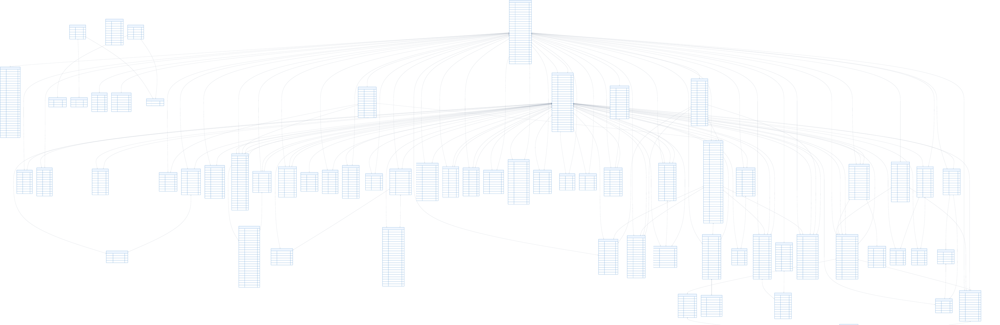
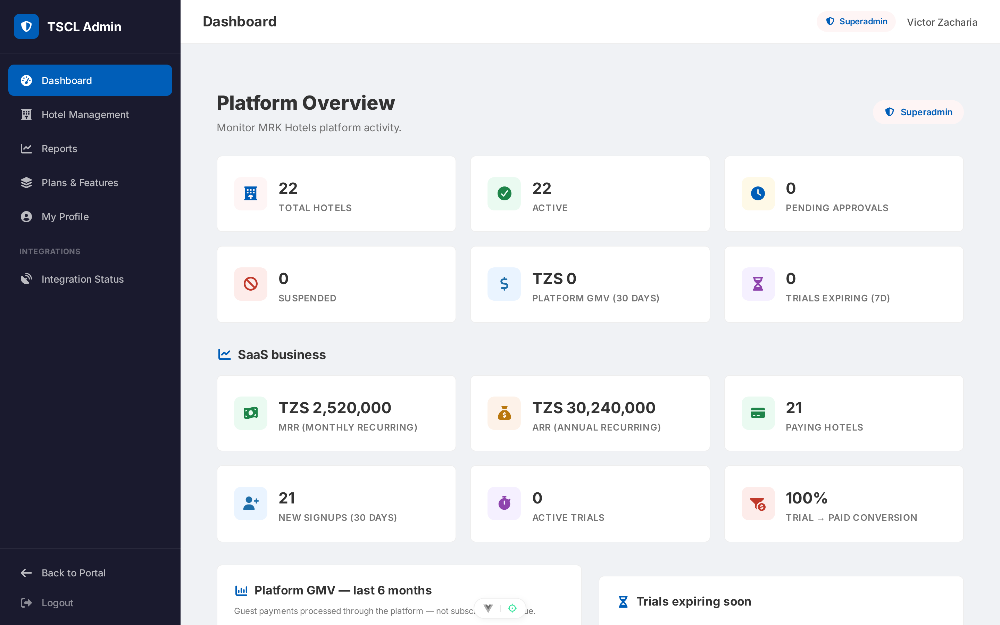
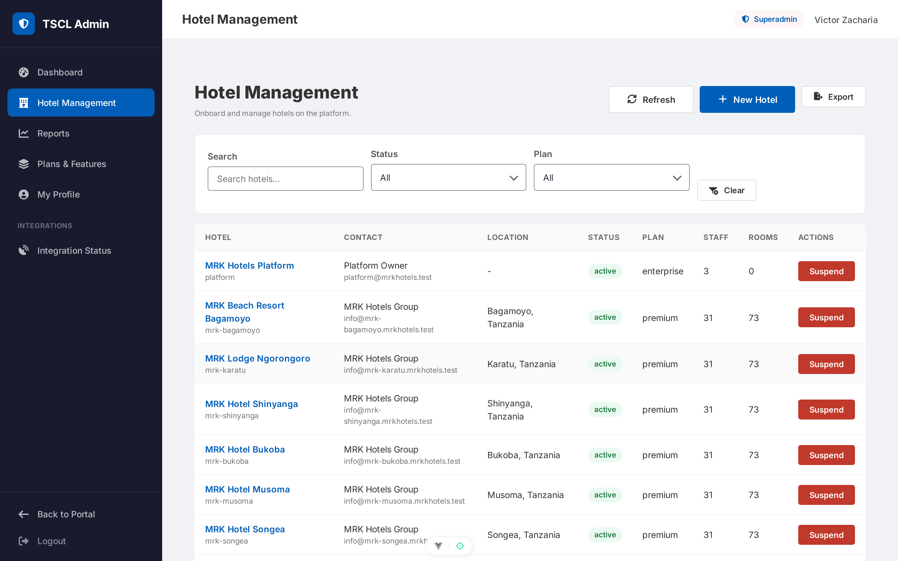
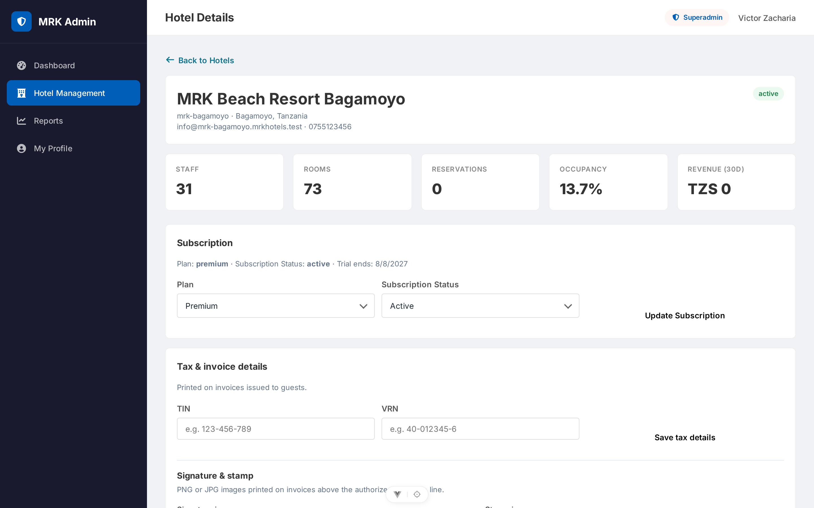
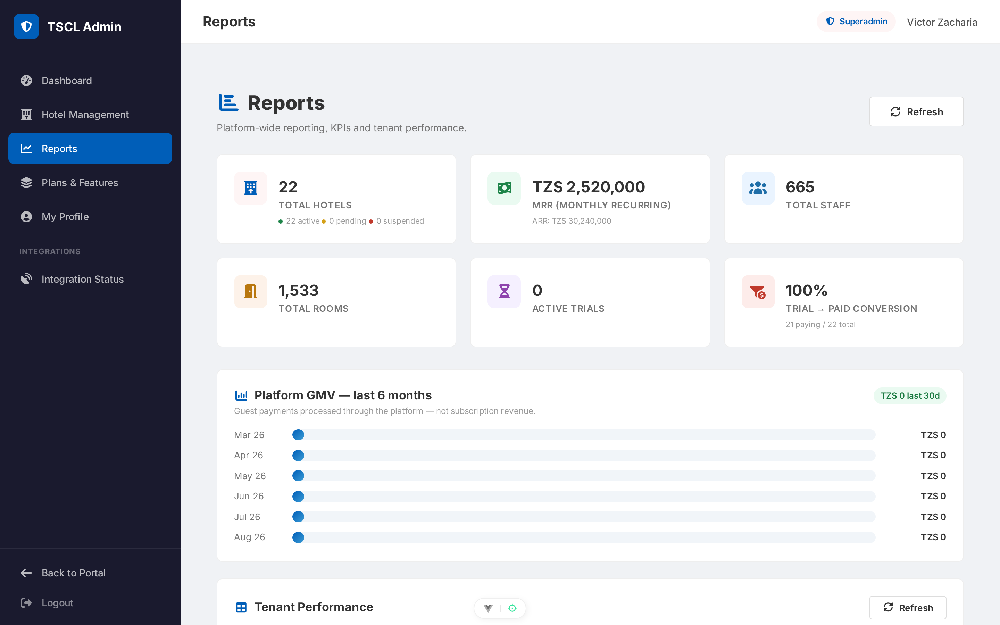
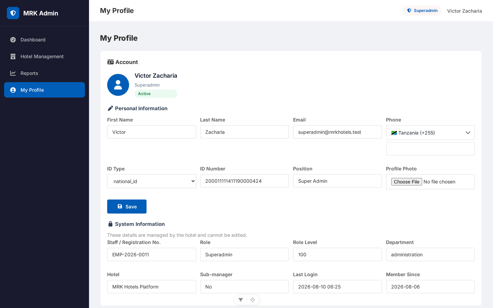

# MRK Hotels — Developer Documentation

**Version 1.4** — Architecture, Setup, Backend, Frontend and API Reference

---

## 1. Overview

MRK Hotels is a **multi-tenant hotel management SaaS** built as two applications:

| Application | Stack | Location |
| --- | --- | --- |
| **API backend** | Laravel 13 (PHP 8.3+), Sanctum, spatie/laravel-permission | `mrk-hotels-api` |
| **Web frontend** | Vue 3, Vite, Pinia, Vue Router, vue-i18n, Axios | `mrk-hotels-frontend` |

The system has three faces:

1. **Public booking portal** — guests browse hotels, check availability and book rooms online, optionally paying via Selcom, mobile money (ClickPesa) or bank transfer.
2. **Hotel panel (`/app`)** — every hotel runs its own operation: reservations, rooms, guests, payments, housekeeping, food & beverage, laundry, fun & games, inventory, procurement, staff, messaging and reports.
3. **Superadmin panel (`/superadmin`)** — manages all tenants (hotels), approves registrations and toggles per-hotel payment methods.

**Multi-tenancy** is implemented at the application layer: models carry `tenant_id` and a global scope (`BelongsToTenant`), and a `TenantContext` support class scopes queries for the active hotel.

---

## 2. Requirements

### Backend
- PHP ^8.3 (tested on 8.4)
- Composer
- MySQL / MariaDB (tests use in-memory SQLite)

### Frontend
- Node ^22.18 / >= 24.12
- npm

### Key dependencies
- Backend: `laravel/framework` ^13.0, `laravel/sanctum` ^4.0, `spatie/laravel-permission` ^7.3, **`laravel/reverb` (WebSocket server)**
- Frontend: vue, vue-router, pinia (+ persistedstate), vue-i18n, axios, font-awesome, country-state-city, libphonenumber-js, **`laravel-echo` + `pusher-js` (real-time client)**; Vitest + Playwright for testing

---

## 3. Local Setup

### 3.1 Backend (`mrk-hotels-api`)

```bash
composer install
cp .env.example .env           # set DB_*, SANCTUM_STATEFUL_DOMAINS, CLICKPESA_*, REVERB_* keys
php artisan key:generate
php artisan migrate --seed      # TenantSeeder creates the demo hotel + users + rooms
php artisan serve               # http://localhost:8000
php artisan reverb:start        # realtime WebSocket server (http://localhost:8080)
```

### 3.2 Frontend (`mrk-hotels-frontend`)

```bash
npm install
cp .env.example .env            # VITE_API_URL=http://localhost:8000/api
npm run dev                     # http://localhost:5173
```

### 3.3 Demo data (TenantSeeder)

- Hotel **MRK Grand Hotel** (Dodoma, Tanzania, `subdomain=mrk-grand`, status `active`) with demo tax IDs (`tin=123-456-789`, `vrn=40-012345-6`) and demo payment accounts (M-Pesa + NMB) so invoices render the full formal layout.
- 10 staff users (hotel_admin, manager, accountant, receptionist, procurement_officer, housekeeping, kitchen, waiter, bartender, staff) — all password `password`.
- 7 rooms (single ×2, double, deluxe ×2, suite, presidential).

A superadmin user (`superadmin@mrkhotels.test`) is created elsewhere (permissions seeder) with full access.

---

## 4. Backend Architecture

### 4.1 Authentication (Sanctum)

`App\Http\Controllers\Api\V1\Auth\AuthController::login`:

- Finds the user by email, verifies `password_hash` with `Hash::check`.
- Rejects disabled accounts (403) and inactive tenants (403).
- Handles **password rotation**: if `passwordExpired()`, the password is reset to the default (`defaultPassword()` = full name in caps) and returned with `password_rotated: true` and a 401, prompting the client to re-sign-in.
- Issues a token: `createToken('api-token', $user->isSuperadmin() ? ['*'] : [$user->user_role])` — **abilities are the user's role name**.
- Returns `{ token, user }`.

`AuthController::loginPin` (`POST /api/v1/auth/login-pin`) — iPOS-style quick sign-in for shared staff terminals:

- Accepts `identifier` + `pin` (`digits:4`); the identifier matches the user's `email` **or** `registration_number`.
- Unknown identifiers, unset PINs and wrong PINs all get one generic 401 (`Invalid credentials.`) so the endpoint cannot be used to enumerate staff accounts.
- Applies the same gates as password login (active account, active/pending tenant), updates `last_login`, issues the identical token shape and audit-logs the login.
- PINs live bcrypt-hashed in `users.login_pin` (nullable — `null` disables PIN login for the account) and are hidden from serialization.
- PINs are assigned by senior staff via `UserController@setPin` (`POST /api/v1/users/{id}/set-pin`, level-80 group): validates `pin` + `pin_confirmation` (`digits:4`, `confirmed`), enforces `assertCanManage` on the target's role, rejects self-service with 422 (a profile self-service flow is planned), and audit-logs `pin_set`.

Protected routes use `auth:sanctum`. Token abilities are currently informational; authorization is enforced by the `level:X` and role-permission middleware below.

### 4.2 Authorization middleware

| Middleware | Purpose |
| --- | --- |
| `CheckRoleLevel` (`level:X`) | Rejects users whose `roleLevel()` < X with 403 (superadmin bypasses). E.g. `level:80` = admin/manager only, `level:60` = receptionist+. |
| `RequireSuperadmin` | Superadmin-only routes. |
| `RequireOwner` (`owner`) | Multi-hotel owner routes (`/owner/*`): consolidated dashboard and per-hotel drill-down across the owner's hotels (`tenants.owner_id`). Owner accounts live on the platform tenant; hotel queries bypass global scopes with explicit `tenant_id` filters. |
| `SetTenantContext` (`tenant`) | Resolves the active tenant for the request: superadmin supplies `X-Tenant-ID`; staff use their own `tenant_id`. Sets `TenantContext` for the request lifecycle. |
| `EnsureTenantActive` | Blocks requests for hotels whose tenant status is not active/pending. |

Roles: `superadmin` (100), `owner` (95), `hotel_admin` (90), `manager` (80), … Owners are created by the superadmin (`POST /api/v1/owners`, default password = full name in caps) and assigned to hotels via `PUT /api/v1/tenants/{id}` (`owner_id`). Demo owner: `owner@mrkhotels.test` / `password` (owns MRK Grand, Dar es Salaam and Zanzibar).

### 4.3 Multi-tenancy

- The `BelongsToTenant` model concern adds a `tenant_id` foreign key and a **global scope** that filters queries to the current tenant (when `TenantContext::id()` is set).
- `App\Support\TenantContext` is a static holder set by the `tenant` middleware and cleared in a `finally` block.
- Public portal endpoints operate **without** a tenant context and pass an explicit `hotel_id`/`tenant_id`.

### 4.4 Routing (`routes/api.php`)

All routes are under the `v1` prefix.

**Public group (`/v1/public`)** — no auth:

| Method | URI | Controller action |
| --- | --- | --- |
| GET | `public/hotels` | `PublicController@hotels` — directory search (`search`, `country`, `city`, `guests`, `check_in/out`) |
| GET | `public/hotels/{id}` | `PublicController@hotelShow` |
| GET | `public/availability` | `PublicController@availability` — returns available rooms + `payment_methods` |
| GET | `public/options` | `PublicController@options` |
| POST | `public/booking-requisitions` | `PublicController@storeBookingRequisition` |
| POST | `public/reservations` | `PublicController@storeReservation` — creates **pending** reservations under one `booking_reference` |
| POST | `public/payments/initiate` | `PublicController@initiatePayment` — online payment entry point |
| GET | `public/booking-requisitions/status` | `PublicController@bookingStatus` |

**Public auth:** `POST auth/login`, `POST auth/login-pin`, `POST auth/register` (all throttled by the shared `auth` limiter).

**Payment webhook:** `POST payments/clickpesa/callback` — no auth, used by the ClickPesa sandbox.

**Authenticated group** — `auth:sanctum` + `tenant`:

| Module | Route prefix | Level |
| --- | --- | --- |
| Auth | `auth/logout`, `auth/me`, `auth/change-password` | all |
| Reports | `reports/dashboard`, `overview`, `occupancy`, `revenue`, `room-status`, `audit-logs` | 20 / 80 / 60 / 70 / 60 / 70 |
| Messaging | `messages/users`, `messages/unread-count`, `messages/conversations`, `messages/conversations/{id}`, `.../messages`, `.../send`, `.../read`, `.../delete`, `.../react`, `messages/groups`, `messages/groups/{id}`, `.../messages`, `.../send`, `.../read`, `.../members`, `.../delete`, `.../react`, `messages/statuses`, `messages/calls`, `messages/calls/{id}/actions` **plus the 24 feature endpoints: replies/priority/polls, pin/star, templates, scheduled messages, forwarding, announcements, search, CSV export, translate, escalations, retention policies, notification preferences/DND, shift handovers, room-linked chats, task groups, staff presence (location/nearby), guest SMS bridge, meetings, SOS alerts** | 20+ |
| Users (staff) | `users` CRUD + activate/invite/reset-password/set-pin/attachments | 80 |
| Rooms | `rooms` CRUD + status | 60 |
| Guests | `guests` CRUD | 60 |
| Reservations | `reservations` CRUD + `options` + check-in/check-out/no-show/cancel + `reservations/{id}/payment` | 60 |
| Payments | `payments` + store | 60 |
| Booking requisitions | `booking-requisitions` | 60 |
| Housekeeping | `housekeeping/tasks` + room status | 40 |
| F&B | `menu-items`, `orders` | 30+ |
| Laundry | `laundry-orders` | 40 |
| Fun & games | `fun-game-orders` | 80 |
| Inventory | `inventory` + movements | 50 |
| Suppliers | `suppliers` CRUD | 50 |
| Procurement | `requisitions`, `purchase-orders`, `goods-received-notes` | 50 |
| Tenants | `tenants` CRUD + `payment-methods` | superadmin |
| Superadmin reports | `reports/superadmin/dashboard` | superadmin |

(246 `Route::` definitions total — 97 GET, 113 POST, 15 PUT, 20 DELETE, 1 PATCH.)

### 4.5 Models and relationships

| Model | Key fields / notes |
| --- | --- |
| `Core\Tenant` | `tenant_id` (UUID), `hotel_name`, `subdomain`, `status` (pending/active/suspended), `subscription_*`, tax IDs (`tin`, `vrn`), invoice branding (`signature_path`, `stamp_path` on the public disk), **`payment_methods`/`payment_accounts` (JSON casts)**, `enabledPaymentMethods()`/`publicPaymentMethods()` |
| `Auth\User` | UUID `user_id`, `tenant_id`, `user_role`, `password_hash`, `is_active`, `password_changed_at`; HasApiTokens, HasRoles |
| `Hotel\Room` | `room_number`, `room_type`, `floor`, `price_per_night`, `max_occupancy`, `status` |
| `Hotel\Reservation` | `tenant_id`, `guest_id`, `room_id`, `status`, `booking_reference`, dates, guest snapshot (denormalized `first_name`, `guest_phone`, …) |
| `Hotel\Guest` | guest register, contact + ID info |
| `Finance\Invoice` | `reservation_id`, `invoice_number`, `room_charges`, `service_charges`, `total_amount`, `paid_amount`, `balance`, `line_items`/`payments` (JSON snapshots), `status` (issued/paid) |
| `Finance\Payment` | `reservation_id`, `amount`, `payment_method`, `payment_provider`, `transaction_reference`, `status`, `booking_reference` |
| `System\BookingRequisition` | online/phone booking requests (no room) |
| `Housekeeping\HousekeepingTask`, `Laundry\LaundryOrder`, `Fun\FunGameOrder`, `FoodBeverage\Order`/`OrderItem`/`MenuItem`, `Inventory\InventoryItem`/`StockMovement`/`Supplier`, `Procurement\*` (requisition/PO/GRN + items) | domain records per module |
| `Messaging\Conversation`/`ConversationMessage`, `Messaging\GroupConversation`/`GroupConversationMember`/`GroupConversationMessage` | staff messaging; `conversation_messages` carries `delivered_at`, `type` (text/audio/image/file), `media_path`, `media_mime`, `view_once`, `is_media_seen`, `deleted_for`, `deleted_at`, `priority` (normal/urgent), `reply_to_id` (self-join for replies), `forwarded_from_type`/`forwarded_from_id` (forwarding); group members track `last_read_at` for read receipts; message **reactions** stored as JSON (`reactions` column) |
| `Messaging\PinnedMessage` / `StarredMessage` | one row per pinned/starred message (`message_type` = conversation/group, `message_id`, `user_id`) |
| `Messaging\Poll` / `PollOption` / `PollVote` | `message_type` + `message_id` polymorphic polls; one vote per user per option |
| `Messaging\MessageTemplate` | reusable message snippets (`name`, `body`, `category`, `is_global`) |
| `Messaging\ScheduledMessage` | future-dated send (`recipient_type` = conversation/group, `recipient_id`, `send_at`, `recurrence`) — dispatched by the `messaging:send-scheduled` command |
| `Messaging\Announcement` / `AnnouncementAcknowledgement` | tenant-wide broadcast with per-user read acknowledgements |
| `Messaging\MessageEscalation` | raise a message to management (`message_type`, `message_id`, `escalated_by`, `handled_by`/`handled_at`) |
| `Messaging\RetentionPolicy` | `scope` (global/conversation/group), `days`, `enabled` — drives the `messaging:purge-expired` command |
| `Messaging\NotificationPreference` | per-chat mute + **DND window** (`dnd_from`/`dnd_to`), `muted_until`/`muted`, `push_enabled`, `scope`/`target_id` polymorphic |
| `Messaging\ShiftHandover` | shift change notes (`shift_from`/`shift_to` timestamps, `status`, `ack_user_id`/`ack_at`) |
| `Messaging\ConversationRoom` | links a chat (`conversation_id` **or** `group_id`) to a `Hotel\Room` |
| `Messaging\StaffLocation` | staff presence (`zone`, `floor`) with `updated_at` recency for the nearby lookup |
| `Messaging\GuestMessage` | outbound SMS bridge to guests (`phone`, `provider`, `provider_status`, `template_id`, `direction`) |
| `Messaging\Meeting` / `MeetingInvitee` | scheduled meetings (`start_at`, `duration_minutes`, `conference_type`, `status`) with per-invitee responses |
| `Messaging\SosAlert` | emergency alert (`message`, `status`, `ack_count`, `ack_user_ids`, `resolved_by`/`resolved_at`); a `staff.location.updated` broadcast powers the nearby panel |
| `Social\Status`, `Social\StatusView`, `Social\StatusReaction` | 24-hour status posts (`type`: text/photo/video), media under `statuses/{id}`; `status_views` dedupe views per user; `status_reactions` holds emoji likes on statuses |
| `Communication\Call`, `Communication\CallEvent` | WebRTC calls: `type` (audio/video), `initiator_id`, `recipient_id`, `channel` (1:1 room name), `status` (ringing/active/missed/ended/rejected/declined), `ring_started_at`/`accepted_at`/`ended_at`; `call_events` logs ring/accept/end/mute events with timestamps |

### 4.6 Services

| Service | Responsibility |
| --- | --- |
| `Hotel\ReservationService` | Room availability check, room totals (with optional ClickPesa service fee), reservation lifecycle (create, check-in/out, no-show, cancel). |
| `Finance\PaymentService` | Record payments, `initiatePublicPayment` (selcom → completed + confirms booking; bank → awaiting_confirmation; mobile money → ClickPesa prompt), confirm sibling reservations by `booking_reference`. |
| `Finance\InvoiceService` | `generateForReservation` builds/refreshes the folio invoice (room + non-cancelled F&B/laundry charges minus completed payments, frozen into JSON snapshots; regenerating keeps the invoice number). `pdf()` renders `pdf.invoice` via dompdf with the MRK logo, tenant branding (signature/stamp), TIN/VRN, VAT-inclusive 18% breakdown, payment terms and "how to pay" lines — images embedded as data URIs. |
| `Inventory\InventoryService` | Stock adjustments and movements. |
| `System\AuditService` | Audit trail for logins and key actions. |
| `Messaging\ConversationController` / `GroupConversationController` | Delivery/read ticks: mark messages `delivered_at` on poll (index/show/messages), mark `read_at` on `markRead`; media upload (public disk, ≤ 10 MB, stored under `messages/conversations/{id}` / `messages/groups/{id}`, `type` inferred from MIME); group `read_by_count` computed in `GroupMessageResource`; **delete** (`delete_for` = me/everyone), **reactions** (emoji toggle), **view-once** media (media URL served once, then `is_media_seen`); **replies** (`reply_to_id` — `ReplySent` broadcasts the full reply resource), **priority** (`normal`/`urgent`), **polls** (`poll` payload: `question`, `multiple`, `options[]`) |
| Messaging feature controllers | `PinStarController` (pin/unpin/star/unstar + `pinned`/`starred` lists, broadcasts `MessagePinned`/`MessageUnpinned`/`MessageStarred`/`MessageUnstarred`), `PollController` (vote once per user; broadcasts `PollCreated`/`PollVoted` with live tallies), `MessageTemplateController` (CRUD, optional `category`), `ScheduledMessageController` (index/store/cancel), `AnnouncementController` (post + per-user acknowledge; broadcasts `AnnouncementPosted`/`AnnouncementAcknowledged` on the tenant channel), `SearchController` (keyword search across chats the caller can access, `ConversationMessage` + `GroupConversationMessage`), `ExportController` (CSV export of a conversation/group history), `TranslateController` (offline EN↔SW glossary `TranslateService`, no external API), `EscalationController` (raise + resolve; broadcasts `MessageEscalated`; auto-escalation of urgent unread messages via the `messaging:escalate` command (default unread threshold 10 minutes)), `RetentionPolicyController` (CRUD + `messaging:purge-expired` command soft-deletes expired messages), `NotificationPreferenceController` (per-chat mute + DND + push), `ShiftHandoverController` (post + acknowledge; broadcasts `ShiftHandoverPosted`/`ShiftHandoverAcknowledged`), `RoomLinkController` (`searchRooms`/`link`/`unlink`/`index` — links a chat to a hotel room), `TaskGroupController` (store + `convert` a room-linked message into a `HousekeepingTask`; broadcasts `TaskConverted`), `StaffLocationController` (update zone/floor + nearby query; broadcasts `StaffLocationUpdated`), `GuestMessageController` (outbound SMS bridge, tenant-scoped), `MeetingController` (`searchUsers`, schedule + invitees respond; broadcasts `MeetingInvited`/`MeetingResponseChanged` on the user channel), `SosController` (initiate/acknowledge/resolve; broadcasts `SosAlertInitiated`/`SosAlertResolved`), `ForwardController` (copy a message into another conversation/group with `forwarded_from_*` provenance; validates access on source and target). |
| Console commands | `messaging:send-scheduled` (queued sends due at `send_at`), `messaging:purge-expired` (retention + scheduled `cancelled_at` cleanup), `messaging:escalate` (auto-escalate urgent messages unread past a threshold). |
| `Social\StatusController` | Post (text/photo/video), list/feed (own + others, auto-expires after 24 h), view/like. Broadcasts `StatusPosted` to the tenant channel so conversations show live status rings. |
| `Communication\CallController` | WebRTC call lifecycle: `start` (creates Call + rings via `CallStarted` broadcast), `accept`, `reject`, `decline` (busy), `end`, `miss` (timeout), plus a `ping` event for live ring/ringing state. |
| Realtime events | `MessageSent` (body/media/type/view_once/priority/reply), `MessageRead`, `MessageDeleted` (includes `channel_id`), `MessageReacted`, `ReplySent`, `MessagePinned`/`MessageUnpinned`, `MessageStarred`/`MessageUnstarred`, `PollCreated`, `PollVoted`, `TaskConverted`, `AnnouncementPosted`, `AnnouncementAcknowledged`, `SosAlertInitiated`, `SosAlertResolved`, `ShiftHandoverPosted`, `ShiftHandoverAcknowledged`, `StaffLocationUpdated`, `GuestMessagePosted`, `MessageEscalated`, `MeetingInvited`, `MeetingResponseChanged`, `StatusPosted`, `CallStarted`, `CallEvent`, `MemberJoined`/`MemberLeft` — all on private channels (`private-users.{id}`, `private-tenants.{tenant_id}`, `private-conversation.{id}`, `private-group.{id}`) via Reverb. |

### 4.7 Support classes

- `PaymentOptions` — methods (`cash`, `mobile_money`, `bank`, `selcom`, `card`), `ONLINE_METHODS` (`selcom`, `mobile_money`, `bank`), providers (mobile money: `airtel_money`, `mixx_by_yas`, `halopesa`, `mpesa`; bank: `crdb`, `nmb`, `nbc`, `other`), statuses (`pending`, `awaiting_confirmation`, `completed`, `failed`, `refunded`), and helpers (`defaultMethods()` excludes selcom, `requiresProvider`, `requiresConfirmation`, `initialStatus`, `label()` for document rendering).
- `BookingOptions` — booking types (single, couple, family, group), room types, ID types, booking sources, guest defaults, `resolveStay()` for nights/departure.
- `NumberGenerator` — per-tenant sequential numbers: `prNumber`, `poNumber`, `grnNumber`, `orderNumber`, `requisitionNumber`, **`bookingReference` (`BK-…`)**, `staffNumber`, `laundryNumber`, `funGameNumber`, `transactionReference`, `clickPesaReference`, `inviteToken`, `tempPassword`.
- `TenantContext` — static tenant id holder.
- Module options: `HousekeepingOptions`, `LaundryOptions`, `FunGameOptions`, `OrderOptions`, `StaffOptions`.

### 4.8 Public booking & payment flow

1. `GET public/availability?hotel_id&check_in&check_out&booking_type` returns available rooms **and** the hotel's enabled `payment_methods`.
2. `POST public/reservations` validates the guest + booking (including `booking_date` after today and before check-in). With `room_selections`, one **pending** `Reservation` is created per room under a shared `booking_reference` (`BK-…`); the response carries `booking_reference` and `total_amount` (room rate × nights + ClickPesa service fee when online). Without rooms it creates a booking requisition.
3. `POST public/payments/initiate` with `booking_reference`, `amount`, `payment_method`, `payment_provider`, `phone`:
   - **selcom** → payment `completed`, all same-reference pending reservations confirmed.
   - **bank** → payment `awaiting_confirmation`; hotel confirms later.
   - **mobile_money** → ClickPesa prompt via `phone`; the `payments/clickpesa/callback` webhook completes the payment and confirms the booking.

### 4.9 Migrations & seeders

- ~68 migrations cover tenants, users (incl. `add_login_pin_to_users_table` — the nullable, hashed 4-digit `users.login_pin` powering PIN sign-in), permissions, rooms, guests, reservations, payments, booking requisitions, housekeeping, F&B, laundry, fun & games, inventory, procurement, staff invitations/attachments, audit logs, **messages (reactions/view-once/delete fields), statuses (`statuses`/`status_views`/`status_reactions`), calls (`calls`/`call_events`)** plus the messaging feature set: `pin_star_templates_scheduled_tables` (pinned/starred/templates/scheduled), `polls_announcements_tables` (polls/poll_options/poll_votes/announcements + acknowledgements), `preferences_retention_escalation_handover_tables` (notification preferences, retention policies, escalations, handovers), `task_groups_staff_locations_guest_messages` (conversation_rooms, task_groups, staff_locations, guest_messages), `meetings_sos_tables` (meetings, meeting_invitees, sos_alerts + `ack_user_ids`), and **attendance anti-cheat**: `add_attendance_audit_columns_to_staff_attendance_table` (`lat`, `lng`, `accuracy_m`, `qr_verified_at`, `ip_address`, `user_agent`), `add_attendance_settings_to_tenants_table` (`attendance_office_lat`, `attendance_office_lng`, `attendance_radius_m`, `attendance_require_qr`), `create_attendance_qr_tokens_table`.
- `TenantSeeder` seeds the demo tenant; `RolePermissionSeeder` sets up roles/permissions.

#### 4.9.1 Database schema ERD

The full relational diagram (all 67 tables, columns, primary/foreign keys and crow's-foot relationships) is available as a poster-size document:

- **`MRK_Hotels_Database_Schema_ERD.pdf`** — a single page printed at `8578 × 2794 mm` (way larger than A4, about 7 A0 sheets side by side) with a large 36 px font, so every table name, column and relationship is legible. Exported from the live schema served by **Laravel Truss** at `http://localhost:8000/truss` (`GET /truss/export/mermaid`), rendered with **Mermaid** (36 px font, blue `#005EB8` accent theme) and printed to a **vector PDF** via WeasyPrint.
- Preview of the same diagram, scaled to fit:



### 4.10 Testing

- `phpunit.xml` uses in-memory SQLite (`:memory:`) for tests.
- Base `Tests\TestCase` with `RefreshDatabase`.
- Feature tests include `tests/Feature/PublicBookingPaymentFlowTest.php` (7 tests: availability methods, selcom default-off, pending booking creation, selcom confirms, bank awaiting-confirmation, selcom rejected when disabled, multi-room shared reference + batch confirm), `tests/Feature/ConversationTest.php` (direct messaging: scoping, resumes, unread counts, polling, delivery/read ticks, audio upload), `tests/Feature/GroupConversationTest.php` (11 tests: hotel/global groups, member guards, read receipts, media, add/remove/leave, unread badge feed), `tests/Feature/MessagingFeaturesTest.php` (**20 tests** covering the 24-feature set: replies + priority + polls, poll voting, pin/star, templates, scheduled messages, announcements + acknowledge, escalation + resolve, command auto-escalation, search, CSV export, translate, task-group conversion, meetings + responses, SOS flow, staff location/nearby, guest SMS, retention purge, **forwarding (incl. cross-chat access block), room search, meeting-invitee search**), `tests/Feature/OverviewPaginationTest.php` (3 tests: staff/in-house/housekeeping section filtering + pagination), `tests/Feature/InvoiceTest.php` (folio totals, regeneration keeps number and settles, PDF download, front-desk level, tenant scoping), `tests/Feature/PublicInvoiceDownloadTest.php` (reference + any phone spelling, wrong phone 404, pending reservation has no invoice, group booking, rate limit), `tests/Feature/TenantTest.php` (payment accounts, tax IDs, branding upload/removal), `tests/Feature/RateLimitTest.php` (3 tests: login per-IP/per-email, public portal writes per-IP, messaging per-user), `tests/Feature/StaffPinLoginTest.php` (13 tests: PIN login by email and by registration number, wrong/unset/unknown-identifier rejections, disabled accounts, 4-digit validation, and the set-pin guards — role hierarchy, no self-service, confirmation required), and `tests/Feature/AttendanceTest.php` (**15 tests**: clock-in/out, double clock-in refused, clock-out without shift refused, location + request metadata capture, location required when office configured, inside/outside geofence, manager QR issue, QR-required refusal without token, valid + expired token paths, requirements reflect policy, admin settings update, QR cannot be enabled without an office, who-is-on-shift).
- Messaging tests broadcast to the local Reverb server — run `php artisan reverb:start` (or set `BROADCAST_CONNECTION=null` and avoid the broadcast calls) for the full suite to stay green.
- Run: `php artisan test` (currently **199 passing, 676 assertions**).

### 4.11 Realtime (Reverb + Echo)

- **Server:** `laravel/reverb` runs a standalone WebSocket server (`php artisan reverb:start`, default `ws://localhost:8080`). Configure `REVERB_APP_ID`, `REVERB_APP_KEY`, `REVERB_APP_SECRET`, `REVERB_HOST`/`REVERB_PORT` and the public/private ports in `.env`.
- **Client:** the SPA connects with `laravel-echo` (`pusher-js` transport) against `REVERB_*` config, authenticated via the Sanctum bearer token (channel auth goes through `/api/broadcasting/auth`).
- **Channels:** per-user private channel `private-users.{user_id}` (incoming messages, meeting invites, SOS rings), per-tenant `private-tenants.{tenant_id}` (announcements, SOS, handovers, guest messages, staff locations, escalations) and per-thread `private-conversation.{id}` / `private-group.{id}` (message, reply, pin/star, poll and task-convert events scoped to the open thread). Online state is derived from last activity; no presence channels are used.
- **Security:** private channels are authorised by `BroadcastChannel::check` — a user may only subscribe to their own user channel and to channels of tenants they belong to. Sensitive payloads (view-once media, call signaling data) never travel on public channels.

### 4.12 Rate limiting

Defined as named limiters in `AppServiceProvider::boot()` and applied in `routes/api.php`:

| Limiter | Key | Budget | Applied to |
| --- | --- | --- | --- |
| `api` | user `user_id` (authed) / IP (guest) | 120 / min (authed), 30 / min (guest) | whole authenticated group (`auth:sanctum` → `tenant` → `throttle:api`) and `/api/broadcasting/auth` |
| `auth` | IP + email (or the PIN-login `identifier`) | 5 / min | `auth/login`, `auth/login-pin`, `auth/register` — blocks credential stuffing; both sign-in forms share one budget |
| `public` | IP | 10 / min | portal writes & lookups: `public/booking-requisitions`, `public/reservations`, `public/payments/initiate`, `public/booking-requisitions/status`, `public/invoices/download` |
| `messaging` | user `user_id` | 30 / min | messages, groups, reactions, statuses, calls (`level:20` group) |
| `webhook` | IP | 60 / min | `payments/clickpesa/callback` (server-to-server; generous to avoid breaking payment verification) |

Violations return `429 Too Many Requests` with the standard Laravel JSON body (`Retry-After` included). Counter storage uses the configured cache store (database by default); flush `cache` in tests to keep rate-limit tests isolated.

### 4.13 Attendance anti-cheat (geofence + entrance QR)

`StaffAttendanceController` enforces the hotel's attendance policy from `tenants.attendance_office_lat`, `attendance_office_lng`, `attendance_radius_m` and `attendance_require_qr` (default: **off** — unconfigured hotels behave as before):

- **Office location** — when lat/lng are set, `clock-in` (and best-effort `clock-out`) requires a `lat`/`lng` (`accuracy_m` optional) and the point must fall within the geofence radius (haversine via `AttendanceService::distanceToOffice()`); outside or missing → `422 You must be at the office to clock in.`
- **Entrance QR** — when `attendance_require_qr` is on (only valid once the office is configured; the settings validator refuses QR without a location), `clock-in` also needs a `qr_token` issued by a manager/level-80+ (`POST attendance/qr-token`, 60-second TTL, single-use — consumed on successful clock-in, stored in `attendance_qr_tokens`). Missing/expired/reused token → `422 Scan the office QR code to clock in.` A successful `clock-in` stamps `qr_verified_at`.
- **Audit** — every clock-in/out records `lat`, `lng`, `accuracy_m`, `ip_address` and `user_agent` on the `staff_attendance` row.
- **Flow** — the staff SPA calls `attendanceApi.requirements()` on the Profile page, geolocates, then (when enabled) surfaces the generated QR (issued per user, rotates every 60 s with a `refreshToken`) in a scan-the-office-phone dialog; the scan is decoded with `jsqr` and passed as `qr_token`. `POST attendance/qr-token` is rate-limited per user and never returns tokens for the same user (no self-issue); `qr-token` also refuses to mint when the policy isn't enabled.

 - **Selfie verification & device binding** — hotels may enable an optional selfie verification step (`attendance_require_selfie`) or a device-binding policy that registers a device on first clock-in. When selfie verification is enabled the client must capture a live selfie (the SPA uses `AttendanceSelfieCapture`) and submit the captured image or a facial-match proof; the API records an `evidence` item tied to the attendance row. Device binding records a `device_id`/`device_fingerprint` and provides admin endpoints to list and revoke devices; revoking a device marks it `revoked` and prevents it from minting QR tokens until re-bound.

 - **Suspicious-records & absence claims** — anomalous patterns (large geofence deviations, IP/device mismatches, repeated outside attempts, or reused selfies) create `suspicious-record` entries for manager review. Staff can create `absence-claim` records with optional evidence; the admin review flow accepts or rejects claims and links decisions to the attendance audit. The API surfaces flags like `on_shift`, `suspicious`, and `evidence_count` for UI rendering and review workflows.

 - **Administrator and manager behaviours** — `attendance/settings` controls geofence coordinates, radius, QR and selfie/device policies; enabling QR or selfie requires a validated office location. Manager-level (level 80+) actions mint QR tokens and view `on-shift` lists and suspicious records; admin-level users update settings and revoke devices. All sensitive actions are audit-logged and rate-limited.

---

## 5. Frontend Architecture

### 5.1 Project layout

```
src/
  api/          axios instance + endpoint groups (index.js, echo.js)
  components/   PhoneInput, CountryCitySelect, StayDates, PaymentMethodSelect, ChangePasswordForm, ModulePlaceholder
  composables/  useCallManager.js (WebRTC + call ring), useConversation.js, useBroadcast.js
  config/       modules.js — role access matrix
  layouts/      StoreLayout (public + hotel panel), SuperadminLayout
  locales/      i18n.js + en.json + sw.json
  pages/        public/, auth/, dashboards/, reservations/, rooms/, guests/, payments/, booking/,
                housekeeping/, orders/, menu/, laundry/, fungames/, inventory/, suppliers/,
                procurement/, staff/, reports/, overview/, superadmin/, profile/,
                messages/, statuses/
  router/       index.js — routes + guards
  stores/       auth.js (Pinia, persisted token), session.js (idle watchdog)
  utils/        dates.js, locations.js, payments.js, phone.js
  main.js
```

### 5.2 API layer (`src/api`)

- `axios.js`: baseURL from `VITE_API_URL` (default `http://localhost:8000/api`); adds `Authorization: Bearer <auth_token>` from sessionStorage; flattens Laravel pagination (`data.data` + `meta` → top-level); on 401 clears the token and hard-redirects to `/login`.
 - `index.js` exposes typed endpoint groups under `/v1`: `publicApi`, `authApi`, `reportApi`, `userApi`, `roomApi`, `guestApi`, `reservationApi`, `paymentApi`, `housekeepingApi`, `inventoryApi`, `supplierApi`, `menuItemApi`, `orderApi`, `laundryApi`, `funGameApi`, `purchaseRequisitionApi`, `purchaseOrderApi`, `goodsReceivedNoteApi`, `bookingRequisitionApi`, `tenantApi`, `superadminReportApi`, `conversationApi`, `groupApi`, **`messageActionApi`** (react/delete/view-once), **`statusApi`** (post/list/view/like), **`callApi`** (start/accept/reject/decline/end/miss), **`featuresApi`** (reply/pin/star/polls/templates/scheduled/announcements/search/export/translate/escalate/retention/preferences/handovers/guest SMS/nearby/SOS/forward), **`roomLinkApi`** (index/searchRooms/link/unlink), **`taskGroupApi`** (store/convert), **`meetingApi`** (index/store/respond/searchUsers), **`sosApi`** (index/initiate/acknowledge/resolve), **`attendanceApi`** (clock-in/clock-out/status/requirements/qr-token/on-shift/users/{id}/history/settings/device/suspicious-record/absence-claim/evidence).
- `echo.js` sets up the `laravel-echo` instance from `VITE_REVERB_*` env vars, authorises private channels through the SPA's `axios` auth headers, and exports `echo` for the broadcast composables.
- PIN sign-in: `authApi.loginPin({ identifier, pin })` mirrors `authApi.login` (same response shape); `userApi.setPin(id, { pin, pin_confirmation })` lets admins/managers assign staff login PINs from the Staff page.
- `reportApi.overview(params)` sends per-section filters/pagination (`staff_search`, `role`, `status`, `in_house_search`, `upcoming_search`, `housekeeping_status`, `page`); nested sections return raw `{ data, links, meta }` (the interceptor only flattens top-level pagination).

### 5.3 Routing & access control

- Three areas: public portal (`/`, `/hotels/:id`, `/booking`), hotel panel (`/app/*`), superadmin (`/superadmin/*`).
- `router.beforeEach`: requires `auth_token` (sessionStorage) for `requiresAuth`; guest routes bounce signed-in users to their dashboard; fetches `/me` before role/module checks; enforces `role` meta and module access via `canAccess`.
- Access matrix (`src/config/modules.js`): explicit role allow-lists per module with optional extra `permission` gate. Empty `roles` = everyone (dashboard, profile). Superadmin bypasses all lists.

### 5.4 Stores (Pinia)

- `auth.js`: `token` (stored in sessionStorage — survives a refresh, dies with the tab; credentials left in localStorage by older builds are cleared once), `user`, `permissions`, `mustChangePassword`; `ROLE_LEVELS`; helpers `can()`, `hasPermission()`, `canAccess()`; actions `login`, `loginPin` (identical session handling to `login`, used by the PIN keypad mode), `logout`, `fetchProfile`, `changePassword`.
- `session.js`: **5-minute idle timeout**; hiding the tab (tab switch/minimise) logs out **immediately** — `visibilitychange` → `terminate()`; a refresh keeps the session (the token lives in sessionStorage, so a closed tab always returns to login) and restarts the idle countdown; activity listeners; auto-logout → login page. `App.vue` re-arms the timer on boot when a stored token exists; a fresh login arms it from `LoginPage`.
- `messages.js` (Pinia): conversations + groups merged into one feed, unread counts, active thread state; subscribes to `MessageSent`/`MessageRead`/`MessageDeleted`/`MessageReacted` via Echo to update the UI live.

### 5.5 i18n

- `vue-i18n` v11; locale files `en.json` and `sw.json`; default locale from `localStorage`, toggle button in the top bar (`EN`/`SW`).
- Always translate UI strings via `$t('section.key')`; add new keys to **both** files.

### 5.6 Key components

| Component | Purpose |
| --- | --- |
| `PhoneInput` | Phone input with country-code select, format via libphonenumber-js; emits `update:modelValue` + `update:countryCode`. |
| `CountryCitySelect` | Cascading country/city pickers (country-state-city); emits `update:countryCode`, `update:country`, `update:city`. |
| `StayDates` | Arrival/departure/days inputs; keeps departure & day count in sync. |
| `PaymentMethodSelect` | Method + provider select with contextual notices (selcom auto-pay, mobile-money confirmation). |
| `BookingStatusTracker` | Public booking status lookup card (reference + phone). |
| `InvoiceDownloadCard` | Public guest self-service invoice download (reference + phone) via `publicApi.invoiceDownload`; saves the blob with the server-provided filename (`saveBlob` util). |
| `ChangePasswordForm` | Change-password form. |
| `ModulePlaceholder` | Generic "under construction" page for unimplemented modules. |
| `ConversationItem` / `MessageBubble` | Conversation row (avatar, last message, unread badge, **online/status ring**) and message bubble (ticks, media thumbnail, **reactions row**, long-press/hover context menu for delete / view-once toggle). |
| `ViewOnceMedia` | View-once image/video: covers the media, exposes `media_url` exactly once, then marks `is_media_seen` via `messageActionApi`. |
| `ReactionPicker` | Emoji picker used to react to a message (toggles on/off). |
| `StatusRing` | Avatar ring showing a colleague has an active status; navigates to the Statuses page. |
| `StatusItem` | A single 24-hour status (photo/video/text) with viewer + reaction counts. |
| `CallIncomingOverlay` | Full-screen incoming-call modal (audio/video) with accept/reject; uses `useCallManager`. |
| `AttendanceQrScanner` | Attendance clock-in flow on the Profile page: geolocates the user, checks `attendanceApi.requirements()`, renders the rotating per-user office QR (drawn with the `qrcode` lib, refreshes every 60 s), opens `getUserMedia` camera preview and decodes scans with `jsqr` (`qr_token`), then calls `clock-in`. Also contains the manager's "issue token" action and the admin's attendance-settings form (office marker/radius/QR toggle). |

**Key pages:** `pages/messages/` (conversation list + thread composer with replies, priority, polls, templates, scheduled send, forwarding, pin/star, translate, search, export, mute/DND, room-link + task groups, and the **Workspace panel** with Announcements / Meetings / Handovers / Guest SMS / Nearby Staff / Escalations / SOS / Scheduled / Starred / Retention tabs + the floating SOS button), `pages/statuses/` (my status + status feed), `pages/calls/` for call history (missed/active logs).

**Composables:** `useBroadcast` (subscribes to Echo private channels), `useConversation` (thread loading, sending, polling fallback), `useCallManager` (peer connection, `getUserMedia`, ring/answer/end signaling over `CallEvent` broadcasts).

**Mobile tables:** list tables are wrapped in `<div class="table-scroll">` (`overflow-x: auto`) so only the table scrolls horizontally on small screens; `html`/`body` both have `overflow-x: hidden` and page-level horizontal scrolling should never appear.

### 5.7 Utilities

- `dates.js` — `todayISO()`, `addDays()`, `daysBetween()`.
- `payments.js` — method/provider constants, `isAutoPaid()`, `requiresConfirmation()`, `requiresProvider()`.
- `locations.js` — country/city lists, `getCountryName()`, `findCountryCode()`.
- `phone.js` — `normalizePhoneNumber()`.

### 5.8 Frontend testing

- Vitest unit tests in `src/__tests__/`.
- Playwright e2e specs in `e2e/` (`login.spec.js`, `modules.spec.js`, `vue.spec.js`).
- Scripts: `npm run build`, `npm run lint` (eslint), `npm run format` (oxfmt), `npm test`.

---

## 6. API Reference — Key Endpoints

### 6.1 Public

**`POST /api/v1/auth/login-pin`**

Body: `identifier` (username/email **or** registration number), `pin` (exactly 4 digits).

Response: identical to password login — `200 { message, token, user }`. Unknown identifiers, unset PINs and wrong PINs all return one generic `401 { "message": "Invalid credentials." }`; throttled 5/min together with `auth/login` and `auth/register` under the shared `auth` limiter.

**`GET /api/v1/public/hotels`**

Params: `search` (hotel name/city LIKE), `country`, `city`, `guests` (min occupancy), `check_in`, `check_out`, `per_page`.

Response (paginated `hotels` + `meta`): each hotel includes `tenant_id`, `hotel_name`, `city`, `country`, `available_rooms`, `starting_price`, `room_types`.

**`GET /api/v1/public/availability`**

Params: `hotel_id`, `check_in`, `check_out`, `room_type`, `booking_type`, `guests`.

Response: `{ hotel, rooms: [...], payment_methods: [...] }`.

**`POST /api/v1/public/reservations`**

Validates guest details + booking (`booking_date` = `after_or_equal:today` + `before_or_equal:check_in_date`). With `room_selections[]` returns `201 { booking_reference, total_amount, message }`; otherwise a booking requisition.

**`POST /api/v1/public/payments/initiate`**

Body: `booking_reference`, `amount`, `payment_method`, `payment_provider`, `phone`.

Response: `{ message, payment: { transaction_reference|clickpesa_reference, ... } }`.

**`GET /api/v1/public/invoices/download`**

Guest self-service invoice PDF. Params: `reference` (booking reference), `phone` (matched by trailing digits, so local/international spellings both work).

Returns the generated PDF (`Content-Disposition: attachment; filename=INV-….pdf`, throttled 10/min) or `404` with a generic message when no confirmed reservation matches — never reveals whether the reference exists.

### 6.2 Authenticated (Bearer token)

| Method | URI | Purpose |
| --- | --- | --- |
| GET | `/api/v1/auth/me` | Current user + permissions |
| POST | `/api/v1/auth/logout` | Revoke current token |
| POST | `/api/v1/users/{id}/set-pin` | Set a staff member's 4-digit login PIN (`pin` + `pin_confirmation`; level 80+, role-guarded, no self-service) |
| GET | `/api/v1/reservations` | List (filters: status, booking_type, from, to, search) |
| POST | `/api/v1/reservations` | Create reservation |
| POST | `/api/v1/reservations/{id}/check-in` | Check in |
| POST | `/api/v1/reservations/{id}/check-out` | Check out |
| POST | `/api/v1/reservations/{id}/cancel` | Cancel |
| POST | `/api/v1/reservations/{id}/no-show` | Mark no-show |
| POST | `/api/v1/payments` | Record a payment |
| GET | `/api/v1/rooms`, `/api/v1/guests`, `/api/v1/payments` | Module lists |
| GET | `/api/v1/messages/conversations` | Direct conversations (merge with groups on the client) |
| POST | `/api/v1/messages/conversations` | Start a conversation (`scope: hotel|global`, `user_id`) |
| GET | `/api/v1/messages/conversations/{id}/messages` | Messages + poll (marks them delivered) |
| POST | `/api/v1/messages/conversations/{id}/messages` | Send (`body` and/or `media`, optional `type`) |
| POST | `/api/v1/messages/conversations/{id}/read` | Mark thread read |
| GET | `/api/v1/messages/unread-count` | Direct + group unread total for the nav badge |
| GET/POST | `/api/v1/messages/groups` | List / create group (`name`, `scope`, `member_ids[]`) |
| GET | `/api/v1/messages/groups/{id}/messages` | Group messages (mark delivered) |
| POST | `/api/v1/messages/groups/{id}/messages` | Send group message (`body`/`media`) |
| POST | `/api/v1/messages/groups/{id}/read` | Mark group read (`last_read_at`) |
| POST | `/api/v1/messages/groups/{id}/members` | Add members (`user_ids[]`) |
| DELETE | `/api/v1/messages/groups/{id}/members/{userId}` | Remove member (leave when self) |
| POST | `/api/v1/messages/conversations/{convId}/messages/{msgId}/delete` | Delete a message (`delete_for: me\|everyone`) — both parties vanish from threads; everyone removes it everywhere |
| POST | `/api/v1/messages/conversations/{convId}/messages/{msgId}/react` | Toggle an emoji reaction (`emoji`) |
| GET | `/api/v1/messages/conversations/{convId}/messages/{msgId}/media` | Consume a **view-once** media URL (one hit only, then locked) |
| POST | `/api/v1/messages/groups/{groupId}/messages/{msgId}/delete` | Delete a group message (`delete_for: me\|everyone`) |
| POST | `/api/v1/messages/groups/{groupId}/messages/{msgId}/react` | Toggle a reaction on a group message |
| GET | `/api/v1/messages/statuses` | Status feed (active, < 24 h) |
| POST | `/api/v1/messages/statuses` | Post a status (`type: text\|photo\|video`, `body`/`media`) |
| GET | `/api/v1/messages/statuses/{id}` | View a status (marks it seen) |
| POST | `/api/v1/messages/statuses/{id}/like` | Toggle a reaction/like on a status |
| POST | `/api/v1/messages/calls/start` | Start a WebRTC call (`type`, `recipient_id`) — rings the callee |
| POST | `/api/v1/messages/calls/{id}/accept` / `reject` / `decline` / `end` | Call lifecycle (decline = busy) |
| POST | `/api/v1/messages/calls/{id}/miss` | Mark a call missed (ring timeout / auto-end) |
| GET | `/api/v1/messages/calls` | Call history (missed/active/ended, scoped to caller) |
| POST | `/api/v1/messages/pin` / `unpin` / `star` / `unstar` | Pin/star a message (`message_type`, `message_id`) |
| GET | `/api/v1/messages/pinned`, `/api/v1/messages/starred` | Your pinned / starred messages |
| POST | `/api/v1/messages/polls/vote` | Vote on a poll (`poll_id`, `poll_option_id`) |
| GET/POST | `/api/v1/messages/templates` | List / create message templates; `PUT`/`DELETE` per id |
| GET/POST | `/api/v1/messages/scheduled` | List / schedule a message (`recipient_type`, `recipient_id`, `body`, `send_at`, `recurrence`) |
| DELETE | `/api/v1/messages/scheduled/{id}` | Cancel a scheduled message |
| GET/POST | `/api/v1/messages/announcements` | List / post an announcement; `POST {id}/acknowledge` |
| GET | `/api/v1/messages/search` | Keyword search across accessible chats (`search`, `chat_type`/`chat_id`, `from`/`to`) |
| GET | `/api/v1/messages/export` | CSV export of a chat history (`chat_type`, `chat_id`) |
| POST | `/api/v1/messages/translate` | Translate a body (offline EN↔SW glossary) |
| GET/POST | `/api/v1/messages/escalations` | List / raise an escalation (`message_type`, `message_id`, `reason`) |
| POST | `/api/v1/messages/escalations/{id}/resolve` | Resolve an escalation (`resolution`, `handled_by`) |
| GET/POST | `/api/v1/messages/retention-policies` | List / create a retention policy (`scope`, `days`, `enabled`); `DELETE` per id |
| GET/POST | `/api/v1/messages/preferences` | List / create notification preferences (`scope`, `target_id`, `muted`, `muted_until`, `dnd_enabled`, `dnd_from`, `dnd_to`, `push_enabled`) |
| PUT/DELETE | `/api/v1/messages/preferences/{id}` | Update / delete a preference |
| GET/POST | `/api/v1/messages/handovers` | List / post a shift handover (`title`, `notes`, `shift_from`, `shift_to`); `POST {id}/acknowledge` |
| GET | `/api/v1/messages/rooms`, `/api/v1/messages/rooms/search` | Linked rooms / search rooms to link (`search`) |
| POST | `/api/v1/messages/rooms` | Link a chat to a room (`chat_type`, `chat_id`, `room_id`) |
| DELETE | `/api/v1/messages/rooms/{id}` | Unlink a room from a chat |
| POST | `/api/v1/messages/task-groups` | Create a task group (room-linked group for housekeeping) |
| POST | `/api/v1/messages/groups/{groupId}/messages/{messageId}/convert-task` | Convert a room-linked message into a `HousekeepingTask` (`task_type`) |
| POST | `/api/v1/messages/forward` | Forward a message (`message_type`, `message_id`, `target_type`, `target_id`) |
| PUT/GET | `/api/v1/messages/location`, `/api/v1/messages/nearby` | Update your zone/floor; list colleagues updated in the last 30 min (`zone`, `floor`) |
| GET/POST | `/api/v1/messages/guest-messages` | List / send an outbound guest SMS (`phone`, `body`) |
| GET/POST | `/api/v1/messages/meetings` | List / schedule a meeting (`title`, `start_at`, `duration_minutes`, `conference_type`, `invitee_ids`) |
| GET | `/api/v1/messages/meetings/users` | Search staff to invite (`search`) |
| POST | `/api/v1/messages/meetings/{id}/respond` | Accept/decline a meeting invite (`response`) |
| GET/POST | `/api/v1/messages/sos` | List / initiate an SOS alert (`message`) |
| POST | `/api/v1/messages/sos/{id}/acknowledge` / `resolve` | Acknowledge / resolve an SOS alert |
| GET | `/api/v1/reports/overview` | Admin overview with per-section filters + 15/page pagination |
| GET | `/api/v1/owner/dashboard` | Owner: consolidated stats + per-hotel comparison across owned hotels |
| GET | `/api/v1/owner/hotels`, `/api/v1/owner/hotels/{id}` | Owner: owned-hotel list / drill-down (404 for unowned) |
| GET/POST | `/api/v1/owners` | Superadmin: list / create owner accounts |
| GET | `/api/v1/invoices` | List invoices (tenant scoped) |
| POST | `/api/v1/reservations/{id}/invoice` | Generate/refresh the folio invoice |
| GET | `/api/v1/invoices/{id}/download` | Staff invoice PDF download |
| PUT | `/api/v1/tenants/{id}` | Superadmin: update hotel details incl. `tin`, `vrn`, `payment_methods`, `payment_accounts` |
| POST | `/api/v1/tenants/{id}/branding` | Superadmin: upload/remove invoice signature & stamp images (multipart `signature`/`stamp`, or `remove_signature`/`remove_stamp`) |
| POST | `/api/v1/attendance/clock-in` | Clock in (`lat`, `lng`, optional `accuracy_m`, optional `qr_token`); enforces geofence + QR when configured |
| POST | `/api/v1/attendance/clock-out` | Clock out (best-effort `lat`/`lng`) |
| GET | `/api/v1/attendance/status` | Current user's on-shift status + active attendance record |
| GET | `/api/v1/attendance/requirements` | Policy for the caller's hotel (`office_configured`, `requires_qr`, `office_lat`/`office_lng`/`radius_m`) |
| POST | `/api/v1/attendance/qr-token` | Manager (level 80+): mint a 60-second single-use entrance QR token |
| GET | `/api/v1/attendance/on-shift` | Manager: who is currently on shift |
| GET | `/api/v1/attendance/users/{userId}/history` | Manager: a staff member's attendance register |
| GET | `/api/v1/attendance/settings` | Admin: current attendance settings |
| PUT | `/api/v1/attendance/settings` | Admin: set office location / radius / QR requirement (QR refused without office) |

**Payment methods payload** (superadmin):

```json
{ "payment_methods": ["cash", "mobile_money", "bank", "selcom", "card"] }
```

---

## 7. Payment semantics

| Method | Provider required | Initial status | Confirmation |
| --- | --- | --- | --- |
| cash / card | — | `completed` | immediate |
| mobile_money | yes (airtel_money, mixx_by_yas, halopesa, mpesa) | `pending` (online) / `awaiting_confirmation` (desk) | ClickPesa webhook → `completed`, **or** receptionist confirms manually |
| bank | yes (crdb, nmb, nbc, other) | `awaiting_confirmation` | hotel staff marks paid |
| selcom | — | `completed` | immediate + confirms booking |

A mobile-money payment is always **confirmable**: `Payment::isConfirmable()` accepts both `pending` and `awaiting_confirmation`, so the receptionist can verify and confirm an online payment on the Payments page (`payments/{id}/confirm`) using the reference from the guest's SMS — the webhook is a fast-path auto-confirm, not the only path.

`PaymentOptions::defaultMethods()` = all staff methods **except** selcom (shipped disabled). The superadmin can enable it per tenant.

---

## 8. Messaging semantics

**Delivery / read ticks.** A message is `delivered_at` the moment the recipient's device pulls it — any read of the conversation list, the thread, or a `messages` poll marks outgoing messages as delivered. `markRead` sets `read_at` on the conversation (or `last_read_at` on the group membership) when the thread is opened.

- Direct messages: single tick = delivered, double tick = read.
- Group messages: a message is "read" when `read_by_count > 0` (computed in `GroupMessageResource` from loaded members whose `last_read_at` >= message `created_at`). The UI shows "Seen by N".

**Scoping.** `scope=hotel` conversations are restricted to the caller's tenant; `scope=global` conversations cross hotels but never expose a superadmin. Group creation enforces the same rule per scope.

**Media.** `POST .../messages` accepts `body`, `media` (file, ≤ 10 MB) and optional `type`. `type` is inferred from the MIME (`audio/*` → audio, `image/*` → image, else file) when not supplied. `body` is nullable, so audio/attachment-only messages are valid. Files are stored on the public disk under `messages/conversations/{id}` or `messages/groups/{id}` and exposed via `media_url` on the message resource.

**View-once media.** Messages sent with `view_once: true` are rendered in the client as a covered tile. The recipient taps **once** to reveal; the client calls `GET .../messages/{msgId}/media`, which serves the media and sets `is_media_seen = true`. Subsequent requests return 403 and the UI shows an "opened" state — the media can never be replayed. View-once is only applied to `image`/`video` types; plain text cannot be view-once.

**Deleting messages.** `POST .../delete` takes `delete_for: me|everyone`.
- Direct conversations: `me` hides the message for the caller only (recipient keeps it); `everyone` removes it for **both** parties. The other side learns instantly via the `MessageDeleted` broadcast (which carries `channel_id` so open threads update live without a refetch).
- Group conversations: `me` hides it for the caller; `everyone` soft-deletes it for all current members (restored conversation history still omits it). Group message deletion also broadcasts `MessageDeleted`.

**Reactions.** `POST .../react` with `emoji` toggles an emoji on a message. Reactions are stored as a JSON map on the message row (`reactions` column keyed by `user_id` → `emoji`), summed per emoji in the message resource. The UI renders the reaction row beneath the bubble (tapping your own reaction removes it). `MessageReacted` broadcasts keep open threads in sync.

**Mentions.** Typing `@` in the composer surfaces a colleague picker (from `messages/users`). Selecting someone inserts `@FirstName`, sends `mention_user_ids[]` with the message, and the mentioned user gets a highlighted bubble + notification in their thread (via `MessageSent` with `mentions`). Mentions have no tenant-crossing behaviour beyond the existing `scope` rules.

**Statuses.** Every user can post a **status** (`type: text|photo|video`) that lives for **24 hours** then expires (soft-deleted by the feed query, no cron needed). A status is scoped to the poster's tenant by default (`scope=hotel`) or `scope=global`. The **Statuses page** shows "Your status" plus a feed; viewing a status records a `StatusView` (deduplicated per user), and `POST /statuses/{id}/like` toggles an emoji reaction (`StatusReaction`). In the conversation list, a colleague's avatar shows a **status ring** when they have an active status — fed live by the `StatusPosted` broadcast on the tenant channel.

**Calls (WebRTC).** The `CallController` orchestrates the signaling:
1. `POST /calls/start` (`type: audio|video`, `recipient_id`) creates a `Call` (`ringing`), broadcasts `CallStarted` to `private-users.{recipient_id}`, and records a `CallEvent` (ring).
2. The callee's `CallIncomingOverlay` offers accept/reject. Accepting calls `POST /calls/{id}/accept` (status → `active`), broadcasts `CallEvent` (accept) so the initiator opens the peer connection. Rejecting → `rejected`; a busy callee → `decline` (`declined`).
3. Media is exchanged peer-to-peer over WebRTC (no server-side media). Call state rides the `CallEvent` broadcasts; `end` (either side) → `ended`, ring timeout → `missed`.
4. Call history (`GET /calls`) lists the caller's own calls (missed/active/ended) with callers/callees, type and timestamps.

**Realtime.** All of the above are pushed over Reverb/Echo (see §4.11): `MessageSent`, `MessageRead`, `MessageDeleted`, `MessageReacted`, `StatusPosted`, `CallStarted`, `CallEvent`, `MemberJoined`/`MemberLeft`. The SPA listens on `private-users.{id}` (direct) and `private-tenants.{tenant_id}` (group/global). A polling fallback remains for slow WebSocket connections (unread count + thread refetch).

**The 24-feature enhancement set.** Everything below lives under `messages/*`, is level-20+ (any employee) unless noted, and rides the private channels above.

- **Replies.** `POST .../messages` accepts `reply_to_id`. The message row self-joins (`reply_to`), the resource includes `reply_to: { message_id, sender_id, sender_name, body }`, and `ReplySent` broadcasts the full reply (conversation → `MessageResource`, group → `GroupMessageResource`). The composer shows a **reply bar** while composing; tapping a quoted reply scrolls to the original message.
- **Priority.** `POST .../messages` accepts `priority: normal|urgent`. Urgent messages get a red border, an "urgent" tag, a pin **and** are auto-escalated when unread past the command threshold (`messaging:escalate`).
- **Polls.** Sending a `poll: { question, multiple, options[] }` creates `Poll`/`PollOption` rows and broadcasts `PollCreated`. Voting is `POST messages/polls/vote` (`poll_id`, `poll_option_id`), once per user (unique `poll_votes`), tally + percentages recomputed and broadcast via `PollVoted`. Messages with a poll render the live option bars inline in the thread.
- **Pin & star.** `PinStarController` upserts `PinnedMessage`/`StarredMessage` (per user), broadcasts `MessagePinned`/`Unpinned`/`Starred`/`Unstarred` on the thread channel so open chats update live, and exposes `GET messages/pinned` / `messages/starred` (each returns a copy of the message at pin time, so later edits/deletes don't corrupt the pinned snapshot).
- **Templates.** `MessageTemplate` is a personal/tenant snippet store (`name`, `body`, `category`, `is_global`). The composer's template picker inserts the body directly.
- **Scheduled messages.** `ScheduledMessage` holds `recipient_type` (conversation/group), `recipient_id`, `body`/`media`, `send_at` and optional `recurrence`. The `messaging:send-scheduled` command (runs every minute) dispatches due sends through the normal send pipeline (so `MessageSent` still fires), then stamps `last_sent_at`; repeating schedules are re-queued, one-off sends are soft-cancelled.
- **Forwarding.** `POST messages/forward` (`message_type`, `message_id`, `target_type`, `target_id`) copies the source message into the target chat with `forwarded_from_type`/`forwarded_from_id` provenance and a "Forwarded" label in the UI. Source and target access are both validated (participant/member + same-tenant), deleted and view-once messages cannot be forwarded, and the copy dispatches `MessageSent`/`GroupMessageSent` on the target thread.
- **Announcements.** `Announcement` posts tenant-wide and broadcasts `AnnouncementPosted`; every recipient sees it in the **Workspace → Announcements** tab and `POST {id}/acknowledge` records an `AnnouncementAcknowledgement` (broadcast `AnnouncementAcknowledged`) so the poster sees "N acknowledged".
- **Search & export.** `GET messages/search` (keyword + optional `chat_type`/`chat_id`, `from`/`to`) matches `ConversationMessage` and `GroupConversationMessage` that the caller can access and returns them newest-first with a matching snippet. `GET messages/export` streams a CSV of a chat's history (id, sender, body, type, timestamps).
- **Translate.** `POST messages/translate` with `text` returns the offline `TranslateService` result — a bundled EN↔SW glossary with direct + reverse lookups (no external API, works offline). The bubble's translate button toggles original / translated text.
- **Escalations.** `MessageEscalation` is polymorphic (`message_type`, `message_id`) with `escalated_by`, optional `handled_by`/`handled_at`. `POST messages/escalations` raises it (broadcast `MessageEscalated` to the tenant channel); managers see a tab in Workspace and `POST {id}/resolve` marks it handled.
- **Retention.** `RetentionPolicy` (`scope` = global/conversation/group, `days`, `enabled`) is set by admins (the Workspace Retention tab is admin-only). `messaging:purge-expired` soft-deletes messages older than the policy; expired scheduled messages are also cleaned up.
- **Notification preferences / DND.** `NotificationPreference` is polymorphic (`scope` = conversation/group/global, `target_id`): mute a chat (with optional `muted_until`) or set a daily DND window (`dnd_from`/`dnd_to`). The muted chat shows a speaker-off icon; `push_enabled` gates push-style notifications.
- **Shift handovers.** `ShiftHandover` captures `title`, required `notes`, `shift_from`/`shift_to`. `POST messages/handovers` broadcasts `ShiftHandoverPosted`; `POST {id}/acknowledge` records who acked and broadcasts `ShiftHandoverAcknowledged`.
- **Room-linked chats & task groups.** `ConversationRoom` binds a chat to a `Hotel\Room`. `TaskGroupController::store` creates a **task group** (group chat with `is_task_group`, a `task_type`, and a linked room); its members are room-relevant staff. `POST .../convert-task` turns a room-linked message into a `HousekeepingTask` (broadcast `TaskConverted`), so a "Room 401 needs sheets" chat message becomes an actual housekeeping assignment.
- **Staff presence.** `PUT messages/location` upserts `StaffLocation` (`zone`, `floor`, `updated_at`); `GET messages/nearby` lists colleagues updated in the last 30 minutes, filterable by zone/floor. Updates broadcast `StaffLocationUpdated` on the tenant channel so the Workspace nearby tab refreshes live.
- **Guest SMS bridge.** `POST messages/guest-messages` (`phone`, `body`, optional `template_id`) creates an outbound `GuestMessage` (direction `outbound`) and broadcasts `GuestMessagePosted`; history is tenant-scoped.
- **Meetings.** `Meeting` (`start_at`, `duration_minutes`, `conference_type`, `status`) with `MeetingInvitee` rows. Scheduling broadcasts `MeetingInvited` to each invitee's user channel; `POST {id}/respond` (`accepted`/`declined`) broadcasts `MeetingResponseChanged` so the organizer's list updates live (the `index` response includes `my_invitee` per meeting).
- **SOS alerts.** `SosController::initiate` (`message`) broadcasts `SosAlertInitiated` to the tenant channel with a prominent pulse in the UI; any staff member acknowledges (`ack_count`, `ack_user_ids`) or resolves (`SosAlertResolved`). The SOS button floats over the chat list, including on the login-protected hotel panel.

---

## 9. Deployment notes

- Set `APP_ENV`, `APP_DEBUG`, `APP_URL`, `SANCTUM_STATEFUL_DOMAINS` (add your frontend host) and `CLICKPESA_*` keys (sandbox live URL, service fee percent).
- `APP_URL` must be the public API origin (including port) — tenant branding image URLs (`signature_url`/`stamp_url`) are built from it.
- Run `php artisan storage:link` so uploaded branding images under `storage/app/public/tenants/{id}` are reachable.
- CORS is configured in `config/cors.php`: `Content-Disposition` is exposed so the SPA can read the generated invoice filename from download responses; keep it exposed when hardening origins.
- Build the frontend with `npm run build` and serve `dist/` behind the same-origin as `VITE_API_URL` or configure CORS.
- Run `php artisan migrate --force` in production; schedule nothing currently (no queued jobs required by the current flow — ClickPesa is handled synchronously + webhook).
- Realtime in production: run `php artisan reverb:start` behind a process supervisor (or Reverb's own fleet config), set `REVERB_*` env vars on both apps, and make sure the SPA's `VITE_REVERB_*` values match. If the WebSocket handshake is proxied, also expose `/api/broadcasting/auth` through your API host.
- Tests: `php artisan test` (SQLite in-memory) and `npm test` / Playwright for the frontend.

---

## 10. Screens

Captured from the running demo (MRK Grand Hotel + the platform superadmin). Public and hotel-panel screens are shared with the user manuals; the superadmin screens appear only here. The PIN sign-in screens (`login-pin.png`, `app-staff.png`, `app-staff-set-pin.png`) are regenerated with `node scripts/capture-docs-images.mjs` (requires the dev server on :5173 and the API on :8000).

### 10.1 Public portal and sign-in

<figure><figcaption>Sign-in page (`/login`) — dual-mode: email + password, or username/registration number + 4-digit PIN on the iPOS-style keypad.</figcaption></figure>

<figure><figcaption>PIN mode — the on-screen keypad; sign-in is submitted automatically when the 4th digit is entered.</figcaption></figure>

<figure><figcaption>Public booking portal home (`/`) — hotel directory, country/city filters, invoice download.</figcaption></figure>

<figure><figcaption>Public hotel detail (`/hotels/{id}`) — rooms, rates, occupancy.</figcaption></figure>

### 10.2 Hotel panel

<figure><figcaption>Staff dashboard (`/app`).</figcaption></figure>

<figure><figcaption>Reservations.</figcaption></figure>

<figure><figcaption>Rooms.</figcaption></figure>

<figure><figcaption>Guests.</figcaption></figure>

<figure><figcaption>Payments.</figcaption></figure>

<figure><figcaption>Booking requisitions.</figcaption></figure>

<figure><figcaption>Housekeeping.</figcaption></figure>

<figure><figcaption>Menu items.</figcaption></figure>

<figure><figcaption>F&B orders.</figcaption></figure>

<figure><figcaption>Laundry.</figcaption></figure>

<figure><figcaption>Fun & games.</figcaption></figure>

<figure><figcaption>Inventory.</figcaption></figure>

<figure><figcaption>Suppliers.</figcaption></figure>

<figure><figcaption>Purchase requisitions.</figcaption></figure>

<figure><figcaption>Purchase orders.</figcaption></figure>

<figure><figcaption>Goods received notes.</figcaption></figure>

<figure><figcaption>Staff — accounts, roles, invites, password resets and login PINs.</figcaption></figure>

<figure><figcaption>Set Login PIN modal (`/app/staff`) — admins set a hashed 4-digit PIN per staff member for shared-terminal sign-in.</figcaption></figure>

<figure><figcaption>Messages.</figcaption></figure>

<figure><figcaption>Statuses.</figcaption></figure>

<figure><figcaption>Admin overview.</figcaption></figure>

<figure><figcaption>Reports.</figcaption></figure>

<figure><figcaption>Profile.</figcaption></figure>

### 10.3 Superadmin panel

<figure><figcaption>Platform Overview (`/superadmin`) — consolidated stats across all hotels.</figcaption></figure>

<figure><figcaption>Hotel Management — the tenant (hotel) directory.</figcaption></figure>

<figure><figcaption>Tenant detail — payment methods, tax IDs, branding.</figcaption></figure>

<figure><figcaption>Global reports across hotels.</figcaption></figure>

<figure><figcaption>Superadmin profile.</figcaption></figure>

---

*End of developer documentation — © MRK Hotels.*
