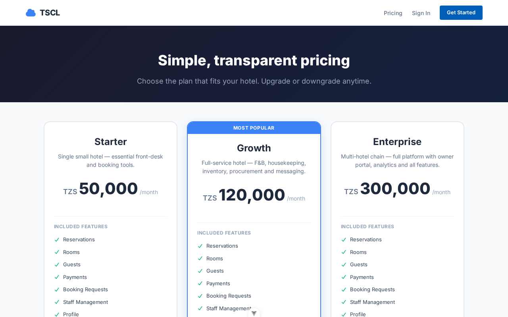
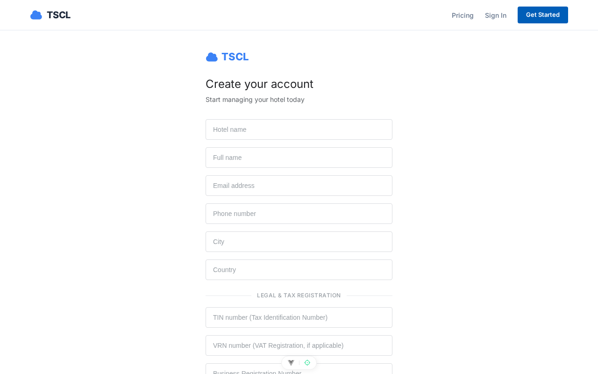
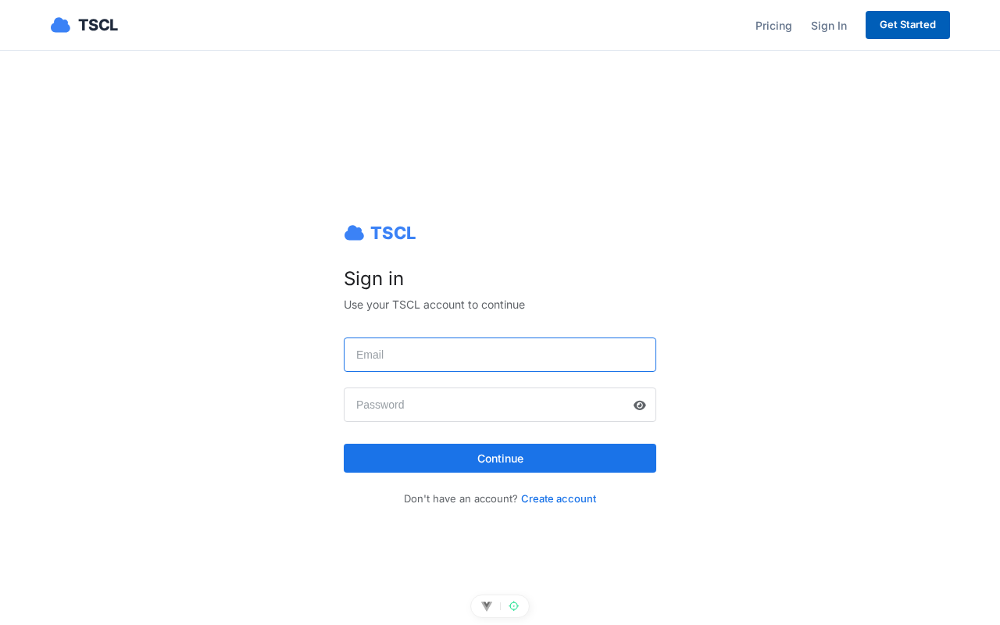
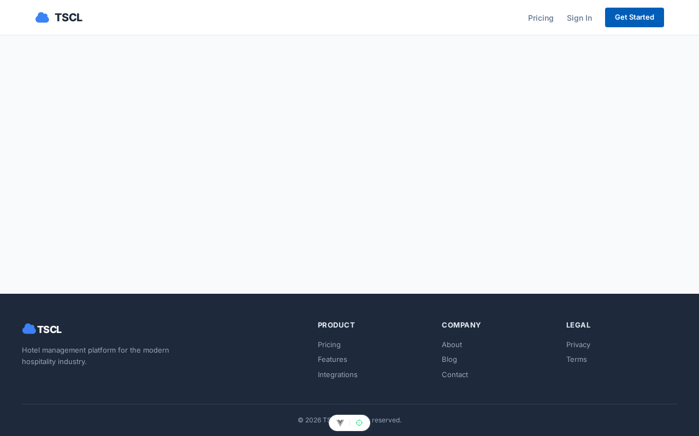

# MRK Hotels — Developer Documentation

**Version 1.6** — code v1.3.0 · 21 August 2026 — Architecture, Setup, Backend, Frontend, Mobile App, SaaS Portal and API Reference

---

## 1. Overview

MRK Hotels is a **multi-tenant hotel management SaaS** built as two applications:

| Application | Stack | Location |
| --- | --- | --- |
| **API backend** | Laravel 13 (PHP 8.3+), Sanctum, spatie/laravel-permission | `mrk-hotels-api` |
| **Web frontend** | Vue 3, Vite, Pinia, Vue Router, vue-i18n, Axios | `mrk-hotels-frontend` |
| **Mobile app** | Laravel 13, NativePHP Mobile 4.2, Blade/Livewire UI | `mrk-hotels-mobile` |

The system has five faces:

1. **Public booking portal** — guests browse hotels, check availability and book rooms online, optionally paying via Selcom, mobile money (ClickPesa) or bank transfer.
2. **Hotel panel (`/app`)** — every hotel runs its own operation: reservations, rooms, guests, payments, housekeeping, food & beverage, laundry, fun & games, inventory, procurement, staff, messaging and reports.
3. **Superadmin panel (`/superadmin`)** — manages all tenants (hotels), approves registrations, toggles per-hotel payment methods, and manages SaaS subscription plans.
4. **Customer self-service portal (`/portal`)** — hotels that sign up via the public pricing page manage their own subscription, payments, staff, and hotel details.
5. **Mobile app** — Android companion app for housekeeping, attendance, and front-desk operations.

**Multi-tenancy** is implemented at the application layer: models carry `tenant_id` and a global scope (`BelongsToTenant`), and a `TenantContext` support class scopes queries for the active hotel.

---

## 2. Requirements

### Backend
- PHP ^8.3 (tested on 8.4)
- Composer
- MySQL / MariaDB (tests use in-memory SQLite)

### Frontend
- Node ^22.18 / >= 24.12
- npm

### Key dependencies
- Backend: `laravel/framework` ^13.0, `laravel/sanctum` ^4.0, `spatie/laravel-permission` ^7.3, **`laravel/reverb` (WebSocket server)**
- Frontend: vue, vue-router, pinia (+ persistedstate), vue-i18n, axios, font-awesome, country-state-city, libphonenumber-js, **`laravel-echo` + `pusher-js` (real-time client)**; Vitest + Playwright for testing

---

## 3. Local Setup

### 3.1 Backend (`mrk-hotels-api`)

```bash
composer install
cp .env.example .env           # set DB_*, SANCTUM_STATEFUL_DOMAINS, CLICKPESA_*, REVERB_* keys
php artisan key:generate
php artisan migrate --seed      # TenantSeeder creates the demo hotel + users + rooms
php artisan serve               # http://localhost:8000
php artisan reverb:start        # realtime WebSocket server (http://localhost:8080)
```

### 3.2 Frontend (`mrk-hotels-frontend`)

```bash
npm install
cp .env.example .env            # VITE_API_URL=http://localhost:8000/api
npm run dev                     # http://localhost:5173
```

### 3.3 Demo data (TenantSeeder)

- Hotel **MRK Grand Hotel** (Dodoma, Tanzania, `subdomain=mrk-grand`, status `active`) with demo tax IDs (`tin=123-456-789`, `vrn=40-012345-6`) and demo payment accounts (M-Pesa + NMB) so invoices render the full formal layout.
- 10 staff users (hotel_admin, manager, accountant, receptionist, procurement_officer, housekeeping, kitchen, waiter, bartender, staff) — all password `password`.
- 7 rooms (single ×2, double, deluxe ×2, suite, presidential).

A superadmin user (`superadmin@mrkhotels.test`) is created elsewhere (permissions seeder) with full access.

---

## 4. Backend Architecture

### 4.1 Authentication (Sanctum)

`App\Http\Controllers\Api\V1\Auth\AuthController::login`:

- Finds the user by email, verifies `password_hash` with `Hash::check`.
- Rejects disabled accounts (403) and inactive tenants (403).
- Handles **password rotation**: if `passwordExpired()`, the password is reset to the default (`defaultPassword()` = full name in caps) and returned with `password_rotated: true` and a 401, prompting the client to re-sign-in.
- Issues a token: `createToken('api-token', $user->isSuperadmin() ? ['*'] : [$user->user_role])` — **abilities are the user's role name**.
- Returns `{ token, user }`.

`AuthController::loginPin` (`POST /api/v1/auth/login-pin`) — iPOS-style quick sign-in for shared staff terminals:

- Accepts `identifier` + `pin` (`digits:4`); the identifier matches the user's `email` **or** `registration_number`.
- Unknown identifiers, unset PINs and wrong PINs all get one generic 401 (`Invalid credentials.`) so the endpoint cannot be used to enumerate staff accounts.
- Applies the same gates as password login (active account, active/pending tenant), updates `last_login`, issues the identical token shape and audit-logs the login.
- PINs live bcrypt-hashed in `users.login_pin` (nullable — `null` disables PIN login for the account) and are hidden from serialization.
- PINs are assigned by senior staff via `UserController@setPin` (`POST /api/v1/users/{id}/set-pin`, level-80 group): validates `pin` + `pin_confirmation` (`digits:4`, `confirmed`), enforces `assertCanManage` on the target's role, rejects self-service with 422 (a profile self-service flow is planned), and audit-logs `pin_set`.

Protected routes use `auth:sanctum`. Token abilities are currently informational; authorization is enforced by the `level:X` and role-permission middleware below.

### 4.2 Authorization middleware

| Middleware | Purpose |
| --- | --- |
| `CheckRoleLevel` (`level:X`) | Rejects users whose `roleLevel()` < X with 403 (superadmin bypasses). E.g. `level:80` = admin/manager only, `level:60` = receptionist+. |
| `RequireSuperadmin` | Superadmin-only routes. |
| `RequireOwner` (`owner`) | Multi-hotel owner routes (`/owner/*`): consolidated dashboard and per-hotel drill-down across the owner's hotels (`tenants.owner_id`). Owner accounts live on the platform tenant; hotel queries bypass global scopes with explicit `tenant_id` filters. |
| `SetTenantContext` (`tenant`) | Resolves the active tenant for the request: superadmin supplies `X-Tenant-ID`; staff use their own `tenant_id`. Sets `TenantContext` for the request lifecycle. |
| `EnsureTenantActive` | Blocks requests for hotels whose tenant status is not active/pending. |

Roles: `superadmin` (100), `owner` (95), `hotel_admin` (90), `manager` (80), … Owners are created by the superadmin (`POST /api/v1/owners`, default password = full name in caps) and assigned to hotels via `PUT /api/v1/tenants/{id}` (`owner_id`). Demo owner: `owner@mrkhotels.test` / `password` (owns MRK Grand, Dar es Salaam and Zanzibar).

### 4.3 Multi-tenancy

- The `BelongsToTenant` model concern adds a `tenant_id` foreign key and a **global scope** that filters queries to the current tenant (when `TenantContext::id()` is set).
- `App\Support\TenantContext` is a static holder set by the `tenant` middleware and cleared in a `finally` block.
- Public portal endpoints operate **without** a tenant context and pass an explicit `hotel_id`/`tenant_id`.

### 4.4 Routing (`routes/api.php`)

All routes are under the `v1` prefix.

**Public group (`/v1/public`)** — no auth:

| Method | URI | Controller action |
| --- | --- | --- |
| GET | `public/hotels` | `PublicController@hotels` — directory search (`search`, `country`, `city`, `guests`, `check_in/out`) |
| GET | `public/hotels/{id}` | `PublicController@hotelShow` |
| GET | `public/availability` | `PublicController@availability` — returns available rooms + `payment_methods` |
| GET | `public/options` | `PublicController@options` |
| POST | `public/booking-requisitions` | `PublicController@storeBookingRequisition` |
| POST | `public/reservations` | `PublicController@storeReservation` — creates **pending** reservations under one `booking_reference` |
| POST | `public/payments/initiate` | `PublicController@initiatePayment` — online payment entry point |
| GET | `public/booking-requisitions/status` | `PublicController@bookingStatus` |

**Public auth:** `POST auth/login`, `POST auth/login-pin`, `POST auth/register` (all throttled by the shared `auth` limiter).

**Payment webhook:** `POST payments/clickpesa/callback` — no auth, used by the ClickPesa sandbox.

**Authenticated group** — `auth:sanctum` + `tenant`:

| Module | Route prefix | Level |
| --- | --- | --- |
| Auth | `auth/logout`, `auth/me`, `auth/change-password` | all |
| Reports | `reports/dashboard`, `overview`, `occupancy`, `revenue`, `room-status`, `audit-logs` | 20 / 80 / 60 / 70 / 60 / 70 |
| Messaging | `messages/users`, `messages/unread-count`, `messages/conversations`, `messages/conversations/{id}`, `.../messages`, `.../send`, `.../read`, `.../delete`, `.../react`, `messages/groups`, `messages/groups/{id}`, `.../messages`, `.../send`, `.../read`, `.../members`, `.../delete`, `.../react`, `messages/statuses`, `messages/calls`, `messages/calls/{id}/actions` **plus the 24 feature endpoints: replies/priority/polls, pin/star, templates, scheduled messages, forwarding, announcements, search, CSV export, translate, escalations, retention policies, notification preferences/DND, shift handovers, room-linked chats, task groups, staff presence (location/nearby), guest SMS bridge, meetings, SOS alerts** | 20+ |
| Users (staff) | `users` CRUD + activate/invite/reset-password/set-pin/attachments | 80 |
| Rooms | `rooms` CRUD + status | 60 |
| Guests | `guests` CRUD | 60 |
| Reservations | `reservations` CRUD + `options` + check-in/check-out/no-show/cancel + `reservations/{id}/payment` | 60 |
| Payments | `payments` + store | 60 |
| Booking requisitions | `booking-requisitions` | 60 |
| Housekeeping | `housekeeping/tasks` + room status | 40 |
| F&B | `menu-items`, `orders` | 30+ |
| Laundry | `laundry-orders` | 40 |
| Fun & games | `fun-game-orders` | 80 |
| Inventory | `inventory` + movements | 50 |
| Suppliers | `suppliers` CRUD | 50 |
| Procurement | `requisitions`, `purchase-orders`, `goods-received-notes` | 50 |
| Tenants | `tenants` CRUD + `payment-methods` | superadmin |
| Superadmin reports | `reports/superadmin/dashboard` | superadmin |

(246 `Route::` definitions total — 97 GET, 113 POST, 15 PUT, 20 DELETE, 1 PATCH.)

### 4.5 Models and relationships

| Model | Key fields / notes |
| --- | --- |
| `Core\Tenant` | `tenant_id` (UUID), `hotel_name`, `subdomain`, `status` (pending/active/suspended), `subscription_*`, tax IDs (`tin`, `vrn`), invoice branding (`signature_path`, `stamp_path` on the public disk), **`payment_methods`/`payment_accounts` (JSON casts)**, `enabledPaymentMethods()`/`publicPaymentMethods()` |
| `Auth\User` | UUID `user_id`, `tenant_id`, `user_role`, `password_hash`, `is_active`, `password_changed_at`; HasApiTokens, HasRoles |
| `Hotel\Room` | `room_number`, `room_type`, `floor`, `price_per_night`, `max_occupancy`, `status` |
| `Hotel\Reservation` | `tenant_id`, `guest_id`, `room_id`, `status`, `booking_reference`, dates, guest snapshot (denormalized `first_name`, `guest_phone`, …) |
| `Hotel\Guest` | guest register, contact + ID info |
| `Finance\Invoice` | `reservation_id`, `invoice_number`, `room_charges`, `service_charges`, `total_amount`, `paid_amount`, `balance`, `line_items`/`payments` (JSON snapshots), `status` (issued/paid) |
| `Finance\Payment` | `reservation_id`, `amount`, `payment_method`, `payment_provider`, `transaction_reference`, `status`, `booking_reference` |
| `System\BookingRequisition` | online/phone booking requests (no room) |
| `Housekeeping\HousekeepingTask`, `Laundry\LaundryOrder`, `Fun\FunGameOrder`, `FoodBeverage\Order`/`OrderItem`/`MenuItem`, `Inventory\InventoryItem`/`StockMovement`/`Supplier`, `Procurement\*` (requisition/PO/GRN + items) | domain records per module |
| `Messaging\Conversation`/`ConversationMessage`, `Messaging\GroupConversation`/`GroupConversationMember`/`GroupConversationMessage` | staff messaging; `conversation_messages` carries `delivered_at`, `type` (text/audio/image/file), `media_path`, `media_mime`, `view_once`, `is_media_seen`, `deleted_for`, `deleted_at`, `priority` (normal/urgent), `reply_to_id` (self-join for replies), `forwarded_from_type`/`forwarded_from_id` (forwarding); group members track `last_read_at` for read receipts; message **reactions** stored as JSON (`reactions` column) |
| `Messaging\PinnedMessage` / `StarredMessage` | one row per pinned/starred message (`message_type` = conversation/group, `message_id`, `user_id`) |
| `Messaging\Poll` / `PollOption` / `PollVote` | `message_type` + `message_id` polymorphic polls; one vote per user per option |
| `Messaging\MessageTemplate` | reusable message snippets (`name`, `body`, `category`, `is_global`) |
| `Messaging\ScheduledMessage` | future-dated send (`recipient_type` = conversation/group, `recipient_id`, `send_at`, `recurrence`) — dispatched by the `messaging:send-scheduled` command |
| `Messaging\Announcement` / `AnnouncementAcknowledgement` | tenant-wide broadcast with per-user read acknowledgements |
| `Messaging\MessageEscalation` | raise a message to management (`message_type`, `message_id`, `escalated_by`, `handled_by`/`handled_at`) |
| `Messaging\RetentionPolicy` | `scope` (global/conversation/group), `days`, `enabled` — drives the `messaging:purge-expired` command |
| `Messaging\NotificationPreference` | per-chat mute + **DND window** (`dnd_from`/`dnd_to`), `muted_until`/`muted`, `push_enabled`, `scope`/`target_id` polymorphic |
| `Messaging\ShiftHandover` | shift change notes (`shift_from`/`shift_to` timestamps, `status`, `ack_user_id`/`ack_at`) |
| `Messaging\ConversationRoom` | links a chat (`conversation_id` **or** `group_id`) to a `Hotel\Room` |
| `Messaging\StaffLocation` | staff presence (`zone`, `floor`) with `updated_at` recency for the nearby lookup |
| `Messaging\GuestMessage` | outbound SMS bridge to guests (`phone`, `provider`, `provider_status`, `template_id`, `direction`) |
| `Messaging\Meeting` / `MeetingInvitee` | scheduled meetings (`start_at`, `duration_minutes`, `conference_type`, `status`) with per-invitee responses |
| `Messaging\SosAlert` | emergency alert (`message`, `status`, `ack_count`, `ack_user_ids`, `resolved_by`/`resolved_at`); a `staff.location.updated` broadcast powers the nearby panel |
| `Social\Status`, `Social\StatusView`, `Social\StatusReaction` | 24-hour status posts (`type`: text/photo/video), media under `statuses/{id}`; `status_views` dedupe views per user; `status_reactions` holds emoji likes on statuses |
| `Communication\Call`, `Communication\CallEvent` | WebRTC calls: `type` (audio/video), `initiator_id`, `recipient_id`, `channel` (1:1 room name), `status` (ringing/active/missed/ended/rejected/declined), `ring_started_at`/`accepted_at`/`ended_at`; `call_events` logs ring/accept/end/mute events with timestamps |

### 4.6 Services

| Service | Responsibility |
| --- | --- |
| `Hotel\ReservationService` | Room availability check, room totals (with optional ClickPesa service fee), reservation lifecycle (create, check-in/out, no-show, cancel). |
| `Finance\PaymentService` | Record payments, `initiatePublicPayment` (selcom → completed + confirms booking; bank → awaiting_confirmation; mobile money → ClickPesa prompt), confirm sibling reservations by `booking_reference`. |
| `Finance\InvoiceService` | `generateForReservation` builds/refreshes the folio invoice (room + non-cancelled F&B/laundry charges minus completed payments, frozen into JSON snapshots; regenerating keeps the invoice number). `pdf()` renders `pdf.invoice` via dompdf with the MRK logo, tenant branding (signature/stamp), TIN/VRN, VAT-inclusive 18% breakdown, payment terms and "how to pay" lines — images embedded as data URIs. |
| `Inventory\InventoryService` | Stock adjustments and movements. |
| `System\AuditService` | Audit trail for logins and key actions. |
| `Messaging\ConversationController` / `GroupConversationController` | Delivery/read ticks: mark messages `delivered_at` on poll (index/show/messages), mark `read_at` on `markRead`; media upload (public disk, ≤ 10 MB, stored under `messages/conversations/{id}` / `messages/groups/{id}`, `type` inferred from MIME); group `read_by_count` computed in `GroupMessageResource`; **delete** (`delete_for` = me/everyone), **reactions** (emoji toggle), **view-once** media (media URL served once, then `is_media_seen`); **replies** (`reply_to_id` — `ReplySent` broadcasts the full reply resource), **priority** (`normal`/`urgent`), **polls** (`poll` payload: `question`, `multiple`, `options[]`) |
| Messaging feature controllers | `PinStarController` (pin/unpin/star/unstar + `pinned`/`starred` lists, broadcasts `MessagePinned`/`MessageUnpinned`/`MessageStarred`/`MessageUnstarred`), `PollController` (vote once per user; broadcasts `PollCreated`/`PollVoted` with live tallies), `MessageTemplateController` (CRUD, optional `category`), `ScheduledMessageController` (index/store/cancel), `AnnouncementController` (post + per-user acknowledge; broadcasts `AnnouncementPosted`/`AnnouncementAcknowledged` on the tenant channel), `SearchController` (keyword search across chats the caller can access, `ConversationMessage` + `GroupConversationMessage`), `ExportController` (CSV export of a conversation/group history), `TranslateController` (offline EN↔SW glossary `TranslateService`, no external API), `EscalationController` (raise + resolve; broadcasts `MessageEscalated`; auto-escalation of urgent unread messages via the `messaging:escalate` command (default unread threshold 10 minutes)), `RetentionPolicyController` (CRUD + `messaging:purge-expired` command soft-deletes expired messages), `NotificationPreferenceController` (per-chat mute + DND + push), `ShiftHandoverController` (post + acknowledge; broadcasts `ShiftHandoverPosted`/`ShiftHandoverAcknowledged`), `RoomLinkController` (`searchRooms`/`link`/`unlink`/`index` — links a chat to a hotel room), `TaskGroupController` (store + `convert` a room-linked message into a `HousekeepingTask`; broadcasts `TaskConverted`), `StaffLocationController` (update zone/floor + nearby query; broadcasts `StaffLocationUpdated`), `GuestMessageController` (outbound SMS bridge, tenant-scoped), `MeetingController` (`searchUsers`, schedule + invitees respond; broadcasts `MeetingInvited`/`MeetingResponseChanged` on the user channel), `SosController` (initiate/acknowledge/resolve; broadcasts `SosAlertInitiated`/`SosAlertResolved`), `ForwardController` (copy a message into another conversation/group with `forwarded_from_*` provenance; validates access on source and target). |
| Console commands | `messaging:send-scheduled` (queued sends due at `send_at`), `messaging:purge-expired` (retention + scheduled `cancelled_at` cleanup), `messaging:escalate` (auto-escalate urgent messages unread past a threshold). |
| `Social\StatusController` | Post (text/photo/video), list/feed (own + others, auto-expires after 24 h), view/like. Broadcasts `StatusPosted` to the tenant channel so conversations show live status rings. |
| `Communication\CallController` | WebRTC call lifecycle: `start` (creates Call + rings via `CallStarted` broadcast), `accept`, `reject`, `decline` (busy), `end`, `miss` (timeout), plus a `ping` event for live ring/ringing state. |
| Realtime events | `MessageSent` (body/media/type/view_once/priority/reply), `MessageRead`, `MessageDeleted` (includes `channel_id`), `MessageReacted`, `ReplySent`, `MessagePinned`/`MessageUnpinned`, `MessageStarred`/`MessageUnstarred`, `PollCreated`, `PollVoted`, `TaskConverted`, `AnnouncementPosted`, `AnnouncementAcknowledged`, `SosAlertInitiated`, `SosAlertResolved`, `ShiftHandoverPosted`, `ShiftHandoverAcknowledged`, `StaffLocationUpdated`, `GuestMessagePosted`, `MessageEscalated`, `MeetingInvited`, `MeetingResponseChanged`, `StatusPosted`, `CallStarted`, `CallEvent`, `MemberJoined`/`MemberLeft` — all on private channels (`private-users.{id}`, `private-tenants.{tenant_id}`, `private-conversation.{id}`, `private-group.{id}`) via Reverb. Presence join/leave is handled by Reverb itself on `presence-online.all` (every user) and `presence-online.{tenant_id}` (tenant members) — no app event needed. |

### 4.7 Support classes

- `PaymentOptions` — methods (`cash`, `mobile_money`, `bank`, `selcom`, `card`), `ONLINE_METHODS` (`selcom`, `mobile_money`, `bank`), providers (mobile money: `airtel_money`, `mixx_by_yas`, `halopesa`, `mpesa`; bank: `crdb`, `nmb`, `nbc`, `other`), statuses (`pending`, `awaiting_confirmation`, `completed`, `failed`, `refunded`), and helpers (`defaultMethods()` excludes selcom, `requiresProvider`, `requiresConfirmation`, `initialStatus`, `label()` for document rendering).
- `BookingOptions` — booking types (single, couple, family, group), room types, ID types, booking sources, guest defaults, `resolveStay()` for nights/departure.
- `NumberGenerator` — per-tenant sequential numbers: `prNumber`, `poNumber`, `grnNumber`, `orderNumber`, `requisitionNumber`, **`bookingReference` (`BK-…`)**, `staffNumber`, `laundryNumber`, `funGameNumber`, `transactionReference`, `clickPesaReference`, `inviteToken`, `tempPassword`.
- `TenantContext` — static tenant id holder.
- Module options: `HousekeepingOptions`, `LaundryOptions`, `FunGameOptions`, `OrderOptions`, `StaffOptions`.

### 4.8 Public booking & payment flow

1. `GET public/availability?hotel_id&check_in&check_out&booking_type` returns available rooms **and** the hotel's enabled `payment_methods`.
2. `POST public/reservations` validates the guest + booking (including `booking_date` after today and before check-in). With `room_selections`, one **pending** `Reservation` is created per room under a shared `booking_reference` (`BK-…`); the response carries `booking_reference` and `total_amount` (room rate × nights + ClickPesa service fee when online). Without rooms it creates a booking requisition.
3. `POST public/payments/initiate` with `booking_reference`, `amount`, `payment_method`, `payment_provider`, `phone`:
   - **selcom** → payment `completed`, all same-reference pending reservations confirmed.
   - **bank** → payment `awaiting_confirmation`; hotel confirms later.
   - **mobile_money** → ClickPesa prompt via `phone`; the `payments/clickpesa/callback` webhook completes the payment and confirms the booking.

### 4.9 Migrations & seeders

- ~68 migrations cover tenants, users (incl. `add_login_pin_to_users_table` — the nullable, hashed 4-digit `users.login_pin` powering PIN sign-in), permissions, rooms, guests, reservations, payments, booking requisitions, housekeeping, F&B, laundry, fun & games, inventory, procurement, staff invitations/attachments, audit logs, **messages (reactions/view-once/delete fields), statuses (`statuses`/`status_views`/`status_reactions`), calls (`calls`/`call_events`)** plus the messaging feature set: `pin_star_templates_scheduled_tables` (pinned/starred/templates/scheduled), `polls_announcements_tables` (polls/poll_options/poll_votes/announcements + acknowledgements), `preferences_retention_escalation_handover_tables` (notification preferences, retention policies, escalations, handovers), `task_groups_staff_locations_guest_messages` (conversation_rooms, task_groups, staff_locations, guest_messages), `meetings_sos_tables` (meetings, meeting_invitees, sos_alerts + `ack_user_ids`), and **attendance anti-cheat**: `add_attendance_audit_columns_to_staff_attendance_table` (`lat`, `lng`, `accuracy_m`, `qr_verified_at`, `ip_address`, `user_agent`, `photo_path`), `add_attendance_settings_to_tenants_table` (`attendance_office_lat`, `attendance_office_lng`, `attendance_radius_m`, `attendance_require_qr`, `attendance_require_photo`, `attendance_shift_start`, `attendance_shift_end`, `attendance_late_grace_minutes`, `attendance_absent_after_minutes`, `attendance_early_leave_grace_minutes`), `create_attendance_qr_tokens_table`, `create_attendance_devices_table`, `create_attendance_penalties_table`, `create_attendance_absence_requests_table`, `create_attendance_absence_attachments_table`, and `add_attendance_anti_cheat_columns` (`attendance_devices.secret_hash`, `attendance_devices.trust_score`, `attendance_qr_tokens.used_device_ids`, `staff_attendance.photo_hash`).
- `TenantSeeder` seeds the demo tenant; `RolePermissionSeeder` sets up roles/permissions.

#### 4.9.1 Database schema ERD

The full relational diagram (all 67 tables, columns, primary/foreign keys and crow's-foot relationships) is available as a poster-size document:

- **`MRK_Hotels_Database_Schema_ERD.pdf`** — a single page printed at `8578 × 2794 mm` (way larger than A4, about 7 A0 sheets side by side) with a large 36 px font, so every table name, column and relationship is legible. Exported from the live schema served by **Laravel Truss** at `http://localhost:8000/truss` (`GET /truss/export/mermaid`), rendered with **Mermaid** (36 px font, blue `#005EB8` accent theme) and printed to a **vector PDF** via WeasyPrint.
- Preview of the same diagram, scaled to fit:


### 4.10 Testing

- `phpunit.xml` uses in-memory SQLite (`:memory:`) for tests.
- Base `Tests\TestCase` with `RefreshDatabase`.
- Feature tests include `tests/Feature/PublicBookingPaymentFlowTest.php` (7 tests: availability methods, selcom default-off, pending booking creation, selcom confirms, bank awaiting-confirmation, selcom rejected when disabled, multi-room shared reference + batch confirm), `tests/Feature/ConversationTest.php` (direct messaging: scoping, resumes, unread counts, polling, delivery/read ticks, audio upload), `tests/Feature/GroupConversationTest.php` (11 tests: hotel/global groups, member guards, read receipts, media, add/remove/leave, unread badge feed), `tests/Feature/MessagingFeaturesTest.php` (**20 tests** covering the 24-feature set: replies + priority + polls, poll voting, pin/star, templates, scheduled messages, announcements + acknowledge, escalation + resolve, command auto-escalation, search, CSV export, translate, task-group conversion, meetings + responses, SOS flow, staff location/nearby, guest SMS, retention purge, **forwarding (incl. cross-chat access block), room search, meeting-invitee search**), `tests/Feature/OverviewPaginationTest.php` (3 tests: staff/in-house/housekeeping section filtering + pagination), `tests/Feature/InvoiceTest.php` (folio totals, regeneration keeps number and settles, PDF download, front-desk level, tenant scoping), `tests/Feature/PublicInvoiceDownloadTest.php` (reference + any phone spelling, wrong phone 404, pending reservation has no invoice, group booking, rate limit), `tests/Feature/TenantTest.php` (payment accounts, tax IDs, branding upload/removal), `tests/Feature/RateLimitTest.php` (3 tests: login per-IP/per-email, public portal writes per-IP, messaging per-user), `tests/Feature/StaffPinLoginTest.php` (13 tests: PIN login by email and by registration number, wrong/unset/unknown-identifier rejections, disabled accounts, 4-digit validation, and the set-pin guards — role hierarchy, no self-service, confirmation required), and `tests/Feature/AttendanceTest.php` (**15 tests**: clock-in/out, double clock-in refused, clock-out without shift refused, location + request metadata capture, location required when office configured, inside/outside geofence, manager QR issue, QR-required refusal without token, valid + expired token paths, requirements reflect policy, admin settings update, QR cannot be enabled without an office, who-is-on-shift).
- Messaging tests broadcast to the local Reverb server — run `php artisan reverb:start` (or set `BROADCAST_CONNECTION=null` and avoid the broadcast calls) for the full suite to stay green.
- Run: `php artisan test` (currently **199 passing, 676 assertions**).

### 4.11 Realtime (Reverb + Echo)

- **Server:** `laravel/reverb` runs a standalone WebSocket server (`php artisan reverb:start`, default `ws://localhost:8080`). Configure `REVERB_APP_ID`, `REVERB_APP_KEY`, `REVERB_APP_SECRET`, `REVERB_HOST`/`REVERB_PORT` and the public/private ports in `.env`.
- **Client:** the SPA connects with `laravel-echo` (`pusher-js` transport) against `REVERB_*` config, authenticated via the Sanctum bearer token (channel auth goes through `/broadcasting/auth`).
- **Channels:** per-user private channel `private-users.{user_id}` (incoming messages, meeting invites, SOS rings), per-tenant `private-tenants.{tenant_id}` (announcements, SOS, handovers, guest messages, staff locations, escalations) and per-thread `private-conversation.{id}` / `private-group.{id}` (message, reply, pin/star, poll and task-convert events scoped to the open thread). Online state rides a **presence channel** — the global `presence-online.all` (joined by `echo.join('online.all')`, member payload `user_id` + `full_name` + `tenant_id` + `hotel_name`) plus each hotel's `presence-online.{tenant_id}` (member payload `user_id` + `full_name`): every open app tab registers with Reverb, so peers see who is online right now (`here`/`joining`/`leaving`) without polling.
- **Security:** private channels are authorised by `BroadcastChannel::check` — a user may only subscribe to their own user channel and to channels of tenants they belong to. The presence callbacks publish no sensitive payload (just `user_id`, `full_name` and — on the global channel — the public `tenant_id`/`hotel_name`); the tenant channel only admits members of the given tenant. Sensitive payloads (view-once media, call signaling data) never travel on public channels.

### 4.12 Rate limiting

Defined as named limiters in `AppServiceProvider::boot()` and applied in `routes/api.php`:

| Limiter | Key | Budget | Applied to |
| --- | --- | --- | --- |
| `api` | user `user_id` (authed) / IP (guest) | 120 / min (authed), 30 / min (guest) | whole authenticated group (`auth:sanctum` → `tenant` → `throttle:api`) and `/broadcasting/auth` |
| `auth` | IP + email (or the PIN-login `identifier`) | 5 / min | `auth/login`, `auth/login-pin`, `auth/register` — blocks credential stuffing; both sign-in forms share one budget |
| `public` | IP | 10 / min | portal writes & lookups: `public/booking-requisitions`, `public/reservations`, `public/payments/initiate`, `public/booking-requisitions/status`, `public/invoices/download` |
| `messaging` | user `user_id` | 30 / min | messages, groups, reactions, statuses, calls (`level:20` group) |
| `webhook` | IP | 60 / min | `payments/clickpesa/callback` (server-to-server; generous to avoid breaking payment verification) |

Violations return `429 Too Many Requests` with the standard Laravel JSON body (`Retry-After` included). Counter storage uses the configured cache store (database by default); flush `cache` in tests to keep rate-limit tests isolated.

### 4.13 Attendance anti-cheat (geofence + QR + device binding)

`StaffAttendanceController` enforces the hotel's attendance policy from `tenants.attendance_office_lat`, `attendance_office_lng`, `attendance_radius_m`, `attendance_require_qr`, `attendance_require_photo` and the discipline-policy columns (shift window + tolerances). All defaults are **off** — unconfigured hotels behave as before:

- **Office location** — when lat/lng are set, `clock-in` (and best-effort `clock-out`) requires a `lat`/`lng` (`accuracy_m` optional) and the point must fall within the geofence radius (haversine via `AttendanceService::distanceToOffice()`); outside or missing → `422 You must be at the office to clock in.` A successful fix stamps `positioned_at`.
- **GPS hardening** — `AttendanceService::normalizePositionedAt()` is authoritative for time: a missing, future or more than `positioned_at_max_skew_seconds` (default 300 s) off client timestamp is replaced with the server clock and the record is flagged `clock_skew`. Two fixes closer in time than `max_plausible_kmh` (default 180 km/h) allows are physically impossible, so the later record is flagged `gps_teleport` (see `impliesTeleport()`).
- **Entrance QR** — when `attendance_require_qr` is on (only valid once the office is configured; the settings validator refuses QR without a location), `clock-in` also needs a `qr_token` issued by a manager/level-80+ (`POST attendance/qr-token`, 60-second TTL, single-use — consumed on successful clock-in, stored in `attendance_qr_tokens`). Missing/expired/reused token → `422 Scan the office QR code to clock in.` A token is additionally bound to the presenting `device_id`: `attendance_qr_tokens.used_device_ids` records which device already consumed it, so a scanned code cannot be replayed by the same phone across many clock-ins. A successful `clock-in` stamps `qr_verified_at`.
- **Device binding** — each phone/browser registers a stable `device_id` plus a server-issued `device_secret` (hashed into `attendance_devices.secret_hash`; the plaintext secret is returned exactly once at `POST attendance/devices/register`). Policy values (`attendance.device.policy`): `off` (ids recorded, never enforced), `auto_register` (default — first clock-in registers the device; new devices on an account are flagged, not refused), `strict` (clock-in refused until the device is registered to that account, and a device bound to another staff member is always refused). `resolveDevice()` runs *before* the QR is consumed so a failed check never wastes an entrance code. `trust_score` bumps on every verified clock-in; revoking a device (admin `POST attendance/devices/{id}/revoke`) marks it `revoked_at` and its future clock-ins are refused/flagged.
- **Clock-in selfie** — when `attendance_require_photo` is on, `clock-in` requires a `photo` upload (`422 A clock-in selfie is required.`). Photos are stored on a **private disk** (default `local`, `attendance/photos`, max 3 MB) and are served **only** through the authenticated, audited blob endpoints `GET attendance/photos/{attendanceId}` and `GET attendance/attachments/{attachmentId}` (both log `AuditService::log('other', ...)` with an `entity_type` distinguishing the pod) — never via public URLs. The SHA-256 is kept in `staff_attendance.photo_hash`.
- **Suspicion detection** — each clock-in is scored by `AttendanceService::detectSuspicion()` and `detectPhotoSuspicion()`, producing a `suspicion_reasons` array of stable reason codes: `outside_allowed_area`, `shared_device` (another user clocked in from this device inside the 10-minute window — the "colleague clocked me in" hand-off, which also flags the peer via `flagSharedDevicePeers()`), `revoked_device`, `too_many_devices` (over `max_per_user`, default 3), `gps_teleport`, `clock_skew`, `selfie_reused` (byte-identical to a past selfie or the profile picture), `selfie_no_camera_exif`, `selfie_edited`. Flagged records surface on `GET attendance/suspicious` for manager review.
- **Absence claims** — staff file claims (`POST attendance/absences`, with optional evidence attachments and a `device_id`); managers approve/reject via `POST attendance/absences/{requestId}/decide`. All evidence uploads are hashed and stored on the private disk.
- **Discipline policy & penalties** — managers configure the shift window and tolerances via `PUT attendance/policy` (`shift_start`, `shift_end`, `late_grace_minutes`, `absent_after_minutes`, `early_leave_grace_minutes`). Auto-detected offenses (`late_arrival`, `early_departure`, `absence`) plus manual ones (`no_show`, `other`) land in `attendance_penalties` as `pending` system offenses; the manager applies or dismisses each via `POST attendance/penalties/{id}/decide`. The vocabulary (offense types, `minor|major|critical` severities, default points, `verbal_warning|written_warning|fine|suspension|termination` actions) is centralised in `App\Support\PenaltyOptions`.
- **Scheduled commands** — `attendance:scan-no-shows` runs hourly and flags staff with no clock-in on a shift day (no approved absence claim, no existing offense) as `absence` offenses; `attendance:verify-evidence` runs daily and re-hashes every stored selfie/attachment, flagging `evidence_missing` / `evidence_tampered`.
- **Audit** — every clock-in/out records `lat`, `lng`, `accuracy_m`, `ip_address` and `user_agent` on the `staff_attendance` row; every clock-in/out, device registration, QR mint and penalty/absence decision is audit-logged.
- **Rate limiting** — all attendance *writes* (clock-in/out, device register/revoke, QR mint, absence claims, penalty decisions) go through the `attendance` limiter (8 per minute per user, registered in `AppServiceProvider`), so the anti-cheat endpoints cannot be sprayed with spoofed events.
- **Flow** — the staff SPA calls `attendanceApi.requirements()` on the Profile page (returns `office_configured`, `requires_location`, `requires_qr`, `qr_ttl_seconds`, `requires_photo`, `device_policy`, `device_registered`), geolocates, registers the device if needed (`src/utils/device.js` persists `mrk_attendance_device_secret` in localStorage and submits it with clock-in), captures a selfie when required, then (when enabled) surfaces the generated QR (issued per user, rotates every 60 s with a `refreshToken`) in a scan-the-office-phone dialog; the scan is decoded with `jsqr` and passed as `qr_token`. `POST attendance/qr-token` is rate-limited per user and never returns tokens for the same user (no self-issue); it also refuses to mint when the policy isn't enabled.

---

## 5. Frontend Architecture

### 5.1 Project layout

```
src/
  api/          axios instance + endpoint groups (index.js)
  components/   PhoneInput, CountryCitySelect, StayDates, PaymentMethodSelect, ChangePasswordForm, ModulePlaceholder
  composables/  useCallManager.js (WebRTC + call ring), useConversation.js, useBroadcast.js,
                useHoliday.js (holiday logo decorations), usePresence.js (online-status presence)
  config/       modules.js — role access matrix
  layouts/      StoreLayout (public + hotel panel), SuperadminLayout
  locales/      i18n.js + en.json + sw.json
  pages/        public/, auth/, dashboards/, reservations/, rooms/, guests/, payments/, booking/,
                housekeeping/, orders/, menu/, laundry/, fungames/, inventory/, suppliers/,
                procurement/, staff/, reports/, overview/, superadmin/, profile/,
                messages/, statuses/
  plugins/      echo.js — laravel-echo (Reverb) lazy singleton
  router/       index.js — routes + guards
  stores/       auth.js (Pinia, persisted token), session.js (idle watchdog)
  utils/        dates.js, locations.js, payments.js, phone.js
  main.js
```

### 5.2 API layer (`src/api`)

- `axios.js`: baseURL from `VITE_API_URL` (default `http://localhost:8000/api`); adds `Authorization: Bearer <auth_token>` from sessionStorage; flattens Laravel pagination (`data.data` + `meta` → top-level); on 401 clears the token and hard-redirects to `/login`.
 - `index.js` exposes typed endpoint groups under `/v1`: `publicApi`, `authApi`, `reportApi`, `userApi`, `roomApi`, `guestApi`, `reservationApi`, `paymentApi`, `housekeepingApi`, `inventoryApi`, `supplierApi`, `menuItemApi`, `orderApi`, `laundryApi`, `funGameApi`, `purchaseRequisitionApi`, `purchaseOrderApi`, `goodsReceivedNoteApi`, `bookingRequisitionApi`, `tenantApi`, `superadminReportApi`, `conversationApi`, `groupApi`, **`messageActionApi`** (react/delete/view-once), **`statusApi`** (post/list/view/like), **`callApi`** (start/accept/reject/decline/end/miss), **`featuresApi`** (reply/pin/star/polls/templates/scheduled/announcements/search/export/translate/escalate/retention/preferences/handovers/guest SMS/nearby/SOS/forward), **`roomLinkApi`** (index/searchRooms/link/unlink), **`taskGroupApi`** (store/convert), **`meetingApi`** (index/store/respond/searchUsers), **`sosApi`** (index/initiate/acknowledge/resolve), **`attendanceApi`** (clock-in/clock-out/status/requirements/qr-token/on-shift/history/settings/policy/register/penalties/devices register·mine·all·revoke/suspicious/absences report·mine·all·decide/photo·attachment blob).
- `plugins/echo.js` sets up the `laravel-echo` instance from `VITE_REVERB_*` env vars, authorises private channels through the SPA's `axios` auth headers, and exports the lazy `echo` singleton for the broadcast composables.
- `usePresence.js` joins `echo.join('online.all')` (global, every user) and `echo.join('online.{tenant_id}')` (own hotel) — module singleton, self-healing across Echo rebuilds — keeps two reactive sets of peer `user_id`s from `here`/`joining`/`leaving` and exposes `isOnline(userId)`; wired globally from `StoreLayout` so the indicator is accurate across all pages (§6.13.18, Online status).
- PIN sign-in: `authApi.loginPin({ identifier, pin })` mirrors `authApi.login` (same response shape); `userApi.setPin(id, { pin, pin_confirmation })` lets admins/managers assign staff login PINs from the Staff page.
- `reportApi.overview(params)` sends per-section filters/pagination (`staff_search`, `role`, `status`, `in_house_search`, `upcoming_search`, `housekeeping_status`, `page`); nested sections return raw `{ data, links, meta }` (the interceptor only flattens top-level pagination).

### 5.3 Routing & access control

- Three areas: public portal (`/`, `/hotels/:id`, `/booking`), hotel panel (`/app/*`), superadmin (`/superadmin/*`).
- `router.beforeEach`: requires `auth_token` (sessionStorage) for `requiresAuth`; guest routes bounce signed-in users to their dashboard; fetches `/me` before role/module checks; enforces `role` meta and module access via `canAccess`.
- Access matrix (`src/config/modules.js`): explicit role allow-lists per module with optional extra `permission` gate. Empty `roles` = everyone (dashboard, profile). Superadmin bypasses all lists.

### 5.4 Stores (Pinia)

- `auth.js`: `token` (stored in sessionStorage — survives a refresh, dies with the tab; credentials left in localStorage by older builds are cleared once), `user`, `permissions`, `mustChangePassword`; `ROLE_LEVELS`; helpers `can()`, `hasPermission()`, `canAccess()`; actions `login`, `loginPin` (identical session handling to `login`, used by the PIN keypad mode), `logout`, `fetchProfile`, `changePassword`.
- `session.js`: **5-minute idle timeout**; hiding the tab (tab switch/minimise) logs out **immediately** — `visibilitychange` → `terminate()`; a refresh keeps the session (the token lives in sessionStorage, so a closed tab always returns to login) and restarts the idle countdown; activity listeners; auto-logout → login page. `App.vue` re-arms the timer on boot when a stored token exists; a fresh login arms it from `LoginPage`.
- `messages.js` (Pinia): conversations + groups merged into one feed, unread counts, active thread state; subscribes to `MessageSent`/`MessageRead`/`MessageDeleted`/`MessageReacted` via Echo to update the UI live.

### 5.5 i18n

- `vue-i18n` v11; locale files `en.json` and `sw.json`; default locale from `localStorage`, toggle button in the top bar (`EN`/`SW`).
- Always translate UI strings via `$t('section.key')`; add new keys to **both** files.

### 5.6 Key components

| Component | Purpose |
| --- | --- |
| `PhoneInput` | Phone input with country-code select, format via libphonenumber-js; emits `update:modelValue` + `update:countryCode`. |
| `CountryCitySelect` | Cascading country/city pickers (country-state-city); emits `update:countryCode`, `update:country`, `update:city`. |
| `StayDates` | Arrival/departure/days inputs; keeps departure & day count in sync. |
| `PaymentMethodSelect` | Method + provider select with contextual notices (selcom auto-pay, mobile-money confirmation). |
| `BookingStatusTracker` | Public booking status lookup card (reference + phone). |
| `InvoiceDownloadCard` | Public guest self-service invoice download (reference + phone) via `publicApi.invoiceDownload`; saves the blob with the server-provided filename (`saveBlob` util). |
| `ChangePasswordForm` | Change-password form. |
| `ModulePlaceholder` | Generic "under construction" page for unimplemented modules. |
| `ConversationItem` / `MessageBubble` | Conversation row (avatar, last message, unread badge, **online/status ring**) and message bubble (ticks, media thumbnail, **reactions row**, long-press/hover context menu for delete / view-once toggle). |
| `ViewOnceMedia` | View-once image/video: covers the media, exposes `media_url` exactly once, then marks `is_media_seen` via `messageActionApi`. |
| `ReactionPicker` | Emoji picker used to react to a message (toggles on/off). |
| `StatusRing` | Avatar ring showing a colleague has an active status; navigates to the Statuses page. |
| `StatusItem` | A single 24-hour status (photo/video/text) with viewer + reaction counts. |
| `CallIncomingOverlay` | Full-screen incoming-call modal (audio/video) with accept/reject; uses `useCallManager`. |
| `AttendanceQrScanner` | Attendance clock-in flow on the Profile page: geolocates the user, checks `attendanceApi.requirements()`, renders the rotating per-user office QR (drawn with the `qrcode` lib, refreshes every 60 s), opens `getUserMedia` camera preview and decodes scans with `jsqr` (`qr_token`), then calls `clock-in`. Also contains the manager's "issue token" action and the admin's attendance-settings form (office marker/radius/QR toggle). Selfie capture (when `requires_photo`) uses `AttendanceSelfieCapture`; evidence blobs are opened via `attendanceApi.photo()`/`attachment()` + `URL.createObjectURL`. |

**Key pages:** `pages/messages/` (conversation list + thread composer with replies, priority, polls, templates, scheduled send, forwarding, pin/star, translate, search, export, mute/DND, room-link + task groups, and the **Workspace panel** with Announcements / Meetings / Handovers / Guest SMS / Nearby Staff / Escalations / SOS / Scheduled / Starred / Retention tabs + the floating SOS button), `pages/statuses/` (my status + status feed), `pages/calls/` for call history (missed/active logs).

**Composables:** `useBroadcast` (subscribes to Echo private channels), `useConversation` (thread loading, sending, polling fallback), `useCallManager` (peer connection, `getUserMedia`, ring/answer/end signaling over `CallEvent` broadcasts).

**Mobile tables:** list tables are wrapped in `<div class="table-scroll">` (`overflow-x: auto`) so only the table scrolls horizontally on small screens; `html`/`body` both have `overflow-x: hidden` and page-level horizontal scrolling should never appear.

### 5.7 Utilities

- `dates.js` — `todayISO()`, `addDays()`, `daysBetween()`.
- `payments.js` — method/provider constants, `isAutoPaid()`, `requiresConfirmation()`, `requiresProvider()`.
- `locations.js` — country/city lists, `getCountryName()`, `findCountryCode()`.
- `phone.js` — `normalizePhoneNumber()`.

### 5.8 Frontend testing

- Vitest unit tests in `src/__tests__/`.
- Playwright e2e specs in `e2e/` (`login.spec.js`, `modules.spec.js`, `vue.spec.js`).
- Scripts: `npm run build`, `npm run lint` (eslint), `npm run format` (oxfmt), `npm test`.

---

## 6. Request Lifecycle

This section is your route map for debugging. Every request — from the moment a user clicks in the browser to the
moment the response updates the screen — passes through the same spine of files in **both** codebases. Each hop
below names the exact files involved, what they do, and what to look at when that hop fails. Use the worked
examples in §6.12, the per-feature catalog in §6.13, and the runbook in §6.14 when something breaks.

### 6.1 The loop in one picture

Every request (except webhooks and realtime events, which start from the server side) follows this spine:

```
FRONTEND (mrk-hotels-frontend)                        BACKEND (mrk-hotels-api)
───────────────────────────────────────────────       ────────────────────────────────────────────────────
user click  →  Page.vue / component / store            public/index.php  →  bootstrap/app.php
                  │                                        (middleware aliases, rate limiters, CORS)
                  ▼                                        │
              src/api/index.js                            ▼
              (endpoint group fn)                     routes/api.php   →  route matched
                  │                                        │
                  ▼                                        ▼
              src/api/axios.js                     middleware chain:
              (single funnel: token,              tenant → level:N / operate / superadmin / owner
               pagination flatten, 401)                │
                  │                                    ▼
                  └──► HTTP (Bearer token) ──────► Controller@method  →  Service  →  Model  →  DB
                                                      │ (validate inline)      │ (TenantContext)
                                                      │                        ▼
                                                      ▼                       DB query / write
                                                  Resource / json() ◄─── result
                  ◄─────────────────────────────────── HTTP response ───────────┘
                  ▼
              axios.js response interceptor
              (flatten pagination, 401 → /login)
                  │
                  ▼
              store / page updates → UI + toast (i18n)     and  Echo/Reverb pushes live updates to other clients
```

Webhooks (STAAH, ClickPesa) and the scheduled commands (SMS reminders, STAAH push) **bypass the frontend entirely**;
they enter at `routes/api.php` (or `routes/console.php`) — see §6.12.4 and §6.12.5.

### 6.2 Hop 0 — Frontend: where a request is born

Four kinds of frontend files fire requests. All of them call a function from `src/api/index.js`, which funnels
through `src/api/axios.js` (§6.3).

**Pages** (`src/pages/**` — every page and the API groups it calls):

| Page file | API groups used |
| --- | --- |
| `public/HotelDirectoryPage.vue` | `publicApi` |
| `public/HotelDetailPage.vue` | `publicApi` |
| `public/BookingPage.vue` | `publicApi` |
| `auth/LoginPage.vue` | via `stores/auth.js` → `authApi` |
| `dashboards/HotelDashboard.vue` | `reportApi` |
| `overview/AdminOverviewPage.vue` | `reportApi`, `reservationApi`, `housekeepingApi`, `userApi` |
| `reservations/ReservationListPage.vue` | `reservationApi`, `guestApi`, `paymentApi`, `invoiceApi`, `publicApi` |
| `rooms/RoomListPage.vue` | `roomApi` |
| `guests/GuestListPage.vue` | `guestApi` |
| `payments/PaymentListPage.vue` | `paymentApi`, `invoiceApi`, `reservationApi` |
| `booking/BookingRequisitionListPage.vue` | `bookingRequisitionApi` |
| `housekeeping/HousekeepingPage.vue` | `housekeepingApi`, `roomApi`, `userApi` |
| `laundry/LaundryListPage.vue` | `laundryApi`, `userApi` |
| `orders/OrderListPage.vue` | `orderApi`, `menuItemApi` |
| `menu/MenuListPage.vue` | `menuItemApi` |
| `fungames/FunGameListPage.vue` | `funGameApi`, `userApi` |
| `inventory/InventoryListPage.vue` | `inventoryApi` |
| `suppliers/SupplierListPage.vue` | `supplierApi` |
| `procurement/RequisitionListPage.vue` | `purchaseRequisitionApi` |
| `procurement/PurchaseOrderListPage.vue` | `purchaseOrderApi`, `purchaseRequisitionApi`, `supplierApi` |
| `procurement/GoodsReceivedNoteListPage.vue` | `goodsReceivedNoteApi`, `purchaseOrderApi` |
| `issuereports/IssueReportListPage.vue` | `issueReportApi`, `userApi` |
| `staff/StaffListPage.vue` | `userApi` |
| `reports/ReportPage.vue` | `reportApi` |
| `accounting/AccountingPage.vue` | `accountingApi` |
| `profile/ProfilePage.vue` | `authApi`, `attendanceApi` |
| `statuses/StatusesPage.vue` | `statusApi` |
| `messages/MessagesPage.vue` | `conversationApi`, `groupApi`, `messageActionApi`, `statusApi`, `callApi`, `templateApi`, `scheduledApi`, `announcementApi`, `meetingApi`, `handoverApi`, `guestMessageApi`, `guestNotificationSettingsApi`, `staffLocationApi`, `escalationApi`, `sosApi`, `retentionApi`, `preferenceApi`, `roomLinkApi`, `taskGroupApi`, `featuresApi` |
| `owner/OwnerDashboard.vue` | `ownerApi` |
| `owner/OwnerHotelDetail.vue` | `ownerApi` |
| `owner/ProfilePage.vue` | `authApi` |
| `superadmin/SuperadminDashboard.vue` | `superadminReportApi` |
| `superadmin/TenantListPage.vue` | `tenantApi` |
| `superadmin/TenantDetailPage.vue` | `tenantApi`, `superadminReportApi` |
| `superadmin/ReportsPage.vue` | `superadminReportApi` |
| `superadmin/ProfilePage.vue` | `authApi` |

**Components that call APIs directly** (`src/components/`): `BookingStatusTracker.vue` → `publicApi` (booking status);
`InvoiceDownloadCard.vue` → `publicApi.invoiceDownload` (blob download, `saveBlob` util); `AttendanceQrScanner.vue` →
`attendanceApi.requirements()` + `attendanceApi.clock-in` (QR + geofence flow); `ViewOnceMedia.vue` →
`messageActionApi` (view-once marking); `CallIncomingOverlay.vue` → via `useCallManager` → `callApi`.
(`PhoneInput`, `CountryCitySelect`, `StayDates`, `PaymentMethodSelect`, `ChangePasswordForm`, `ModulePlaceholder`
are pure UI — they never hit the network.)

**Stores** (`src/stores/`): `auth.js` → `authApi.login/loginPin/logout/me`, `userApi.changePassword` (holds the
token in sessionStorage; `fetchProfile` runs on boot); `session.js` → no network (5-minute idle watchdog +
tab-hidden logout); `messages.js` → `conversationApi`/`groupApi` + live Echo subscriptions.

**Composables** (`src/composables/`): `useCallManager.js` → `callApi` (initiate/signal/accept/end) + WebRTC
`getUserMedia`; `useRoomBrowser.js` → `roomApi`/`booking` availability flows.

### 6.3 Hop 1 — The funnel: `src/api/axios.js`

Every request passes through this one file. This is the first place to look when "all" requests fail.

- **Base URL**: `baseURL` from `VITE_API_URL` (default `http://localhost:8000/api`). A wrong/empty env var here
  makes every request 404/fail with CORS.
- **Auth header**: a request interceptor attaches `Authorization: Bearer <auth_token>` read from sessionStorage.
  If the token is missing you get 401 on every authenticated call — check the store, not the network.
- **Pagination flatten**: the response interceptor rewrites Laravel pagination `{ data, links, meta }` into
  top-level `data` + `meta` so pages can read `response.data` directly. Note: nested paginated sections inside
  overview/reports are left raw (see `reportApi.overview`).
- **401 handling**: any 401 clears the stored token and hard-redirects to `/login`.
- `src/api/index.js` exports the endpoint groups (§5.2). Each function is a thin wrapper: HTTP method + `/v1/...`
  path. To add a new call, add a function here, then consume it from a page/store — never call `axios` directly
  from a component.
- `src/plugins/echo.js` — not request/response; sets up the Reverb socket (`VITE_REVERB_*`) for live updates (§6.12.5), initialised lazily and owned globally by `StoreLayout` (private-channel auth via `POST /broadcasting/auth`).

### 6.4 Hop 2 — HTTP entry & bootstrap (backend infrastructure)

- `public/index.php` boots Laravel → `bootstrap/app.php` (`Application::configure()` with web/api/channels/commands).
- **Middleware aliases** defined here: `tenant` → `SetTenantContext`, `level` → `CheckRoleLevel`,
  `operate` → `CanOperate`, `superadmin` → `RequireSuperadmin`, `owner` → `RequireOwner`,
  `tenant.active` → `EnsureTenantActive`.
- **Rate limiters** registered in `app/Providers/AppServiceProvider.php::boot()`: `api` (120/min authed, 30/min
  guest), `auth` (5/min login+PIN shared), `public` (10/min), `messaging` (30/min), `attendance` (8/min),
  `webhook` (60/min). A 429 response means you hit one of these — the limiter key tells you which group.
- **CORS** (`config/cors.php`): paths `api/*` + `sanctum/csrf-cookie`, origins `*`, exposes `Content-Disposition`
  (needed for invoice PDF downloads).
- **Error shapes**: Laravel 11+ default JSON rendering (no custom `Exceptions/Handler`). 401 `{"message":"Unauthenticated."}`,
  403 message string, 404 `Route ... not found`, 422 `{ message, errors }`. Logs land in `storage/logs/laravel.log`.

### 6.5 Hop 3 — `routes/api.php` (the registry)

Everything lives under the `v1` prefix. Order matters: static segments (e.g. `guests/lookup`,
`reservations/options`, `payments/options`, `orders/form-options`, `messages/rooms/search`) are declared **before**
`{id}` segments so they are not swallowed by the wildcard.

| Group | Routes | Middleware | Handler |
| --- | --- | --- | --- |
| Public portal | `GET public/hotels`, `public/hotels/{id}`, `public/availability`, `public/options` | — | `PublicController` |
| Public writes | `POST public/booking-requisitions`, `public/reservations`, `public/payments/initiate`; `GET public/booking-requisitions/status`, `public/invoices/download` | `throttle:public` | `PublicController` |
| Auth | `POST auth/register`, `auth/login`, `auth/login-pin` | `throttle:auth` | `AuthController` |
| ClickPesa webhook | `POST payments/clickpesa/callback` | `throttle:webhook` | `PaymentController` |
| STAAH webhooks | `POST integrations/staah/reservations`, `integrations/staah/push-data` | `throttle:webhook` | `StaahWebhookController` |
| (disabled) | `POST messaging/sms/inbound` | — | commented out — guest SMS is one-way |
| Authenticated root | everything below | `auth:sanctum`, `tenant`, `throttle:api` + per-route `level:N` / `operate` | all API controllers |
| Realtime | `POST broadcasting/auth` | `throttle:api` | Reverb channel auth |

Representative authenticated routes → handlers: `auth/me` → `AuthController@me`; `reports/dashboard` →
`ReportController@dashboard`; `accounting/*` → `AccountingController`; `users*` → `UserController`; `rooms*` →
`RoomController`; `guests*` → `GuestController`; `reservations*` → `ReservationController`; `payments*`,
`payments/clickpesa/*` → `PaymentController`; `invoices*` → `InvoiceController`; `integrations/staah/*` →
`StaahController`; `housekeeping*` → `HousekeepingController`; `laundry*` → `LaundryOrderController`;
`inventory*` → `InventoryController`; `suppliers*` → `SupplierController`; `menu*` → `MenuItemController`;
`orders*` → `OrderController`; `fun-games*` → `FunGameOrderController`; `procurement/*` → the three procurement
controllers; `booking-requisitions*` → `BookingRequisitionController`; `attendance*` → `StaffAttendanceController`;
`messaging/*`, `conversations*`, `groups*`, `messages/*`, `statuses*`, `calls*`, `announcements*`, `meetings*`,
`sos*`, `guest-messages*` → the 27 messaging controllers; `superadmin/*` → `TenantController`/`ReportController`;
`owner/*` → `OwnerController`.

### 6.6 Hop 4 — Middleware chain (per request)

Applied in order; the first failure ends the request with a JSON 401/403.

| Alias | Class | What it checks | Failure |
| --- | --- | --- | --- |
| `auth:sanctum` | Sanctum | Valid bearer token (created at login with ability = role name, or `*` for superadmin) | 401 |
| `tenant` | `SetTenantContext` | Resolves tenant: superadmin → global or `X-Tenant-ID` header; owner → `X-Tenant-ID` or 403; everyone else locked to their own `tenant_id`. Sets `TenantContext::set()`. | 403 |
| `level:{N}` | `CheckRoleLevel` | `config('roles.levels')[$user_role] >= N` (superadmin always passes; owner passes ≤95) | 403 |
| `operate` | `CanOperate` | Role in the operational whitelist (receptionist/accountant/procurement/housekeeping/kitchen/waiter/bartender) | 403 |
| `superadmin` | `RequireSuperadmin` | `user_role === 'superadmin'` | 403 |
| `owner` | `RequireOwner` | `user_role === 'owner'` | 403 |
| `tenant.active` | `EnsureTenantActive` | tenant status active/pending (defense-in-depth) | 403 |

`TenantContext` (`app/Models/Support/TenantContext.php`) is the static per-request holder; every
`BelongsToTenant` model (all tenant data) is filtered by it via a global scope. `TenantContext::clear()` runs after
each request so state never leaks between requests (especially on the queue worker).

### 6.7 Hop 5 — Controllers (every file, grouped by module)

All under `app/Http/Controllers/Api/V1/`. Base `Controller.php` is empty/abstract; controllers validate **inline**
via `$request->validate(...)` (no FormRequest classes exist), call a service when business logic is involved,
then return `response()->json(...)` or a `Resource`/`AnonymousResourceCollection`. M = methods.

| Controller | Key methods | Collaborators |
| --- | --- | --- |
| `Auth/AuthController` | register, login, loginPin, logout, me, changePassword, updateProfile | `User`, `Tenant`, `AuditService`, `UserResource` |
| `Booking/BookingRequisitionController` | index, show, respond, destroy | `BookingRequisition`, `AuditService`, `BookingOptions` |
| `Finance/AccountingController` | generalLedger, trialBalance, balanceSheet, dayCloseReport, storeDayClose, dayCloses | `Payment`, `Reservation`, `Order`, `FunGameOrder`, `LaundryOrder`, `PurchaseOrder`, `DayClose` |
| `Finance/PaymentController` | index, store, show, confirm, reject, options, refund, destroy, clickPesaInitiate, clickPesaCallback | `PaymentService`, `Payment`, `AuditService` |
| `Finance/InvoiceController` | index, show, generate, download | `InvoiceService`, `Invoice`, `Reservation` |
| `FoodBeverage/MenuItemController` | CRUD | `MenuItem` |
| `FoodBeverage/OrderController` | formOptions, index, store, show, update, markItemStatus, pay, billToRoom | `PaymentService`, `Order` |
| `Fun/FunGameOrderController` | CRUD | `FunGameOrder` |
| `Hotel/GuestController` | index, lookup, store, show, update, destroy | `Guest` |
| `Hotel/ReservationController` | index, options, store, show, update, cancel, checkIn, checkOut, noShow, destroy | `ReservationService`, `Reservation`, `AuditService` |
| `Hotel/RoomController` | index, store, show, update, updateStatus, destroy | `ReservationService`, `Room` |
| `Housekeeping/HousekeepingController` | index, store, show, update, assign, start, confirm, verify, complete, destroy | `HousekeepingTask` |
| `Integration/StaahController` | settings, updateSettings, mappings CRUD, sync, pull, receipts | `StaahAriService`, `StaahSetting`, `StaahMapping`, `StaahWebhookReceipt` |
| `Integration/StaahWebhookController` | reservations, pushData | `StaahReservationService`, `StaahClient` |
| `Inventory/InventoryController` | index, store, show, update, adjust, movements, destroy | `InventoryService`, `InventoryItem`, `StockMovement` |
| `Inventory/SupplierController` | CRUD | `Supplier` |
| `Issue/IssueReportController` | index, show, store, comment, respond | `IssueReport`, `IssueReportComment` |
| `Laundry/LaundryOrderController` | CRUD | `LaundryOrder` |
| `Messaging/ConversationController` | users, unreadCount, index, store, show, messages, send, markRead | `Conversation`, `ConversationMessage`, broadcast events |
| `Messaging/GroupConversationController` | CRUD + members | `GroupConversation`, `GroupConversationMessage` |
| `Messaging/MessageActionController` | delete, viewOnce, reactions | `ConversationMessage`, `GroupConversationMessage` |
| `Messaging/StatusController` | post, list, view, like | `Status`, `StatusView`, `StatusReaction` |
| `Messaging/CallController` | initiate, signal, accept, decline, end, cancel | `Call`, call broadcast events |
| `Messaging/PinStarController` | pin, unpin, star, unstar | `PinnedMessage`, `StarredMessage` |
| `Messaging/PollController` | vote | `Poll`, `PollVote` |
| `Messaging/MessageTemplateController` | CRUD | `MessageTemplate` |
| `Messaging/ScheduledMessageController` | CRUD | `ScheduledMessage` |
| `Messaging/AnnouncementController` | index, store, acknowledge | `Announcement`, `AnnouncementAcknowledgement` |
| `Messaging/SearchController` | invokable search | `Conversation`/`GroupConversation` |
| `Messaging/ExportController` | invokable export | conversations |
| `Messaging/TranslateController` | invokable translate | `TranslateService` |
| `Messaging/EscalationController` | index, escalate, resolve | `MessageEscalation` |
| `Messaging/RetentionPolicyController` | CRUD | `RetentionPolicy` |
| `Messaging/NotificationPreferenceController` | CRUD | `NotificationPreference` |
| `Messaging/ShiftHandoverController` | index, store, acknowledge | `ShiftHandover` |
| `Messaging/RoomLinkController` | link, unlink, searchRooms | `ConversationRoom`, `Room` |
| `Messaging/TaskGroupController` | store, convert | `ConversationRoom`, `TaskGroup` |
| `Messaging/ForwardController` | invokable forward | messages |
| `Messaging/StaffLocationController` | update, nearby | `StaffLocation`, broadcast |
| `Messaging/GuestMessageController` | index, store | `GuestMessage`, `SmsService` |
| `Messaging/GuestNotificationSettingsController` | get/update | `GuestNotificationSetting` |
| `Messaging/MeetingController` | searchUsers, index, store, respond | `Meeting`, `MeetingInvitee`, broadcasts |
| `Messaging/SosController` | index, initiate, acknowledge, resolve | `SosAlert`, broadcasts |
| `Messaging/SmsWebhookController` | inbound *(unreachable — one-way SMS)* | `SmsService` |
| `Owner/OwnerController` | dashboard, hotels, hotel | `Tenant`, `Reservation`, `Payment` |
| `Portal/PublicController` | hotels, hotelShow, availability, storeBookingRequisition, storeReservation, initiatePayment, options, bookingStatus, invoiceDownload | `ReservationService`, `PaymentService`, `InvoiceService`, `SmsService` |
| `Procurement/PurchaseRequisitionController` | index, store, show, approve, reject, cancel | `PurchaseRequisition`, `AuditService` |
| `Procurement/PurchaseOrderController` | index, store, show, managerApprove | `PurchaseOrder`, `AuditService` |
| `Procurement/GoodsReceivedNoteController` | index, store, show | `InventoryService`, `GoodsReceivedNote` |
| `Reports/ReportController` | dashboard, overview, occupancy, revenue, roomStatus, auditLogs, superadminDashboard, tenantAnalytics | aggregates across models |
| `Staff/StaffAttendanceController` | clock-in/out, QR, settings, policy, penalties, devices, suspicious, absences, photos (27 methods) | `AttendanceService`, `StaffAttendance`, `AttendanceDevice`, `AttendancePenalty`, `AttendanceQrToken`, `AttendanceAbsenceRequest` |
| `Tenants/TenantController` | CRUD, approve, reject, suspend, reactivate, subscription, branding, owners, storeOwner | `Tenant`, `User` |
| `Users/UserController` | index, store, show, update, destroy, activate, invite, resetPassword, setPin, attach, deleteAttachment | `User`, `StaffAttachment`, `AuditService` |

### 6.8 Hop 6 — Services (every file)

Services hold the business logic so controllers stay thin. If a feature "almost works" but the details are wrong
(e.g. a booking creates but the room isn't marked unavailable), the bug is usually in the service.

| Service | Responsibility / key methods |
| --- | --- |
| `Hotel/ReservationService` | Availability & overlap checks (`isRoomAvailable`, `overlappingReservations`, `availableRooms`), pricing (`nights`, `roomTotal`), lifecycle (`create` with `online` flag, `checkIn`, `checkOut`, `cancel`, `noShow`, `destroy`), `balanceDue`, `refreshRoomStatus` |
| `Finance/PaymentService` | `record`, `confirm`, `reject`, `refund`, `creditReservation`, `clickPesaInitiate`, `initiatePublicPayment`, `handleClickPesaCallback`; calls `SmsService` on confirmations |
| `Finance/InvoiceService` | `generateForReservation` (dompdf), `pdf` (download response) |
| `Inventory/InventoryService` | `adjustStock` → creates `StockMovement` |
| `Staff/AttendanceService` | 21 methods: geofence (`distanceMeters`, `withinGeofence`), QR (`issueQrToken`, `consumeQrToken`), clock evaluation (`evaluateClockIn/Out`, `lateMinutes`), device policy, suspicion/teleport detection, photos |
| `Messaging/SmsService` | `sendForEvent`, `sendForPayment`, `send`, `isEnabled` (consults `config('sms.events')` + per-tenant `GuestNotificationSetting`); renders `{placeholder}` tokens incl. `invoice_link` |
| `Messaging/SmsDrivers/SmsDriver` | Interface: `deliver`, `parseInbound` |
| `Messaging/SmsDrivers/LogSmsDriver` | Local driver: writes to log (default) |
| `Messaging/SmsDrivers/AfricaTalkingSmsDriver` | Production driver: POST to AT v2 API, marks queued/failed |
| `Integration/StaahClient` | `pushAvailability` (HTTP Basic), `handle()` writes `StaahWebhookReceipt` |
| `Integration/StaahAriService` | `sync` (ARI availability/rates/restrictions); 422 if not wired; guardrails: 2000 req/day, 4 MB payload |
| `Integration/StaahReservationService` | Idempotent reservation upsert on `[tenant_id, channel='staah', external_ref]`; handles Reserved/Modify/Cancelled |
| `System/AuditService` | static `log`/`login`/`logout`/`updated`/`other` → `audit_logs` table |
| `TranslateService` | Offline EN↔SW glossary translation |

### 6.9 Hop 7 — Models & the tenant scope (every file)

`app/Models/Concerns/BelongsToTenant.php` is the heart of multi-tenancy: it adds a global scope that filters
`tenant_id = TenantContext::id()` and stamps `tenant_id` on create. **If a query returns rows from another hotel —
or empty rows that should exist — suspect this trait, the `X-Tenant-ID` header, or a forgotten `tenant_id`.**

| Module | Models (file → table) |
| --- | --- |
| Core | `Tenant` |
| Auth | `User` (PK `user_id`, UUID; `login_pin`, `registration_number`, `user_role`, `is_active`) |
| Hotel | `Guest`, `Reservation`, `Room` |
| Finance | `Payment`, `Invoice`, `DayClose` |
| Housekeeping | `HousekeepingTask` |
| FoodBeverage | `MenuItem`, `Order`, `OrderItem` (child, unscoped) |
| Fun | `FunGameOrder` |
| Inventory | `InventoryItem`, `StockMovement`, `Supplier` |
| Issue | `IssueReport`, `IssueReportComment` (child) |
| Laundry | `LaundryOrder`, `LaundryOrderItem` (child) |
| Messaging | `Conversation`, `ConversationMessage`, `ConversationRoom`, `GroupConversation`, `GroupConversationMember`, `GroupConversationMessage`, `MessageReaction`, `Status`, `StatusView`, `StatusReaction`, `Call`, `PinnedMessage`, `StarredMessage`, `Poll`, `PollOption`, `PollVote`, `MessageTemplate`, `ScheduledMessage`, `Announcement`, `AnnouncementAcknowledgement`, `MessageEscalation`, `RetentionPolicy`, `NotificationPreference`, `ShiftHandover`, `StaffLocation`, `GuestMessage`, `GuestNotificationSetting`, `Meeting`, `MeetingInvitee`, `SosAlert` |
| Procurement | `PurchaseRequisition`, `PurchaseRequisitionItem` (child), `PurchaseOrder`, `PurchaseOrderItem` (child), `GoodsReceivedNote`, `GrnItem` (child) |
| Staff | `StaffAttendance`, `AttendanceDevice`, `AttendanceQrToken`, `AttendancePenalty`, `AttendanceAbsenceRequest`, `AttendanceAbsenceAttachment` |
| System | `AuditLog`, `BookingRequisition`, `StaffAttachment`, `StaffInvitation` (unscoped) |
| Integration | `StaahSetting`, `StaahMapping`, `StaahWebhookReceipt` |

### 6.10 Hop 8 — Response shaping

- **Resources**: 35 classes under `app/Http/Resources/**` shape the JSON per module (e.g. `Auth\UserResource`,
  `Hotel/ReservationResource`, `Messaging/MessageResource`). Controllers return `new XResource(...)` or
  `XResource::collection(...)`. The paginated `data.data` envelope is flattened client-side (§6.3).
- **Validation**: `$request->validate([...])` inline → 422 `{ message, errors: { field: [...] } }`. On a 422, the
  field names in `errors` match the request body keys exactly — diff your payload keys against the controller's
  rule keys.
- **Exceptions**: default Laravel JSON (401/403/404/422/500). A 500 usually logs a stack trace in
  `storage/logs/laravel.log` with the request URL — start there.
- **Broadcast events**: 34 `ShouldBroadcastNow` events under `app/Events/` (root + `Messaging/`) fire after
  mutations (e.g. `MessageSent` → `conversation.{id}`, `GuestMessagePosted` → `tenant.{id}`, `SosAlertInitiated` →
  `tenant.{id}`). They carry the request's side-effects to Reverb (§6.12.5).
- **Audit trail**: mutations write to `audit_logs` via `AuditService` — a good cross-check when a change "didn't
  happen" (check `reportApi.auditLogs`/`adminOverview`).

### 6.11 Hop 9 — Back in the browser

- `axios.js` response interceptor returns the payload (pagination flattened); on 401 it clears the token and
  redirects to `/login`.
- Pages/stores update local state and render; strings go through `$t('section.key')` (`src/locales/en.json` +
  `sw.json`) — a missing key shows as the raw key, not a crash.
- Errors surface via the page's catch handler (toast); network-level failures (timeout, CORS, offline) appear as
  generic errors — check the browser Network tab and `VITE_API_URL`.
- Live updates for *other* users arrive over Reverb/Echo, not HTTP — if one client sees stale data but the API
  response is correct, debug Echo (§6.12.5), not the request path.

### 6.12 Worked path loops

**6.12.1 Login (password)** — the simplest full loop:

`LoginPage.vue` → `stores/auth.js@login` → `authApi.login` → `src/api/axios.js` (no token yet) →
`POST /api/v1/auth/login` (`throttle:auth`) → `AuthController@login` (validate email/password →
`Hash::check` → active/password-expiry/tenant checks → `createToken('api-token', [role])` → `AuditService::login`)
→ `UserResource` + `{ message, token, user }` → interceptor stores token in sessionStorage →
`store.user = payload.user` → router guard passes → dashboard loads (`reportApi.dashboard` repeats the loop with
the new token).

**6.12.2 Staff creates a reservation**:

`ReservationListPage.vue` (form) → `reservationApi.store({...})` → `axios.js` (Bearer) →
`POST /api/v1/reservations` (`auth:sanctum` + `tenant` + `throttle:api` + `level:60` + `operate`) →
`ReservationController@store` → `ReservationService::create` (availability check, pricing, save) →
`Reservation` (BelongsToTenant scope) → `ReservationResource` → page appends to the list. `AuditService` records it.

**6.12.3 Public online booking → confirmation SMS**:

Guest `BookingPage.vue` → `publicApi.storeReservation` → `POST /api/v1/public/reservations` (`throttle:public`) →
`PublicController@storeReservation` → `ReservationService::create(online: true)` →
`SmsService::sendForEvent('booking_confirmed', ...)` → `AfricaTalkingSmsDriver::deliver` (if
`config('sms.driver')=africa_talking`, account funded, and the event toggle enabled) →
`GuestMessage` row (`direction=outbound`) + `GuestMessagePosted` broadcast → response returns
`booking_reference`. Guest also receives the invoice link (`invoice_link` token). If the guest never gets the SMS,
check: account balance, `AFRICASTALKING_FROM`, `sms.events.booking_confirmed.enabled`, guest `phone` present.

**6.12.4 STAAH webhook (server-initiated, no frontend)**:

STAAH → `POST /api/v1/integrations/staah/reservations` (`throttle:webhook`) → `StaahWebhookController@reservations`
→ shared-secret verified → payload written to `StaahWebhookReceipt` (reconciliation ledger) →
`StaahReservationService` upserts `Reservation` (idempotent on `tenant_id + channel='staah' + external_ref`).
Debug from the ledger: `integrationApi`/`StaahController@receipts` shows every raw payload received.

**6.12.5 Realtime round trip (Reverb/Echo)**:

Staff sends a message → `MessagesPage.vue` → `conversationApi.send` → `ConversationController@send` →
`MessageSent::broadcast` → Reverb → `Echo.private('conversation.{id}').listen('.message.sent')` in the SPA →
`stores/messages.js` updates the thread. Channel auth goes through `POST /broadcasting/auth` (Bearer).
If realtime stops: check `VITE_REVERB_*` env, Reverb service, `broadcasting/auth` responses (403 = bad channel auth).

### 6.13 Functionality catalog — one logic loop per feature

Every feature in the app is one loop: `UI → api group → route → middleware → controller → service → model →
side effects → response → UI`. The catalog below gives the exact chain for each feature so you can jump straight to
the files that own it. Arrow syntax: `→` = call/return, `⇒` = side effect. Middleware is abbreviated —
the full chain is `auth:sanctum` + `tenant` + `throttle:api` + `level:N` + `operate` unless noted
(§6.6). Routes live in `routes/api.php`; API methods in `src/api/index.js`.

#### 6.13.1 Authentication

**Login (password)** — `LoginPage.vue` → `authApi.login` → `POST /auth/login` (`throttle:auth`) →
`AuthController@login` (validate → `Hash::check` → active/expiry/tenant checks → `createToken('api-token', [role])`
→ `AuditService::login`) ⇒ token+user in sessionStorage → `stores/auth.js` → router guard lets the dashboard load.

```
LoginPage.vue ── authApi.login ── src/api/axios.js (no token yet)
        │
        ▼
POST /api/v1/auth/login  (throttle:auth)
        │
        ▼
AuthController@login
   ├─ email/password invalid? ───────────────► 401
   ├─ password expired? ─────────────────────► reset to default + 401 (password_rotated)
   ├─ user disabled or tenant inactive? ─────► 403
   └─ ok ──► createToken('api-token', [role]) + AuditService::login
        │
        ▼
{ token, user } → sessionStorage → stores/auth.js → router guard passes → dashboard
```

**Login (PIN)** — same page → `authApi.loginPin` → `POST /auth/login-pin` (`throttle:auth`) →
`AuthController@loginPin` (`identifier` + 4-digit `pin`, `Hash::check` against `login_pin`) → identical response
shape → identical UI path.

```
LoginPage.vue ── authApi.loginPin
        │
        ▼
POST /api/v1/auth/login-pin  (throttle:auth)
        │
        ▼
AuthController@loginPin   (identifier = email | registration_number, pin = digits:4)
   ├─ unknown identifier / PIN unset / PIN wrong? ──► generic 401 (no user enumeration)
   ├─ gates (account active, tenant active)? ────────► 403
   └─ ok ──► createToken('api-token', [role]) + AuditService + last_login
        │
        ▼
{ token, user } → identical UI path as password login
```

**Logout** — header → `authApi.logout` → `POST /auth/logout` → `AuthController@logout` (deletes the current token)
→ interceptor clears sessionStorage → back to `/login`.

```
header button ── authApi.logout
        │
        ▼
POST /api/v1/auth/logout
        │
        ▼
AuthController@logout ──► deletes the current Sanctum token
        │
        ▼
axios.js 401/response interceptor clears sessionStorage ──► router → /login
```

**Change password / profile** — `ProfilePage.vue` → `authApi.changePassword` / `updateProfile` →
`POST /auth/change-password` / `POST /auth/update-profile` → `AuthController@changePassword` (`Hash::check` current)
/ `updateProfile` → `UserResource` → store refreshes `user`.

```
ProfilePage.vue
   ├─ authApi.changePassword ──► POST /auth/change-password ──► AuthController@changePassword
   │      ├─ Hash::check(current) fails? ──► 422 error toast
   │      └─ ok ──► save hashed new password
   └─ authApi.updateProfile ───► POST /auth/update-profile ──► AuthController@updateProfile
          └─ ok ──► UserResource
                        │
                        ▼
              store refreshes `user` → ProfilePage re-renders + toast (i18n)
```

#### 6.13.2 Public portal (no auth — `throttle:public`)

**Hotel directory & availability** — `BookingPage.vue`/home → `publicApi.hotels` / `hotelShow` / `availability` →
`GET /public/hotels[/{id}]` / `GET /public/availability` → `PublicController@hotels|hotelShow|availability`
(sets `TenantContext` from the selected hotel) → `ReservationService::availableRooms` →
`RoomResource`/`TenantResource` → room picker renders with live prices.

```
home / BookingPage.vue ── publicApi.hotels | hotelShow | availability
        │
        ▼
GET /api/v1/public/hotels[/{id}]  |  GET /api/v1/public/availability  (throttle:public, no auth)
        │
        ▼
PublicController@hotels|hotelShow|availability ──► sets TenantContext for the chosen hotel
        │
        ▼
ReservationService::availableRooms
   ├─ room has overlapping active reservation? ──► excluded from the picker
   └─ free ──► RoomResource (status, price)
        │
        ▼
TenantResource / RoomResource → room picker renders with live prices
```

**Public booking → confirmation SMS** — `BookingPage.vue` → `publicApi.reservations` →
`POST /public/reservations` → `PublicController@storeReservation` → `ReservationService::create(online: true)`
(no local availability check — public page only offers free rooms) ⇒ `SmsService::sendForEvent('booking_confirmed')`
→ `AfricaTalkingSmsDriver` (if funded+enabled) → `GuestMessage` row + `GuestMessagePosted` broadcast ⇒
`booking_reference` returned; guest gets the `invoice_link` too.

```
BookingPage.vue ── publicApi.reservations
        │
        ▼
POST /api/v1/public/reservations  (throttle:public, no auth)
        │
        ▼
PublicController@storeReservation ──► ReservationService::create(online: true)
   (no local availability re-check — the public page only offers free rooms)
        │
        ▼
Reservation saved (status confirmed, booking_reference from NumberGenerator)
        │
        ▼
SmsService::sendForEvent('booking_confirmed')
   ├─ sms.driver = africa_talking AND account funded AND event toggle on AND phone present?
   │    └─ yes ──► AfricaTalkingSmsDriver::deliver
   │         └─► GuestMessage row (outbound) + GuestMessagePosted broadcast
   └─ no ──► skip silently (booking still succeeds)
        │
        ▼
response: { booking_reference, invoice_link } → booking confirmation UI
```

**Booking requisition + status check** — `RequisitionPage.vue` → `publicApi.bookingRequisition` / `bookingStatus` →
`POST /public/booking-requisitions` → `PublicController@storeBookingRequisition` (unconfirmed guests, no room yet) →
`BookingRequisition` (pending) → guest polls `GET /public/booking-requisitions/status?ref&phone`.

```
RequisitionPage.vue ── publicApi.bookingRequisition ──► POST /public/booking-requisitions
        │
        ▼
PublicController@storeBookingRequisition  (unconfirmed guest, no room assigned yet)
        │
        ▼
BookingRequisition created (status: pending)
        │
        ▼
guest polls  GET /public/booking-requisitions/status?ref=...&phone=...  (throttle:public)
        │
        ▼
PublicController@bookingStatus  (reference + phone verified server-side)
   ├─ not found / phone mismatch? ──► 404
   └─ ok ──► status returned (pending | confirmed | declined)
```

**Self-service invoice download** — `BookingPage.vue` (guest area) → `publicApi.invoiceDownload` →
`GET /public/invoices/download?booking_reference&phone` → `PublicController@invoiceDownload` (reference+phone verified
server-side) → `InvoiceService::pdf` → PDF blob → browser download. No token needed.

```
BookingPage.vue (guest area) ── publicApi.invoiceDownload
        │
        ▼
GET /api/v1/public/invoices/download?booking_reference=...&phone=...  (throttle:public, no auth)
        │
        ▼
PublicController@invoiceDownload
   ├─ reference + phone don't match an invoice? ──► 404
   └─ ok ──► InvoiceService::pdf (dompdf, tenant branding)
        │
        ▼
PDF blob → axios saveBlob → browser download (no token involved)
```

**ClickPesa from the portal** — `PaymentPage.vue` → `publicApi.initiatePayment` → `POST /public/payments/initiate` →
`PublicController@initiatePayment` → `PaymentService::initiatePublicPayment` → checkout reference; guest pays on the
ClickPesa page and the callback (§6.13.9) reconciles it.

```
PaymentPage.vue ── publicApi.initiatePayment
        │
        ▼
POST /api/v1/public/payments/initiate  (throttle:public, no auth)
        │
        ▼
PublicController@initiatePayment ──► PaymentService::initiatePublicPayment
        │
        ▼
Payment created (awaiting_confirmation) + ClickPesa checkout reference returned
        │
        ▼
guest pays on the ClickPesa page (external) ──► ClickPesa callback reconciles
        │
        ▼
booking_status / payment status updates via §6.13.9 callback loop
```

#### 6.13.3 Superadmin & owner

**Tenant lifecycle** — `TenantsPage.vue` → `tenantApi.approve|reject|suspend|reactivate|updateSubscription|uploadBranding`
→ `POST/PUT /tenants/{id}/...` → `TenantController@...` → `Tenant` (status/subscription/branding stamped) → `AuditService`
→ `TenantResource` → list refreshes. New tenant: `tenantApi.store` → `POST /tenants` →
`TenantController@store` (creates `Tenant` + seeded admin user, `registration_number`).

```
TenantsPage.vue ── tenantApi.store ──► POST /api/v1/tenants ──► TenantController@store
        │                                        (superadmin only, '*')
        ▼
Tenant + seeded admin user + registration_number created (status: pending)
        │
        ▼
approve | reject | suspend | reactivate | updateSubscription | uploadBranding
        │
        ▼
POST/PUT /api/v1/tenants/{id}/... ──► TenantController@...
        │
        ▼
Tenant status/subscription/branding stamped + AuditService
        │
        ▼
TenantResource → list refreshes
```

**Owners** — `OwnersPage.vue` → `tenantApi.owners|createOwner` → `GET/POST /owners` →
`TenantController@owners|storeOwner` → `User` (owner role) → list refreshes.

```
OwnersPage.vue
   ├─ tenantApi.owners ──► GET /owners ──► TenantController@owners ──► User list (owner role)
   └─ tenantApi.createOwner ─► POST /api/v1/owners ─► TenantController@storeOwner
                                 │
                                 ▼
                        User created with owner role → list refreshes
```

**Owner dashboard** — `OwnerDashboardPage.vue` → `ownerApi.dashboard|hotels|hotel` → `GET /owner/...` →
`OwnerController@dashboard|hotels|hotel` (aggregates only the owner's tenants) → KPIs render.

```
OwnerDashboardPage.vue
   ├─ ownerApi.dashboard ──► GET /api/v1/owner/dashboard ──┐
   ├─ ownerApi.hotels ─────► GET /api/v1/owner/hotels ─────┤──► OwnerController@...
   └─ ownerApi.hotel ──────► GET /api/v1/owner/hotel/{id} ─┘
                                            │
                                            ▼
                      aggregates ONLY the tenants this owner owns
                                            │
                                            ▼
                              KPIs render on the dashboard
```

#### 6.13.4 Reports & accounting

**Dashboard/operational reports** — `DashboardPage.vue` → `reportApi.dashboard|overview|occupancy|revenue|roomStatus|auditLogs`
→ `GET /reports/...` → `ReportController@...` (aggregates across `Reservation`/`Payment`/`Room`/`AuditLog` under the
tenant scope) → JSON aggregates → charts. No service layer — the controller + model scopes do the work.

```
DashboardPage.vue ── reportApi.dashboard|overview|occupancy|revenue|roomStatus|auditLogs
        │
        ▼
GET /api/v1/reports/...  (tenant scope via TenantContext)
        │
        ▼
ReportController@... ──► model scopes aggregate
   Reservation / Payment / Room / AuditLog
        │
        ▼
JSON aggregates → charts (no service layer — controller + scopes only)
```

**Accounting reports** — `AccountingPage.vue` → `accountingApi.generalLedger|trialBalance|balanceSheet` →
`GET /accounting/...` → `AccountingController@...` (pivots `Payment`/`Order`/`FunGameOrder`/`LaundryOrder`/
`PurchaseOrder`/`Reservation.room_charges` into ledger rows) → tables.

```
AccountingPage.vue ── accountingApi.generalLedger|trialBalance|balanceSheet
        │
        ▼
GET /api/v1/accounting/...  (tenant scope)
        │
        ▼
AccountingController@...
   └─ pivots Payment / Order / FunGameOrder / LaundryOrder / PurchaseOrder /
      Reservation.room_charges  →  ledger rows
        │
        ▼
tables render (GL / trial balance / balance sheet)
```

**Day close / night audit** — `DayClosePage.vue` → `accountingApi.dayCloseReport` → `GET /accounting/day-close` (computes
on the fly) → then `accountingApi.storeDayClose` → `POST /accounting/day-close` → `AccountingController@storeDayClose`
(freezes a `DayClose` snapshot; 409 if that date is already closed) → `accountingApi.dayCloses` → `GET /accounting/day-closes`
lists frozen days.

```
DayClosePage.vue
   ├─ accountingApi.dayCloseReport ──► GET /accounting/day-close ──► computed on the fly (preview)
   ├─ storeDayClose ───► POST /accounting/day-close ──► AccountingController@storeDayClose
   │      ├─ date already closed? ──► 409 conflict
   │      └─ ok ──► DayClose snapshot frozen
   └─ accountingApi.dayCloses ───────► GET /api/v1/accounting/day-closes ──► lists frozen days
```

#### 6.13.5 Staff users

**CRUD + lifecycle** — `UsersPage.vue` → `userApi.index|store|show|update|destroy` → `/users...` →
`UserController@...` → `User` (tenant-scoped) → `AuditService` → `UserResource`. Lifecycle extras:
`activate` (`POST /users/{id}/activate`, flips `is_active`), `invite` (`POST .../invite` → `StaffInvitation` + email),
`resetPassword` (`POST .../reset-password` → new token via `StaffInvitation`), `setPin` (`POST .../set-pin`,
admin/manager only, sets `login_pin`), `attach`/`removeAttachment` (`POST .../attachments`, multipart → `StaffAttachment`).

```
UsersPage.vue ── userApi.index|store|show|update|destroy
        │
        ▼
GET/POST/PUT/DELETE /api/v1/users...
        │
        ▼
UserController@...  (tenant-scoped User)  →  AuditService
        │
        ▼
UserResource → list / form updates
```

```
lifecycle extras (UsersPage.vue → userApi.*)
   activate      POST /users/{id}/activate       → flips is_active
   invite        POST /users/{id}/invite         → StaffInvitation + email
   resetPassword POST /users/{id}/reset-password → new token via StaffInvitation
   setPin        POST /users/{id}/set-pin        → admin/manager only, sets login_pin
   attach/remove POST /users/{id}/attachments    → multipart → StaffAttachment
```

#### 6.13.6 Issue reports

`IssuesPage.vue` → `issueReportApi.index|store|comment|respond` → `GET/POST /issue-reports[/{id}/comments|/{id}/respond]`
→ `IssueReportController@...` → `IssueReport` + `IssueReportComment` (thread) → `AuditService` on respond →
`IssueReportResource` → thread updates.

```
IssuesPage.vue
   ├─ issueReportApi.store ────► POST /issue-reports ──────────────► IssueReport created
   ├─ issueReportApi.comment ──► POST /issue-reports/{id}/comments ► IssueReportComment added
   └─ issueReportApi.respond ──► POST /issue-reports/{id}/respond ─► status updated + AuditService
        │
        ▼
IssueReportResource → thread updates in place
```

#### 6.13.7 Rooms & guests

**Rooms** — `RoomsPage.vue` → `roomApi.index|store|update|destroy` → `/rooms...` → `RoomController@CRUD` → `Room`.
**Status flip** — `roomApi.updateStatus` → `POST /rooms/{id}/status` → `RoomController@updateStatus`
→ `ReservationService::refreshRoomStatus`-style guard (keeps `dirty/clean/out_of_service` consistent with bookings)
→ `RoomResource`.

```
RoomsPage.vue ── roomApi.index|store|update|destroy
        │
        ▼
GET/POST/PUT/DELETE /api/v1/rooms... ──► RoomController@CRUD ──► Room
```

```
RoomsPage.vue ── roomApi.updateStatus ──► POST /api/v1/rooms/{id}/status
        │
        ▼
RoomController@updateStatus ──► ReservationService::refreshRoomStatus-style guard
   (keeps dirty / clean / out_of_service consistent with active bookings)
        │
        ▼
RoomResource → status badge updates
```

**Guests** — `GuestsPage.vue` → `guestApi.index|store|update|destroy` → `/guests...` → `GuestController@CRUD` → `Guest`.
**Returning-guest lookup** — `guestApi.lookup(search)` → `GET /guests/lookup` → `GuestController@lookup`
(searches across all tenants by phone/name — no tenant scope, deliberate) → pick a row to prefill a new booking.

```
GuestsPage.vue
   ├─ index|store|update|destroy ──► /guests... ──► GuestController@CRUD ──► Guest
   └─ guestApi.lookup(search) ─────────────► GET /api/v1/guests/lookup
                                              │
                                              ▼
                                   GuestController@lookup
                           (cross-tenant by phone/name — no tenant scope, deliberate)
                                              │
                                              ▼
                          pick a row → prefills a new booking form
```

#### 6.13.8 Reservations (the heart)

**Create (desk/walk-in)** — `ReservationListPage.vue` → `reservationApi.store` → `POST /reservations`
(`level:60` + `operate`) → `ReservationController@store` → `ReservationService::create`
(`isRoomAvailable`/`overlappingReservations` guard, `nights`/`roomTotal` pricing, saves `Reservation` with
`booking_reference` from `NumberGenerator`) ⇒ `AuditService::created` + room set dirty if needed →
`ReservationResource` → list appends.

```
ReservationListPage.vue ── reservationApi.store
        │
        ▼
POST /api/v1/reservations  (auth:sanctum + tenant + throttle:api + level:60 + operate)
        │
        ▼
ReservationController@store ──► ReservationService::create  (DB::transaction)
        │
        ├─ room overlaps an active reservation in that window? ──► 422
        ├─ price: nights = date diff, roomTotal = nights × room price
        └─ ok ──► Reservation saved (status confirmed, booking_reference = NumberGenerator)
        │
        ▼
AuditService::created  +  room set dirty if needed
        │
        ▼
ReservationResource → list appends
```

**Check-in** — `reservationApi.checkIn` → `POST /reservations/{id}/check-in` → `ReservationController@checkIn` →
`ReservationService::checkIn` (status `confirmed`→`checked_in`, room `available`→`occupied`) ⇒ SMS
`sendForEvent('checkin')` (if enabled) → `ReservationResource`.

```
ReservationListPage.vue ── reservationApi.checkIn
        │
        ▼
POST /api/v1/reservations/{id}/check-in
        │
        ▼
ReservationController@checkIn ──► ReservationService::checkIn  (DB::transaction)
   ├─ reservation not in a confirmable state? ──► 422
   └─ ok ──► status confirmed→checked_in, room available→occupied
        │
        ▼
SmsService::sendForEvent('checkin')  (if enabled + funded)
        │
        ▼
ReservationResource → badge updates to checked_in
```

**Check-out** — `reservationApi.checkOut` → `POST /reservations/{id}/check-out` →
`ReservationController@checkOut` → `ReservationService::checkOut` (finalises folio: `balanceDue`, room → dirty,
release occupancy) ⇒ `SmsService::sendForEvent('checkout')`; **auto-queues housekeeping + laundry** for the room
(checked-in booking → `HousekeepingTask` + `LaundryOrder` created) ⇒ `AuditService`. Returns final folio totals.

```
ReservationListPage.vue ── reservationApi.checkOut
        │
        ▼
POST /api/v1/reservations/{id}/check-out
        │
        ▼
ReservationController@checkOut ──► ReservationService::checkOut  (DB::transaction)
        │
        ├─ finalise folio: balanceDue computed
        │
        ├─ status → checked_out, room → dirty, occupancy released
        │
        ├─ SmsService::sendForEvent('checkout')  (if enabled + funded)
        │
        └─ auto-queue per room:
             └─ createCheckoutCleaningTask ──► HousekeepingTask (dirty)
             └─ createLinenWashOrder ────────► LaundryOrder
        │
        ▼
AuditService  →  final folio totals returned to the UI
```

**No-show / cancel / destroy** — `reservationApi.noShow|cancel|destroy` →
`POST /reservations/{id}/no-show` / `.../cancel` / `DELETE /reservations/{id}` →
`ReservationController@noShow|cancel|destroy` → `ReservationService::noShow` (status→`no_show`, room released) /
`cancel` (status→`cancelled`) / `destroy` (hard delete with reason) → audit + room status refresh → UI refresh.

```
ReservationListPage.vue
   ├─ noShow ──► POST /reservations/{id}/no-show ──► status→no_show, room freed
   ├─ reservationApi.cancel ──► POST /reservations/{id}/cancel ───► cancel: status→cancelled
   └─ reservationApi.destroy ─► DELETE /reservations/{id} ────────► destroy: hard delete + reason
        │
        ▼
audit  +  room status refresh
        │
        ▼
UI list refreshes
```

#### 6.13.9 Payments (incl. ClickPesa)

**Record / confirm / reject / refund** — `PaymentsPage.vue` → `paymentApi.store|confirm|reject|refund` →
`POST /payments` / `POST /payments/{id}/confirm|reject|refund` → `PaymentController@...` → `PaymentService`:
`record` (desk capture) / `confirm` (receptionist verifies a guest-pushed mobile-money transfer ⇒
`SmsService::sendForPayment('payment_received')`, `creditReservation` advances) / `reject` (reason stored) /
`refund` (reverses, sets `refunded`) → `AuditService` → `PaymentResource`.

```
PaymentsPage.vue
   ├─ paymentApi.store ────► POST /payments ─────────────────► record: desk capture
   ├─ paymentApi.confirm ──► POST /payments/{id}/confirm ────► verify mobile-money transfer
   │      ├─ ok ──► SmsService::sendForPayment('payment_received') + creditReservation advances
   │      └─ bad ──► reject (reason stored)
   ├─ paymentApi.reject ───► POST /payments/{id}/reject ─────► reason stored
   └─ paymentApi.refund ───► POST /payments/{id}/refund ─────► reverses, sets refunded
        │
        ▼
AuditService → PaymentResource → list updates
```

**ClickPesa flow** — desk or portal calls `paymentApi.clickPesaInitiate` → `POST /payments/clickpesa/initiate` →
`PaymentController@clickPesaInitiate` → `PaymentService::clickPesaInitiate` (creates `Payment` `awaiting_confirmation` +
checkout ref) → guest pays on ClickPesa → ClickPesa server calls `POST /payments/clickpesa/callback`
(`throttle:webhook`, no tenant) → `PaymentController@clickPesaCallback` → `PaymentService::handleClickPesaCallback`
(verifies status, flips to `completed`, `creditReservation`, logs receipt) → hotel sees the payment in the list.

```
desk / portal ── paymentApi.clickPesaInitiate
        │
        ▼
POST /api/v1/payments/clickpesa/initiate ──► PaymentService::clickPesaInitiate
        │
        ▼
Payment created (awaiting_confirmation) + checkout reference
        │
        ▼
guest pays on the ClickPesa page (external)
        │
        ▼
ClickPesa server ──► POST /api/v1/payments/clickpesa/callback  (throttle:webhook, no tenant)
        │
        ▼
PaymentService::handleClickPesaCallback
   ├─ status not paid/failed? ──► leave awaiting_confirmation / mark failed
   └─ ok ──► Payment → completed, creditReservation, receipt logged
        │
        ▼
hotel sees the payment in the list (list refreshes)
```

#### 6.13.10 Invoices

`InvoicesPage.vue` → `invoiceApi.generate(reservationId)` → `POST /reservations/{id}/invoice` →
`InvoiceController@generate` → `InvoiceService::generateForReservation` (dompdf, tenant branding/signature/stamp from
`tenantApi.uploadBranding`) → `Invoice` → `invoiceApi.download` → `GET /invoices/{id}/download` → PDF blob → save.
Hotel context: same resource; tenant owns branding files.

```
InvoicesPage.vue
   ├─ invoiceApi.generate ──► POST /api/v1/reservations/{id}/invoice
   │      └─ InvoiceService::generateForReservation  (dompdf + tenant branding/signature/stamp)
   │              └─ Invoice row created
   └─ invoiceApi.download ──► GET /api/v1/invoices/{id}/download
          └─ PDF blob → browser download (saveBlob)
```

#### 6.13.11 Housekeeping

**Workflow** — `HousekeepingPage.vue` → `housekeepingApi.store|assign|start|confirm|verify|complete` →
`POST /housekeeping-tasks[/{id}/assign|/start|/confirm|/verify|/complete]` → `HousekeepingController@...`:
`store` (creates `dirty`) → `assign` (needs `dirty|in_progress`, sets assignee, → `in_progress`) → `start`
(self-assign, → `in_progress`) → `confirm` (**`level:80`**, → `confirmed`) → `verify` (sub-manager or `level:80`,
→ `verified`, and if `room.status=dirty` releases it → `available`) → `complete` (→ `completed`).
Every step → `AuditService`. Index is ordered `urgent > high > normal > low`.

```
HousekeepingPage.vue
   store ─► POST /housekeeping-tasks            → task created (dirty)
   assign ─► POST .../{id}/assign → requires dirty|in_progress, assignee set → in_progress
   start ─► POST .../{id}/start                 → self-assign → in_progress
   confirm ─► POST .../{id}/confirm             → level:80 → confirmed
   verify ─► POST .../{id}/verify               → sub-manager or level:80 → verified
        └─ room.status = dirty? ──► released → available
   complete ─► POST .../{id}/complete           → completed
        │
        ▼
every step: AuditService  ·  index ordered urgent > high > normal > low
```

#### 6.13.12 Inventory, suppliers & F&B

**Inventory** — `InventoryPage.vue` → `inventoryApi.index|store|update|destroy` → `/inventory...` →
`InventoryController@CRUD` → `InventoryItem`. **Adjust** → `inventoryApi.adjust` → `POST /inventory/{id}/adjust` →
`InventoryController@adjust` → `InventoryService::adjustStock` (quantity in/out) ⇒ `StockMovement` row →
`inventoryApi.movements` → `GET /inventory/{id}/movements` renders history.

```
InventoryPage.vue
   ├─ CRUD ──► /inventory... ──► InventoryController@CRUD ──► InventoryItem
   └─ inventoryApi.adjust ─────────────────────► POST /api/v1/inventory/{id}/adjust
          │
          ▼
   InventoryService::adjustStock (quantity in/out)  ⇒  StockMovement row
          │
          ▼
   inventoryApi.movements ──► GET /api/v1/inventory/{id}/movements ──► history renders
```

**Suppliers** — `SuppliersPage.vue` → `supplierApi.CRUD` → `/suppliers...` → `SupplierController` → `Supplier`.

```
SuppliersPage.vue ── supplierApi.index|store|update|destroy
        │
        ▼
/api/v1/suppliers... ──► SupplierController ──► Supplier (tenant-scoped) → list refreshes
```

**Menu items** — `MenuPage.vue` → `menuItemApi.CRUD` → `/menu-items...` → `MenuItemController` → `MenuItem`.

```
MenuPage.vue ── menuItemApi.index|store|update|destroy
        │
        ▼
/api/v1/menu-items... ──► MenuItemController ──► MenuItem → menu refreshes
```

**F&B order** — `OrderPage.vue` → `orderApi.formOptions` (`GET /orders/form-options`; in-house guests + serving
staff) then `orderApi.store` → `POST /orders` → `OrderController@store` (items attached, `total_amount` recomputed) →
`Order`. **Kitchen** — `orderApi.markItemStatus` → `PATCH /orders/{id}/items/{itemId}/status` →
`OrderController@markItemStatus` (per-line `preparing/ready/served`, order status untouched). **Settle** —
`orderApi.pay` → `POST /orders/{id}/pay` → `OrderController@pay` (→ `paid`/`completed`) ⇒ `PaymentService::record`.
**Bill to room** → `orderApi.billToRoom` → `POST /orders/{id}/bill-to-room` → `OrderController@billToRoom`
(transaction: links order to the room's active `confirmed|checked_in` reservation and
`Reservation->increment('room_charges')`) → folio total returns. No active booking ⇒ 422.

```
OrderPage.vue
   ├─ formOptions ──► GET /orders/form-options ──► in-house guests + serving staff options
   ├─ store ─────► POST /orders ──► items attached, total_amount recomputed → Order
   ├─ markItemStatus ─► PATCH .../{id}/items/{itemId}/status ──► line preparing/ready/served
   ├─ pay ───────► POST /orders/{id}/pay ──► paid/completed ⇒ PaymentService::record
   └─ billToRoom ───► POST /orders/{id}/bill-to-room
          │
          ├─ room has an active confirmed|checked_in reservation? ──► no ──► 422
          └─ ok ──► transaction: link order to reservation,
                    Reservation->increment('room_charges') → folio total returns
```

#### 6.13.13 Laundry

`LaundryPage.vue` → `laundryApi.CRUD` → `/laundry-orders...` → `LaundryOrderController` → `LaundryOrder` +
`LaundryOrderItem`. Note: on **check-out** `ReservationService` auto-creates one per room (§6.13.8).

```
LaundryPage.vue ── laundryApi.index|store|update|destroy
        │
        ▼
/api/v1/laundry-orders... ──► LaundryOrderController ──► LaundryOrder + LaundryOrderItem
        │
        ▼
list refreshes   ·   (check-out also auto-creates one per room, see §6.13.8)
```

#### 6.13.14 Fun games

`FunGamesPage.vue` → `funGameApi.CRUD` → `/fun-games...` → `FunGameOrderController` → `FunGameOrder`
(guest activity/merch sales).

```
FunGamesPage.vue ── funGameApi.index|store|update|destroy
        │
        ▼
/fun-games... ──► FunGameOrderController ──► FunGameOrder (activity/merch sales) → list refreshes
```

#### 6.13.15 Procurement

**Requisition** — `RequisitionsPage.vue` → `purchaseRequisitionApi.store` → `POST /purchase-requisitions` →
`PurchaseRequisitionController@store` (`pending`) → `approve|reject|cancel` (`POST .../{id}/approve|reject|cancel`)
→ `PurchaseRequisitionController@...` → status moved (`approved`/`rejected`/`cancelled`) + `AuditService`.

```
RequisitionsPage.vue ── purchaseRequisitionApi.store ──► POST /purchase-requisitions
        │
        ▼
PurchaseRequisition created (status: pending)
        │
        ▼
approve | reject | cancel  ──► POST /purchase-requisitions/{id}/...
        │
        ▼
status → approved | rejected | cancelled  +  AuditService  →  list refreshes
```

**Purchase order (two-level approval)** — `PurchaseOrdersPage.vue` → `purchaseOrderApi.store` →
`POST /purchase-orders` (`pending`) → `approve` (`POST .../approve` → `approved`) →
`managerApprove` (`POST .../manager-approve` → `manager_approved`) → `cancel` → `cancelled`.
Order can only move to receiving after the second approval.

```
PurchaseOrdersPage.vue ── purchaseOrderApi.store ──► POST /purchase-orders
        │
        ▼
PurchaseOrder created (status: pending)
        │
        ▼
approve ──► POST /purchase-orders/{id}/approve ──► approved (first-level)
        │
        ▼
managerApprove ──► POST /purchase-orders/{id}/manager-approve ──► manager_approved (second-level)
        │
        ▼
only manager_approved orders may move to receiving (GRN, §6.13.15)   ·   cancel → cancelled
```

**Goods receipt → stock** — `GoodsReceivedPage.vue` → `goodsReceivedNoteApi.store` → `POST /goods-received-notes` →
`GoodsReceivedNoteController@store` (per-line `passed/failed/partial`) ⇒ `InventoryService` upserts `InventoryItem`
(`quantity_in_stock` += received, unit/unit_cost from the PO line) and flips the PO to
`received`/`partially_received` → GRN shown.

```
GoodsReceivedPage.vue ── goodsReceivedNoteApi.store ──► POST /goods-received-notes
        │
        ▼
GoodsReceivedNoteController@store  (per-line passed / failed / partial)
        │
        ▼
InventoryService upserts InventoryItem:
   quantity_in_stock += received · unit / unit_cost from the PO line
        │
        ▼
PO status → received | partially_received
        │
        ▼
GRN shown
```

#### 6.13.16 Booking requisitions (hotel side)

`BookingRequisitionsPage.vue` → `bookingRequisitionApi.index|respond|destroy` →
`GET/POST/DELETE /booking-requisitions[/{id}/respond]` → `BookingRequisitionController@respond`
(accept → may hand over to `ReservationService::create`; decline → reason) → list refreshes.

```
BookingRequisitionsPage.vue
   ├─ index ──► GET /booking-requisitions
   ├─ respond ──► POST /booking-requisitions/{id}/respond
   │      ├─ accept ──► may hand over to ReservationService::create (confirmed booking)
   │      └─ decline ──► reason stored
   └─ destroy ─► DELETE /booking-requisitions/{id}
        │
        ▼
list refreshes
```

#### 6.13.17 Attendance (anti-cheat)

**Clock-in** — `ClockPage.vue` → `attendanceApi.requirements` (`GET /attendance/requirements`, tells the UI whether
geofence/QR are required) then `attendanceApi.clockIn` → `POST /attendance/clock-in` (`throttle:attendance`) →
`StaffAttendanceController@clockIn` → `AttendanceService::evaluateClockIn`
(device resolve/bind via `resolveDevice`, geofence `withinGeofence`, optional `consumeQrToken`, photo + hash
`storeClockInPhoto`, `detectSuspicion` incl. `impliesTeleport` using `distanceMeters`) → `StaffAttendance`
(`on_time`/`late` via `lateMinutes`) → suspicious flags set (`AttendancePenalty` when policy breached) →
`StaffAttendanceResource`.

```
ClockPage.vue
   ├─ requirements ──► GET /attendance/requirements ──► UI learns: geofence? QR? both?
   └─ attendanceApi.clockIn ───────► POST /api/v1/attendance/clock-in  (throttle:attendance)
          │
          ▼
   StaffAttendanceController@clockIn ──► AttendanceService::evaluateClockIn
      ├─ device unknown? ──► resolveDevice (bind device_id + fingerprint [+ secret])
      ├─ geofence required and outside? ──► clock-in rejected
      ├─ QR required? ──► consumeQrToken (rotating, single-use)
      ├─ photo? ──► storeClockInPhoto (photo + hash)
      └─ detectSuspicion (impliesTeleport via distanceMeters) ──► flags / AttendancePenalty
          │
          ▼
   StaffAttendance: on_time | late (lateMinutes)  →  StaffAttendanceResource
```

**Clock-out** — same page → `attendanceApi.clockOut` → `POST /attendance/clock-out` → `evaluateClockOut` → record
closed (early-leave checks).

```
ClockPage.vue ── attendanceApi.clockOut
        │
        ▼
POST /api/v1/attendance/clock-out ──► AttendanceService::evaluateClockOut
        │
        ▼
record closed  (early-leave checks) → attendance record finalised
```

**Entrance QR** — manager → `attendanceApi.qrToken` → `POST /attendance/qr-token` → `AttendanceService::issueQrToken`
(rotating token, expires) → token displayed; consumed once at clock-in.

```
manager ── attendanceApi.qrToken ──► POST /api/v1/attendance/qr-token
        │
        ▼
AttendanceService::issueQrToken  (rotating token, expires)
        │
        ▼
token displayed at the entrance  ──► consumed exactly once at clock-in
```

**Devices** — `attendanceApi.registerDevice|myDevices|attendanceDevices|revokeDevice` → `/attendance/devices...` →
`AttendanceService::registerDevice|resolveDevice` (device_id + fingerprint + optional secret) → `AttendanceDevice` →
revoke disables. **Suspicious list** → `attendanceApi.suspicious` → `GET /attendance/suspicious` → flagged records.

```
staff / manager
   registerDevice ──► POST /attendance/devices ──► AttendanceService::registerDevice
                        (device_id + fingerprint + optional secret) → AttendanceDevice
   myDevices ──────► GET  /attendance/devices/mine
   attendanceDevices ─► GET  /attendance/devices        (manager)
   revokeDevice ────► POST /attendance/devices/{id}/revoke ──► disables the device
   suspicious ──────► GET  /attendance/suspicious ───────────► flagged records
```

**Absences** — `attendanceApi.reportAbsence` → `POST /attendance/absences` (multipart: type, reason, dates, location,
device, attachments) → `evaluateAbsenceRequest` + `storeAbsenceAttachment` → `AttendanceAbsenceRequest` (pending) →
manager `decideAbsenceRequest` (`POST .../absences/{id}/decide`, approve/reject) →
`reconcileAbsencePenalties` (penalties removed/kept) → status + audit.

```
staff ── attendanceApi.reportAbsence ──► POST /api/v1/attendance/absences  (multipart)
        │
        ▼
AttendanceService: evaluateAbsenceRequest + storeAbsenceAttachment
        │
        ▼
AttendanceAbsenceRequest created (status: pending)
        │
        ▼
manager ── attendanceApi.decideAbsenceRequest ──► POST .../absences/{id}/decide
   ├─ approve ──► reconcileAbsencePenalties (penalties removed/kept)
   └─ reject  ──► status rejected
        │
        ▼
status + audit  →  absence list refreshes
```

#### 6.13.18 Messaging (all `throttle:messaging` unless noted)

**1:1 conversation** — `MessagesPage.vue` → `conversationApi.store|messages|send` → `POST/GET /messages/conversations[/{id}/messages]`
→ `ConversationController@store|messages|send` → `Conversation` + `ConversationMessage` ⇒ `MessageSent` broadcast →
Reverb → `Echo.private('conversation.{id}').listen('.message.sent')` → store appends. **Read** → `markRead` →
`POST .../conversations/{id}/read` → read receipt + `MessageRead` broadcast. **Unread badge** → `unreadCount` →
`GET /messages/unread-count`.

```
MessagesPage.vue
   ├─ conversationApi.send ──► POST /messages/conversations[/{id}/messages] (throttle:messaging)
   │      ▼
   │   ConversationController@send ──► ConversationMessage saved
   │      ▼
   │   MessageSent ──► Echo.private('conversation.{id}').listen('.message.sent') ──► store appends
   ├─ markRead ──► POST .../conversations/{id}/read ──► read receipt + MessageRead broadcast
   └─ unreadCount ──► GET /messages/unread-count ──► badge in the sidebar
```

**Groups** — `groupApi.store|addMembers|removeMember|send|markRead` → `/messages/groups...` →
`GroupConversationController@...` → `GroupConversation` + `GroupConversationMember` + `GroupConversationMessage` ⇒
`GroupMessageSent` broadcast → `Echo.private('group.{id}')`.

```
MessagesPage.vue ── groupApi.store|addMembers|removeMember|send|markRead
        │
        ▼
POST/GET /messages/groups... ──► GroupConversationController@...
        │
        ▼
GroupConversation + GroupConversationMember + GroupConversationMessage
        │
        ▼
GroupMessageSent broadcast ──► Reverb ──► Echo.private('group.{id}') ──► members' UIs update live
```

**Message actions** — `messageActionApi.deleteConversationMessage|deleteGroupMessage` (scope `everyone|me`) →
`POST .../messages/{id}/delete` → `MessageActionController@delete` (scope enforcement) ⇒ `MessageDeleted` broadcast;
`openViewOnce|openGroupViewOnce` → `POST .../view-once` → one-time content served then flagged;
`toggleReaction` → `POST /messages/reactions` → `MessageReaction` upsert ⇒ broadcast.

```
MessagesPage.vue
   ├─ delete (scope everyone | me) ──► POST .../messages/{id}/delete
   │      ▼
   │   MessageActionController@delete ── scope enforced ──► MessageDeleted broadcast
   ├─ openViewOnce ──► POST .../view-once ──► one-time content served, then flagged
   └─ toggleReaction ──► POST /messages/reactions ──► MessageReaction upsert ⇒ broadcast
```

**Disappearing messages** — composer toggle (`fa-hourglass-half`: Off → 1h → 1d → 7d) → `disappears_in` (3600 | 86400 | 604800)
sent with the message → `ConversationController@send` / `GroupConversationController@send` stamp
`disappears_at` → resource exposes it → bubble shows a live ⏳ countdown (`expireDisappearing` ticks every second,
removing the message locally at 0). Authoritative cleanup: `messaging:purge-disappeared` (every minute) soft-deletes
due rows (`deleted_by = 'disappearance'`) and broadcasts `message.disappeared` →
`Echo.listen('.message.disappeared')` → `removeMessageLocally`. Rows stay recoverable, like other deletions.

```
MessagesPage.vue ── composer toggle ──► disappears_in (1h|1d|7d)
        │
        ▼
send (conversation|group) ──► Controller@send ──► disappears_at = now + disappears_in
        │
        ├─► bubble shows ⏳ countdown (1s tick) ──► at 0: removeMessageLocally
        ▼
messaging:purge-disappeared (every minute)
        │
        ├─ where disappears_at <= now() and deleted_at is null
        ▼
MessageDisappeared broadcast ──► Echo.listen('.message.disappeared') ──► removeMessageLocally
        │
        ▼
soft delete (deleted_by = 'disappearance', deleted_for = ['*'])
```

**Statuses** — `statusApi.store|view|react|destroy` → `/statuses...` → `StatusController@post|view|like` →
`Status` + `StatusView` + `StatusReaction` ⇒ `StatusPosted` broadcast.

**Online status / presence** — every authenticated user joins the **global** presence channel
`presence-online.all` via `echo.join('online.all')`, and tenant members additionally join their hotel's channel
`presence-online.{tenant_id}` via `echo.join('online.{id}')` (wired globally in `StoreLayout`; the socket lives
for the whole session, so the indicator survives navigation between pages). Reverb streams the member list to all
peers: `here` seeds the set on subscribe, `joining`/`leaving` keep it current — no polling, no app event. The
`online.all` callback in `routes/channels.php` admits every authenticated user and publishes `user_id`, `full_name`,
`tenant_id` and `hotel_name` (so remote colleagues are distinguishable); `online.{tenantId}` admits only members of
that tenant and publishes `user_id` + `full_name`. Consumers: green dot on direct-chat avatars, an `Online` badge in
the thread header, the group-members panel, the "New message" search results (hotel and global scope) and the staff
list's Online column (`usePresence.isOnline`).

```
StoreLayout ── syncPresence (on auth / tenant_id) ──► initEcho()
        │
        ▼
echo.join('online.all')  ─────────► wire channel presence-online.all        (every user)
echo.join('online.{tenant_id}')  ─► wire channel presence-online.{tenant_id} (tenant members)
        │
        ├─ here(members)  ──► (tenantOnline | globalOnline) = set of peer user_ids
        ├─ joining(member) ──► add user_id
        └─ leaving(member) ──► delete user_id
        │
        ▼
usePresence.isOnline(user_id)  →  avatars · thread header · group members · new-message search · staff list
        │
        ▼
logout / unmount ──► leavePresence() + destroyEcho()
```

**Statuses** — `statusApi.store|view|react|destroy` → `/statuses...` → `StatusController@post|view|like` →

```
MessagesPage.vue ── statusApi.store|view|react|destroy
        │
        ▼
/api/v1/statuses... ──► StatusController@post|view|like
        │
        ▼
Status + StatusView + StatusReaction  ⇒  StatusPosted broadcast → contacts' status rows update
```

**Features** — `featuresApi.pin|unpin|star|unstar|pinned|starred` → `/messages/(pin|unpin|star|unstar|pinned|starred)`
→ `PinStarController` → `PinnedMessage`/`StarredMessage`; `vote` → `/messages/polls/vote` → `PollController@vote` →
`PollVote` (guards double-vote); `search` → `GET /messages/search` → `SearchController` (SQL `LIKE` across
conversation + group messages, tenant-scoped); `exportCsv` → `GET /messages/export` (blob);
`translate` → `POST /messages/translate` → `TranslateController` → `TranslateService` (offline EN↔SW);
`forward` → `POST /messages/forward` → `ForwardController` (copies into the target conversation/group).

```
MessagesPage.vue
   pin/unpin/star/unstar ──► /messages/(pin|unpin|star|unstar|...) ──► Pinned/StarredMessage
   vote ──────────────────► POST /messages/polls/vote ──► PollVote (double-vote guarded)
   search ────────────────► GET /messages/search ──► SQL LIKE convs+groups (tenant-scoped)
   exportCsv ─────────────► GET /messages/export ────────► CSV blob download
   translate ─────────────► POST /messages/translate ────► TranslateService (offline EN ↔ SW)
   forward ───────────────► POST /messages/forward ──────► copy into target conversation/group
```

**Templates** — `templateApi.CRUD` → `/messages/templates...` → `MessageTemplateController` → `MessageTemplate`.

```
MessagesPage.vue ── templateApi.index|store|update|destroy
        │
        ▼
/messages/templates... ──► MessageTemplateController ──► MessageTemplate → picker refreshes
```

**Scheduled** — `scheduledApi.store|index|destroy` → `/messages/scheduled...` → `ScheduledMessageController` →
`ScheduledMessage` (delivered by `schedule:message` / queue when `send_at` fires).

```
MessagesPage.vue ── scheduledApi.store|index|destroy
        │
        ▼
/api/v1/messages/scheduled... ──► ScheduledMessageController ──► ScheduledMessage (send_at)
        │
        ▼
when send_at fires: `schedule:message` command / queue ──► message delivered as normal send
```

**Announcements** — `announcementApi.store|index|acknowledge` → `/messages/announcements...` →
`AnnouncementController@store|index|acknowledge` → `Announcement` + `AnnouncementAcknowledgement` (read-receipt per
user) ⇒ broadcast to `tenant.{id}`.

```
MessagesPage.vue
   ├─ store ────────► POST /messages/announcements ──► Announcement created
   │                     ▼
   │                broadcast to tenant.{id} ──► all staff see it live
   ├─ index ────────► GET  /messages/announcements
   └─ acknowledge ──► POST /messages/announcements/{id}/acknowledge
                        └─ AnnouncementAcknowledgement per user (read-receipt)
```

**Escalations / handovers / preferences / retention / room links / task groups** —
`escalationApi.store|resolve` → `EscalationController` (`MessageEscalation`);
`handoverApi.store|acknowledge` → `ShiftHandoverController` (`ShiftHandover`);
`preferenceApi.CRUD` → `NotificationPreferenceController` (`NotificationPreference`);
`retentionApi.CRUD` → `RetentionPolicyController` (`RetentionPolicy`, sweep job deletes old messages);
`roomLinkApi.store|destroy|searchRooms` → `RoomLinkController` (`ConversationRoom` ↔ `Room`);
`taskGroupApi.store|convert` → `TaskGroupController` (message → `TaskGroup`).

```
MessagesPage.vue
   escalation ──► /messages/escalations ──► EscalationController ──► MessageEscalation
   handover ────► /messages/handovers ──► ShiftHandoverController ──► ShiftHandover
   preference ─► /messages/preferences ──────► NotificationPreferenceController
   retention ───► /messages/retention ──► RetentionPolicyController (sweep deletes old messages)
   roomLink ────► /messages/room-links ──► RoomLinkController ──► ConversationRoom ↔ Room
   taskGroup ───► /messages/task-groups ─────► TaskGroupController ──────► message → TaskGroup
```

**Location** — `staffLocationApi.update|nearby` → `/messages/location` + `/messages/nearby` →
`StaffLocationController` → `StaffLocation` ⇒ `StaffLocationUpdated` broadcast → staff map updates.

```
staff app ── staffLocationApi.update ──► POST /messages/location ──► StaffLocation saved
        │
        ▼
StaffLocationUpdated broadcast ──► staff map updates live
        │
        ▼
staffLocationApi.nearby ──► GET /messages/nearby ──► who's close by
```

**Meetings** — `meetingApi.store|respond|searchUsers` → `/messages/meetings...` → `MeetingController@store|respond`
→ `Meeting` + `MeetingInvitee` (accepted/declined) ⇒ broadcast invites.

```
MessagesPage.vue
   ├─ store ────────► POST /messages/meetings ──► Meeting + MeetingInvitee rows
   ├─ searchUsers ─► GET  /messages/meetings/users ──► invitee picker
   └─ respond ────► POST /messages/meetings/{id}/respond ──► accepted | declined
```

**SOS** — `sosApi.initiate|acknowledge|resolve` → `/messages/sos...` → `SosController@...` → `SosAlert` ⇒
`SosAlertInitiated` broadcast to `tenant.{id}` (all staff alerted) → acknowledge/resolve close it.

```
staff app ── sosApi.initiate ──► POST /messages/sos ──► SosAlert created
        │
        ▼
SosAlertInitiated broadcast ──► tenant.{id} ──► ALL staff alerted (with location)
        │
        ▼
acknowledge | resolve  ──► POST /messages/sos/{id}/... ──► alert closed
```

**Calls (WebRTC)** — `callApi.initiate` → `POST /calls` → `CallController@initiate` (`Call` ringing) ⇒ `CallInitiated`
broadcast → peer `accept|decline` → `CallAccepted`/`CallDeclined`; `signal` relays SDP/candidates;
`end|cancel` close the `Call` + `CallEnded` broadcast.

```
MessagesPage.vue / useCallManager.js ── callApi.initiate ──► POST /api/v1/calls
        │
        ▼
Call created (ringing)  ⇒  CallInitiated broadcast → peer gets the incoming overlay
        │
        ├─ peer accept ──► CallAccepted  ──► WebRTC: signal relays SDP/candidates → live call
        ├─ peer decline ──► CallDeclined ──► call closed
        └─ end | cancel ──► call closed + CallEnded broadcast
```

**Guest messages / guest SMS (one-way)** — `guestMessageApi.store` → `POST /messages/guest-messages` →
`GuestMessageController@store` → `SmsService::sendForEvent` → `GuestMessage` (`direction=outbound`) +
`GuestMessagePosted` broadcast (in-room tablet shows it). Guests cannot reply (inbound route is disabled — §9).
**Automation toggles** — `guestNotificationSettingsApi.index|update` → `GET/PUT /messages/guest-notification-settings`
→ `GuestNotificationSettingsController` → `GuestNotificationSetting` per event (`booking_confirmed`,
`payment_received`, `reminder`, `checkout`, ...) — the on/off switches `SmsService::sendForEvent` consults.

```
staff app ── guestMessageApi.store ──► POST /messages/guest-messages
        │
        ▼
GuestMessageController@store ──► SmsService::sendForEvent
        │
        ├─ event toggle on + funded? ──► SMS sent (outbound)
         └─ GuestMessage (outbound) + GuestMessagePosted broadcast ──► in-room tablet shows it
        │
        ▼
(guest cannot reply — inbound route disabled, §9)

automation toggles ──► GET/PUT /messages/guest-notification-settings
         └─ GuestNotificationSetting per event (booking_confirmed, reminder, checkout, ...)
              └─ on/off switches are what SmsService::sendForEvent consults
```

#### 6.13.19 STAAH integration (backend-driven — no UI yet)

**Availability/rates push** — scheduler (`staah:push-availability`) → `StaahAriService::sync`
(guardrail: `StaahWebhookReceipt` outbound `availability` count < 2000/day; 422 if not wired) →
payload per mapped room type (`roomstosell` = rooms minus blocking reservations; rate = min nightly price;
per-date objects) → `StaahClient::pushAvailability` (HTTP Basic) → TicketIds recorded. `bootstrap` pushes the full
horizon on go-live; `StaahController@pull` reconciles back (`StaahAriService::pull`).

```
scheduler: staah:push-availability ──► StaahAriService::sync
        │
        ├─ outbound availability count today >= 2000/day guardrail? ──► skip (or 422 if not wired)
        └─ ok ──► build payload per mapped room type:
               roomstosell = rooms − blocking reservations · rate = min nightly price · per date
        │
        ▼
StaahClient::pushAvailability  (HTTP Basic) ──► TicketIds recorded in the receipts ledger
        │
        ▼
bootstrap pushes the full horizon on go-live  ·  StaahController@pull reconciles back
```

**Booking webhook (inbound)** — STAAH → `POST /integrations/staah/reservations` (`throttle:webhook`) →
`StaahWebhookController@reservations` (shared-secret via `hash_equals`; payload → `StaahWebhookReceipt` ledger per
booking) → `StaahReservationService::upsert` (idempotent on `tenant_id + channel='staah' + external_ref`;
Reserved→`confirmed`, Cancelled→`cancelled`; room resolved via `StaahMapping` then by type name) → per-booking
`success/failed` response so STAAH retries failures.

```
STAAH ──► POST /api/v1/integrations/staah/reservations  (throttle:webhook, no tenant)
        │
        ▼
StaahWebhookController@reservations
   ├─ shared secret mismatch? ──► 401
   └─ ok ──► raw payload → StaahWebhookReceipt ledger (per booking)
        │
        ▼
StaahReservationService::upsert  (idempotent on tenant_id + channel='staah' + external_ref)
   ├─ Reserved  ──► Reservation → confirmed
   ├─ Cancelled ──► Reservation → cancelled
   └─ room: resolve via StaahMapping, then fall back to room-type name
        │
        ▼
per-booking success/failed response  ──► STAAH retries only the failures
```

**Push-data ack** — `POST /integrations/staah/push-data` → `StaahWebhookController@pushData` →
`StaahWebhookReceipt` (`event=push_data`) → STAAH-style `{type: success, trackingId}`.

```
STAAH ──► POST /api/v1/integrations/staah/push-data  (throttle:webhook)
        │
        ▼
StaahWebhookController@pushData ──► StaahWebhookReceipt (event = push_data)
        │
        ▼
STAAH-style response  { type: success, trackingId }
```

**Settings/mappings** — `StaahController@settings|updateSettings|mappings CRUD|sync|pull|receipts` →
`/integrations/staah/...` → `StaahSetting` + `StaahMapping` (`staah_room_id` ↔ `room_type`) →
the reconcile UI reads the receipts ledger (`StaahWebhookReceipt`).

```
Settings page ──► /api/v1/integrations/staah/...
   settings ────────► StaahController@settings / updateSettings  ──► StaahSetting
   mappings CRUD ───► StaahMapping  (staah_room_id ↔ room_type)
   sync / pull ─────► force availability push / reconcile
   receipts ────────► GET .../receipts ──► reconcile UI reads the StaahWebhookReceipt ledger
```

### 6.14 Debugging runbook — when things crash

| Symptom | Hop | Files to open first | What to check |
| --- | --- | --- | --- |
| All requests fail / CORS | 1–2 | `src/api/axios.js`, `config/cors.php`, `.env` | `VITE_API_URL` matches the API host; CORS allows the origin |
| 401 everywhere | 1–3 | `stores/auth.js`, `axios.js` | Token present in sessionStorage? Expired? `auth:sanctum` passing? |
| 403 on a specific feature | 4 | `routes/api.php` route, `config/roles.php` | The route's `level:N`/`operate` vs the user's role; tenant active? |
| 404 on a route that exists | 3 | `routes/api.php` | Route ordering (static vs `{id}`); wrong method; `{id}` is a string? |
| 422 on a form | 5 | the controller's `validate()` | Payload key names vs rule keys; 422 `errors` map |
| 500 | 5–7 | `storage/logs/laravel.log` | Stack trace URL + line; service exception |
| 429 | 2 | `AppServiceProvider` limiters | Which limiter (`api`/`auth`/`public`/`messaging`/`attendance`/`webhook`) |
| Data missing / cross-tenant | 7 | `BelongsToTenant`, `TenantContext`, `SetTenantContext` | `X-Tenant-ID` header; `TenantContext::set()` ran; model uses the trait |
| Booking created but room not blocked | 6 | `Hotel/ReservationService` | `blocking statuses`, `refreshRoomStatus` |
| Guest SMS not arriving | 6 | `SmsService`, `AfricaTalkingSmsDriver`, `config/sms.php`, `.env` | Driver, balance (`InsufficientBalance`), `AFRICASTALKING_FROM`, event toggle, guest phone |
| STAAH not pushing/receiving | 6, 8 | `StaahAriService`, `StaahClient`, `StaahWebhookReceipt` | Wired settings, shared secret, ledger rows, 2000/day guardrail |
| Realtime updates stop | 6.12.5 | `src/plugins/echo.js`, `routes/channels.php`, `.env` | `VITE_REVERB_*`; `POST /broadcasting/auth` status; Reverb running |
| PDF/invoice download fails | 2, 5 | `config/cors.php`, `InvoiceService` | `Content-Disposition` exposed; dompdf error in log |

---

## 7. Mobile App (NativePHP)

The mobile app is a native Android application built with [NativePHP Mobile](https://nativephp.com) on top of Laravel 13. It reuses the same API backend as the web frontend.

### 7.1 Tech Stack

- **Framework**: Laravel 13 + NativePHP Mobile 4.2
- **UI**: Blade templates with Tailwind CSS
- **HTTP**: `App\Services\ApiClient` — token-based auth via Sanctum
- **Target**: Android only (Linux host — no macOS available for iOS builds)

### 7.2 Structure

| Path | Purpose |
|---|---|
| `app/Services/ApiClient.php` | HTTP client (Sanctum token, login, CRUD) |
| `app/Providers/ApiServiceProvider.php` | Binds `ApiClient` singleton |
| `app/Http/Middleware/AuthenticateApi.php` | Session-based auth guard (redirects to login) |
| `app/Http/Controllers/Mobile/*` | Controllers: Login, Dashboard, Attendance, Housekeeping, Room, Reservation, Order, Profile |
| `resources/views/mobile/*.blade.php` | Blade views for each mobile page |
| `resources/views/layouts/app.blade.php` | Base layout (viewport, Tailwind, safe-area) |
| `resources/views/layouts/bottom-nav.blade.php` | Mobile bottom navigation bar |
| `routes/web.php` | All mobile routes behind `auth.api` middleware |
| `config/api.php` | Base URL, version, timeout settings |

### 7.3 Auth Flow

1. `POST /login` — CSRF token + email/password → API `/auth/login` → stores Sanctum token in session → redirects to dashboard.
2. All protected routes use `auth.api` middleware which checks for `auth_token` in session.
3. Logout clears session and redirects to `/login`.

### 7.4 Configuration

- `.env`: `MRK_API_BASE_URL=http://127.0.0.1:8000/api/v1` (local), `APP_NAME="MRK Hotels"`, `NATIVEPHP_APP_ID=com.mrk.hotels.mobile`
- `config/api.php`: `base_url`, `version`, `timeout` (30s)
- `config/nativephp.php`: NativePHP Mobile config (auto-generated)

### 7.5 Running Locally

```bash
# Terminal 1: API server
cd mrk-hotels-api && php artisan serve --port=8000

# Terminal 2: Mobile dev server
cd mrk-hotels-mobile && php artisan serve --port=8002

# Terminal 3 (optional): Build APK (requires JDK 17)
cd mrk-hotels-mobile && php artisan native:build
```

### 7.6 Pages

| Route | Page | Description |
|---|---|---|
| `/login` | Login | Email + password auth |
| `/dashboard` | Dashboard | Quick actions, stats overview |
| `/attendance` | Attendance | Clock in/out, shift history |
| `/housekeeping` | Housekeeping | Task list, start/complete |
| `/rooms` | Rooms | Room grid by status, detail view |
| `/reservations` | Reservations | List with check-in/out actions |
| `/orders` | F&B Orders | Order list, detail view |
| `/profile` | Profile | User profile, logout |

### 7.7 Role-Based Access

The mobile app uses the same role system as the web app. Staff with `role_level: 20` (e.g. receptionists) can access attendance, orders, profile, and dashboard. Housekeeping and rooms require `role_level: 40+`. Permission errors are shown as amber info cards rather than 500 crashes.

---

## 8. API Reference — Key Endpoints

### 7.1 Public

**`POST /api/v1/auth/login-pin`**

Body: `identifier` (username/email **or** registration number), `pin` (exactly 4 digits).

Response: identical to password login — `200 { message, token, user }`. Unknown identifiers, unset PINs and wrong PINs all return one generic `401 { "message": "Invalid credentials." }`; throttled 5/min together with `auth/login` and `auth/register` under the shared `auth` limiter.

**`GET /api/v1/public/hotels`**

Params: `search` (hotel name/city LIKE), `country`, `city`, `guests` (min occupancy), `check_in`, `check_out`, `per_page`.

Response (paginated `hotels` + `meta`): each hotel includes `tenant_id`, `hotel_name`, `city`, `country`, `available_rooms`, `starting_price`, `room_types`.

**`GET /api/v1/public/availability`**

Params: `hotel_id`, `check_in`, `check_out`, `room_type`, `booking_type`, `guests`.

Response: `{ hotel, rooms: [...], payment_methods: [...] }`.

**`POST /api/v1/public/reservations`**

Validates guest details + booking (`booking_date` = `after_or_equal:today` + `before_or_equal:check_in_date`). With `room_selections[]` returns `201 { booking_reference, total_amount, message }`; otherwise a booking requisition.

**`POST /api/v1/public/payments/initiate`**

Body: `booking_reference`, `amount`, `payment_method`, `payment_provider`, `phone`.

Response: `{ message, payment: { transaction_reference|clickpesa_reference, ... } }`.

**`GET /api/v1/public/invoices/download`**

Guest self-service invoice PDF. Params: `reference` (booking reference), `phone` (matched by trailing digits, so local/international spellings both work).

Returns the generated PDF (`Content-Disposition: attachment; filename=INV-….pdf`, throttled 10/min) or `404` with a generic message when no confirmed reservation matches — never reveals whether the reference exists.

### 7.2 Authenticated (Bearer token)

| Method | URI | Purpose |
| --- | --- | --- |
| GET | `/api/v1/auth/me` | Current user + permissions |
| POST | `/api/v1/auth/logout` | Revoke current token |
| POST | `/api/v1/users/{id}/set-pin` | Set a staff member's 4-digit login PIN (`pin` + `pin_confirmation`; level 80+, role-guarded, no self-service) |
| GET | `/api/v1/reservations` | List (filters: status, booking_type, from, to, search) |
| POST | `/api/v1/reservations` | Create reservation |
| POST | `/api/v1/reservations/{id}/check-in` | Check in |
| POST | `/api/v1/reservations/{id}/check-out` | Check out |
| POST | `/api/v1/reservations/{id}/cancel` | Cancel |
| POST | `/api/v1/reservations/{id}/no-show` | Mark no-show |
| POST | `/api/v1/payments` | Record a payment |
| GET | `/api/v1/rooms`, `/api/v1/guests`, `/api/v1/payments` | Module lists |
| GET | `/api/v1/messages/conversations` | Direct conversations (merge with groups on the client) |
| POST | `/api/v1/messages/conversations` | Start a conversation (`scope: hotel|global`, `user_id`) |
| GET | `/api/v1/messages/conversations/{id}/messages` | Messages + poll (marks them delivered) |
| POST | `/api/v1/messages/conversations/{id}/messages` | Send (`body` and/or `media`, optional `type`, `view_once`, `disappears_in: 3600\|86400\|604800`) |
| POST | `/api/v1/messages/conversations/{id}/read` | Mark thread read |
| GET | `/api/v1/messages/unread-count` | Direct + group unread total for the nav badge |
| GET/POST | `/api/v1/messages/groups` | List / create group (`name`, `scope`, `member_ids[]`) |
| GET | `/api/v1/messages/groups/{id}/messages` | Group messages (mark delivered) |
| POST | `/api/v1/messages/groups/{id}/messages` | Send group message (`body`/`media`) |
| POST | `/api/v1/messages/groups/{id}/read` | Mark group read (`last_read_at`) |
| POST | `/api/v1/messages/groups/{id}/members` | Add members (`user_ids[]`) |
| DELETE | `/api/v1/messages/groups/{id}/members/{userId}` | Remove member (leave when self) |
| POST | `/api/v1/messages/conversations/{convId}/messages/{msgId}/delete` | Delete a message (`delete_for: me\|everyone`) — both parties vanish from threads; everyone removes it everywhere |
| POST | `/api/v1/messages/conversations/{convId}/messages/{msgId}/react` | Toggle an emoji reaction (`emoji`) |
| GET | `/api/v1/messages/conversations/{convId}/messages/{msgId}/media` | Consume a **view-once** media URL (one hit only, then locked) |
| POST | `/api/v1/messages/groups/{groupId}/messages/{msgId}/delete` | Delete a group message (`delete_for: me\|everyone`) |
| POST | `/api/v1/messages/groups/{groupId}/messages/{msgId}/react` | Toggle a reaction on a group message |
| GET | `/api/v1/messages/statuses` | Status feed (active, < 24 h) |
| POST | `/api/v1/messages/statuses` | Post a status (`type: text\|photo\|video`, `body`/`media`) |
| GET | `/api/v1/messages/statuses/{id}` | View a status (marks it seen) |
| POST | `/api/v1/messages/statuses/{id}/like` | Toggle a reaction/like on a status |
| POST | `/api/v1/messages/calls/start` | Start a WebRTC call (`type`, `recipient_id`) — rings the callee |
| POST | `/api/v1/messages/calls/{id}/accept` / `reject` / `decline` / `end` | Call lifecycle (decline = busy) |
| POST | `/api/v1/messages/calls/{id}/miss` | Mark a call missed (ring timeout / auto-end) |
| GET | `/api/v1/messages/calls` | Call history (missed/active/ended, scoped to caller) |
| POST | `/api/v1/messages/pin` / `unpin` / `star` / `unstar` | Pin/star a message (`message_type`, `message_id`) |
| GET | `/api/v1/messages/pinned`, `/api/v1/messages/starred` | Your pinned / starred messages |
| POST | `/api/v1/messages/polls/vote` | Vote on a poll (`poll_id`, `poll_option_id`) |
| GET/POST | `/api/v1/messages/templates` | List / create message templates; `PUT`/`DELETE` per id |
| GET/POST | `/api/v1/messages/scheduled` | List / schedule a message (`recipient_type`, `recipient_id`, `body`, `send_at`, `recurrence`) |
| DELETE | `/api/v1/messages/scheduled/{id}` | Cancel a scheduled message |
| GET/POST | `/api/v1/messages/announcements` | List / post an announcement; `POST {id}/acknowledge` |
| GET | `/api/v1/messages/search` | Keyword search across accessible chats (`search`, `chat_type`/`chat_id`, `from`/`to`) |
| GET | `/api/v1/messages/export` | CSV export of a chat history (`chat_type`, `chat_id`) |
| POST | `/api/v1/messages/translate` | Translate a body (offline EN↔SW glossary) |
| GET/POST | `/api/v1/messages/escalations` | List / raise an escalation (`message_type`, `message_id`, `reason`) |
| POST | `/api/v1/messages/escalations/{id}/resolve` | Resolve an escalation (`resolution`, `handled_by`) |
| GET/POST | `/api/v1/messages/retention-policies` | List / create a retention policy (`scope`, `days`, `enabled`); `DELETE` per id |
| GET/POST | `/api/v1/messages/preferences` | List / create notification preferences (`scope`, `target_id`, `muted`, `muted_until`, `dnd_enabled`, `dnd_from`, `dnd_to`, `push_enabled`) |
| PUT/DELETE | `/api/v1/messages/preferences/{id}` | Update / delete a preference |
| GET/POST | `/api/v1/messages/handovers` | List / post a shift handover (`title`, `notes`, `shift_from`, `shift_to`); `POST {id}/acknowledge` |
| GET | `/api/v1/messages/rooms`, `/api/v1/messages/rooms/search` | Linked rooms / search rooms to link (`search`) |
| POST | `/api/v1/messages/rooms` | Link a chat to a room (`chat_type`, `chat_id`, `room_id`) |
| DELETE | `/api/v1/messages/rooms/{id}` | Unlink a room from a chat |
| POST | `/api/v1/messages/task-groups` | Create a task group (room-linked group for housekeeping) |
| POST | `/api/v1/messages/groups/{groupId}/messages/{messageId}/convert-task` | Convert a room-linked message into a `HousekeepingTask` (`task_type`) |
| POST | `/api/v1/messages/forward` | Forward a message (`message_type`, `message_id`, `target_type`, `target_id`) |
| PUT/GET | `/api/v1/messages/location`, `/api/v1/messages/nearby` | Update your zone/floor; list colleagues updated in the last 30 min (`zone`, `floor`) |
| GET/POST | `/api/v1/messages/guest-messages` | List / send an outbound guest SMS (`phone`, `body`) |
| GET/POST | `/api/v1/messages/meetings` | List / schedule a meeting (`title`, `start_at`, `duration_minutes`, `conference_type`, `invitee_ids`) |
| GET | `/api/v1/messages/meetings/users` | Search staff to invite (`search`) |
| POST | `/api/v1/messages/meetings/{id}/respond` | Accept/decline a meeting invite (`response`) |
| GET/POST | `/api/v1/messages/sos` | List / initiate an SOS alert (`message`) |
| POST | `/api/v1/messages/sos/{id}/acknowledge` / `resolve` | Acknowledge / resolve an SOS alert |
| GET | `/api/v1/reports/overview` | Admin overview with per-section filters + 15/page pagination |
| GET | `/api/v1/owner/dashboard` | Owner: consolidated stats + per-hotel comparison across owned hotels |
| GET | `/api/v1/owner/hotels`, `/api/v1/owner/hotels/{id}` | Owner: owned-hotel list / drill-down (404 for unowned) |
| GET/POST | `/api/v1/owners` | Superadmin: list / create owner accounts |
| GET | `/api/v1/invoices` | List invoices (tenant scoped) |
| POST | `/api/v1/reservations/{id}/invoice` | Generate/refresh the folio invoice |
| GET | `/api/v1/invoices/{id}/download` | Staff invoice PDF download |
| PUT | `/api/v1/tenants/{id}` | Superadmin: update hotel details incl. `tin`, `vrn`, `payment_methods`, `payment_accounts` |
| POST | `/api/v1/tenants/{id}/branding` | Superadmin: upload/remove invoice signature & stamp images (multipart `signature`/`stamp`, or `remove_signature`/`remove_stamp`) |
| POST | `/api/v1/attendance/clock-in` | Clock in (`lat`, `lng`, `accuracy_m`, `positioned_at`, `qr_token`, `device_id`, `device_secret`, `device_fingerprint`, `photo`, `note`); enforces geofence + QR + device binding + selfie when configured |
| POST | `/api/v1/attendance/clock-out` | Clock out (best-effort `lat`/`lng`, optional `note`) |
| GET | `/api/v1/attendance/status` | Current user's on-shift status + active attendance record |
| GET | `/api/v1/attendance/requirements` | Policy for the caller's hotel (`office_configured`, `requires_location`, `requires_qr`, `qr_ttl_seconds`, `requires_photo`, `device_policy`, `device_registered`) |
| GET | `/api/v1/attendance/penalties/mine` | Current user's own penalty ledger |
| POST | `/api/v1/attendance/devices/register` | Register this device; returns the one-time `device_secret` |
| GET | `/api/v1/attendance/devices/mine` | Current user's registered devices |
| POST | `/api/v1/attendance/absences` | File an absence claim (`absence_type`, `reason`, `starts_at`, `ends_at`, `lat`, `lng`, `device_id`, optional evidence `attachments`) |
| GET | `/api/v1/attendance/absences/mine` | Current user's absence claims |
| GET | `/api/v1/attendance/photos/{attendanceId}` | Stream a clock-in selfie blob (audited private disk) |
| GET | `/api/v1/attendance/attachments/{attachmentId}` | Stream an absence-evidence attachment blob (audited private disk) |
| GET | `/api/v1/attendance/on-shift` | Manager (level 80+): who is currently on shift |
| GET | `/api/v1/attendance/users/{userId}/history` | Manager: a staff member's attendance register |
| POST | `/api/v1/attendance/qr-token` | Manager (level 80+): mint a 60-second single-use entrance QR token |
| GET | `/api/v1/attendance/settings` | Admin: current attendance settings |
| PUT | `/api/v1/attendance/settings` | Admin: set office location / radius / QR requirement (QR refused without office) |
| GET | `/api/v1/attendance/policy` | Admin: current discipline policy (shift window + tolerances) |
| PUT | `/api/v1/attendance/policy` | Admin: set shift window / grace windows; null shift disables auto-flagging |
| GET | `/api/v1/attendance/penalties` | Admin: full hotel penalty ledger |
| POST | `/api/v1/attendance/penalties` | Admin: impose a manual penalty |
| POST | `/api/v1/attendance/penalties/{penaltyId}/decide` | Admin: apply or dismiss a pending penalty (cannot decide one's own) |
| GET | `/api/v1/attendance/register` | Admin: the full attendance register |
| GET | `/api/v1/attendance/devices` | Admin: every registered device in the hotel |
| POST | `/api/v1/attendance/devices/{deviceRowId}/revoke` | Admin: revoke a device so it can no longer clock in |
| GET | `/api/v1/attendance/suspicious` | Admin: attendance records the anti-cheat scan flagged |
| GET | `/api/v1/attendance/absences` | Admin: all absence claims |
| POST | `/api/v1/attendance/absences/{requestId}/decide` | Admin: approve or reject an absence claim |

**Payment methods payload** (superadmin):

```json
{ "payment_methods": ["cash", "mobile_money", "bank", "selcom", "card"] }
```

---

## 9. Payment semantics

| Method | Provider required | Initial status | Confirmation |
| --- | --- | --- | --- |
| cash / card | — | `completed` | immediate |
| mobile_money | yes (airtel_money, mixx_by_yas, halopesa, mpesa) | `pending` (online) / `awaiting_confirmation` (desk) | ClickPesa webhook → `completed`, **or** receptionist confirms manually |
| bank | yes (crdb, nmb, nbc, other) | `awaiting_confirmation` | hotel staff marks paid |
| selcom | — | `completed` | immediate + confirms booking |

A mobile-money payment is always **confirmable**: `Payment::isConfirmable()` accepts both `pending` and `awaiting_confirmation`, so the receptionist can verify and confirm an online payment on the Payments page (`payments/{id}/confirm`) using the reference from the guest's SMS — the webhook is a fast-path auto-confirm, not the only path.

`PaymentOptions::defaultMethods()` = all staff methods **except** selcom (shipped disabled). The superadmin can enable it per tenant.

---

## 10. Messaging semantics

**Delivery / read ticks.** A message is `delivered_at` the moment the recipient's device pulls it — any read of the conversation list, the thread, or a `messages` poll marks outgoing messages as delivered. `markRead` sets `read_at` on the conversation (or `last_read_at` on the group membership) when the thread is opened.

- Direct messages: single tick = delivered, double tick = read.
- Group messages: a message is "read" when `read_by_count > 0` (computed in `GroupMessageResource` from loaded members whose `last_read_at` >= message `created_at`). The UI shows "Seen by N".

**Scoping.** `scope=hotel` conversations are restricted to the caller's tenant; `scope=global` conversations cross hotels but never expose a superadmin. Group creation enforces the same rule per scope.

**Media.** `POST .../messages` accepts `body`, `media` (file, ≤ 10 MB) and optional `type`. `type` is inferred from the MIME (`audio/*` → audio, `image/*` → image, else file) when not supplied. `body` is nullable, so audio/attachment-only messages are valid. Files are stored on the public disk under `messages/conversations/{id}` or `messages/groups/{id}` and exposed via `media_url` on the message resource.

**View-once media.** Messages sent with `view_once: true` are rendered in the client as a covered tile. The recipient taps **once** to reveal; the client calls `GET .../messages/{msgId}/media`, which serves the media and sets `is_media_seen = true`. Subsequent requests return 403 and the UI shows an "opened" state — the media can never be replayed. View-once is only applied to `image`/`video` types; plain text cannot be view-once.

**Deleting messages.** `POST .../delete` takes `delete_for: me|everyone`.
- Direct conversations: `me` hides the message for the caller only (recipient keeps it); `everyone` removes it for **both** parties. The other side learns instantly via the `MessageDeleted` broadcast (which carries `channel_id` so open threads update live without a refetch).
- Group conversations: `me` hides it for the caller; `everyone` soft-deletes it for all current members (restored conversation history still omits it). Group message deletion also broadcasts `MessageDeleted`.

**Reactions.** `POST .../react` with `emoji` toggles an emoji on a message. Reactions are stored as a JSON map on the message row (`reactions` column keyed by `user_id` → `emoji`), summed per emoji in the message resource. The UI renders the reaction row beneath the bubble (tapping your own reaction removes it). `MessageReacted` broadcasts keep open threads in sync.

**Mentions.** Typing `@` in the composer surfaces a colleague picker (from `messages/users`). Selecting someone inserts `@FirstName`, sends `mention_user_ids[]` with the message, and the mentioned user gets a highlighted bubble + notification in their thread (via `MessageSent` with `mentions`). Mentions have no tenant-crossing behaviour beyond the existing `scope` rules.

**Statuses.** Every user can post a **status** (`type: text|photo|video`) that lives for **24 hours** then expires (soft-deleted by the feed query, no cron needed). A status is scoped to the poster's tenant by default (`scope=hotel`) or `scope=global`. The **Statuses page** shows "Your status" plus a feed; viewing a status records a `StatusView` (deduplicated per user), and `POST /statuses/{id}/like` toggles an emoji reaction (`StatusReaction`). In the conversation list, a colleague's avatar shows a **status ring** when they have an active status — fed live by the `StatusPosted` broadcast on the tenant channel.

**Calls (WebRTC).** The `CallController` orchestrates the signaling:
1. `POST /calls/start` (`type: audio|video`, `recipient_id`) creates a `Call` (`ringing`), broadcasts `CallStarted` to `private-users.{recipient_id}`, and records a `CallEvent` (ring).
2. The callee's `CallIncomingOverlay` offers accept/reject. Accepting calls `POST /calls/{id}/accept` (status → `active`), broadcasts `CallEvent` (accept) so the initiator opens the peer connection. Rejecting → `rejected`; a busy callee → `decline` (`declined`).
3. Media is exchanged peer-to-peer over WebRTC (no server-side media). Call state rides the `CallEvent` broadcasts; `end` (either side) → `ended`, ring timeout → `missed`.
4. Call history (`GET /calls`) lists the caller's own calls (missed/active/ended) with callers/callees, type and timestamps.

**Realtime.** All of the above are pushed over Reverb/Echo (see §4.11): `MessageSent`, `MessageRead`, `MessageDeleted`, `MessageReacted`, `StatusPosted`, `CallStarted`, `CallEvent`, `MemberJoined`/`MemberLeft`. The SPA listens on `private-users.{id}` (direct) and `private-tenants.{tenant_id}` (group/global). A polling fallback remains for slow WebSocket connections (unread count + thread refetch).

**The 24-feature enhancement set.** Everything below lives under `messages/*`, is level-20+ (any employee) unless noted, and rides the private channels above.

- **Replies.** `POST .../messages` accepts `reply_to_id`. The message row self-joins (`reply_to`), the resource includes `reply_to: { message_id, sender_id, sender_name, body }`, and `ReplySent` broadcasts the full reply (conversation → `MessageResource`, group → `GroupMessageResource`). The composer shows a **reply bar** while composing; tapping a quoted reply scrolls to the original message.
- **Priority.** `POST .../messages` accepts `priority: normal|urgent`. Urgent messages get a red border, an "urgent" tag, a pin **and** are auto-escalated when unread past the command threshold (`messaging:escalate`).
- **Polls.** Sending a `poll: { question, multiple, options[] }` creates `Poll`/`PollOption` rows and broadcasts `PollCreated`. Voting is `POST messages/polls/vote` (`poll_id`, `poll_option_id`), once per user (unique `poll_votes`), tally + percentages recomputed and broadcast via `PollVoted`. Messages with a poll render the live option bars inline in the thread.
- **Pin & star.** `PinStarController` upserts `PinnedMessage`/`StarredMessage` (per user), broadcasts `MessagePinned`/`Unpinned`/`Starred`/`Unstarred` on the thread channel so open chats update live, and exposes `GET messages/pinned` / `messages/starred` (each returns a copy of the message at pin time, so later edits/deletes don't corrupt the pinned snapshot).
- **Templates.** `MessageTemplate` is a personal/tenant snippet store (`name`, `body`, `category`, `is_global`). The composer's template picker inserts the body directly.
- **Scheduled messages.** `ScheduledMessage` holds `recipient_type` (conversation/group), `recipient_id`, `body`/`media`, `send_at` and optional `recurrence`. The `messaging:send-scheduled` command (runs every minute) dispatches due sends through the normal send pipeline (so `MessageSent` still fires), then stamps `last_sent_at`; repeating schedules are re-queued, one-off sends are soft-cancelled.
- **Forwarding.** `POST messages/forward` (`message_type`, `message_id`, `target_type`, `target_id`) copies the source message into the target chat with `forwarded_from_type`/`forwarded_from_id` provenance and a "Forwarded" label in the UI. Source and target access are both validated (participant/member + same-tenant), deleted and view-once messages cannot be forwarded, and the copy dispatches `MessageSent`/`GroupMessageSent` on the target thread.
- **Announcements.** `Announcement` posts tenant-wide and broadcasts `AnnouncementPosted`; every recipient sees it in the **Workspace → Announcements** tab and `POST {id}/acknowledge` records an `AnnouncementAcknowledgement` (broadcast `AnnouncementAcknowledged`) so the poster sees "N acknowledged".
- **Search & export.** `GET messages/search` (keyword + optional `chat_type`/`chat_id`, `from`/`to`) matches `ConversationMessage` and `GroupConversationMessage` that the caller can access and returns them newest-first with a matching snippet. `GET messages/export` streams a CSV of a chat's history (id, sender, body, type, timestamps).
- **Translate.** `POST messages/translate` with `text` returns the offline `TranslateService` result — a bundled EN↔SW glossary with direct + reverse lookups (no external API, works offline). The bubble's translate button toggles original / translated text.
- **Escalations.** `MessageEscalation` is polymorphic (`message_type`, `message_id`) with `escalated_by`, optional `handled_by`/`handled_at`. `POST messages/escalations` raises it (broadcast `MessageEscalated` to the tenant channel); managers see a tab in Workspace and `POST {id}/resolve` marks it handled.
- **Retention.** `RetentionPolicy` (`scope` = global/conversation/group, `days`, `enabled`) is set by admins (the Workspace Retention tab is admin-only). `messaging:purge-expired` soft-deletes messages older than the policy; expired scheduled messages are also cleaned up.
- **Notification preferences / DND.** `NotificationPreference` is polymorphic (`scope` = conversation/group/global, `target_id`): mute a chat (with optional `muted_until`) or set a daily DND window (`dnd_from`/`dnd_to`). The muted chat shows a speaker-off icon; `push_enabled` gates push-style notifications.
- **Shift handovers.** `ShiftHandover` captures `title`, required `notes`, `shift_from`/`shift_to`. `POST messages/handovers` broadcasts `ShiftHandoverPosted`; `POST {id}/acknowledge` records who acked and broadcasts `ShiftHandoverAcknowledged`.
- **Room-linked chats & task groups.** `ConversationRoom` binds a chat to a `Hotel\Room`. `TaskGroupController::store` creates a **task group** (group chat with `is_task_group`, a `task_type`, and a linked room); its members are room-relevant staff. `POST .../convert-task` turns a room-linked message into a `HousekeepingTask` (broadcast `TaskConverted`), so a "Room 401 needs sheets" chat message becomes an actual housekeeping assignment.
- **Staff presence.** `PUT messages/location` upserts `StaffLocation` (`zone`, `floor`, `updated_at`); `GET messages/nearby` lists colleagues updated in the last 30 minutes, filterable by zone/floor. Updates broadcast `StaffLocationUpdated` on the tenant channel so the Workspace nearby tab refreshes live.
- **Guest SMS bridge.** `POST messages/guest-messages` (`phone`, `body`, optional `template_id`) creates an outbound `GuestMessage` (direction `outbound`) and broadcasts `GuestMessagePosted`; history is tenant-scoped.
- **Meetings.** `Meeting` (`start_at`, `duration_minutes`, `conference_type`, `status`) with `MeetingInvitee` rows. Scheduling broadcasts `MeetingInvited` to each invitee's user channel; `POST {id}/respond` (`accepted`/`declined`) broadcasts `MeetingResponseChanged` so the organizer's list updates live (the `index` response includes `my_invitee` per meeting).
- **SOS alerts.** `SosController::initiate` (`message`) broadcasts `SosAlertInitiated` to the tenant channel with a prominent pulse in the UI; any staff member acknowledges (`ack_count`, `ack_user_ids`) or resolves (`SosAlertResolved`). The SOS button floats over the chat list, including on the login-protected hotel panel.

---

## 11. Deployment notes

- Set `APP_ENV`, `APP_DEBUG`, `APP_URL`, `SANCTUM_STATEFUL_DOMAINS` (add your frontend host) and `CLICKPESA_*` keys (sandbox live URL, service fee percent).
- `APP_URL` must be the public API origin (including port) — tenant branding image URLs (`signature_url`/`stamp_url`) are built from it.
- Run `php artisan storage:link` so uploaded branding images under `storage/app/public/tenants/{id}` are reachable.
- CORS is configured in `config/cors.php`: `Content-Disposition` is exposed so the SPA can read the generated invoice filename from download responses; keep it exposed when hardening origins.
- Build the frontend with `npm run build` and serve `dist/` behind the same-origin as `VITE_API_URL` or configure CORS.
- Run `php artisan migrate --force` in production; schedule nothing currently (no queued jobs required by the current flow — ClickPesa is handled synchronously + webhook).
- Realtime in production: run `php artisan reverb:start` behind a process supervisor (or Reverb's own fleet config), set `REVERB_*` env vars on both apps, and make sure the SPA's `VITE_REVERB_*` values match. If the WebSocket handshake is proxied, also expose `/broadcasting/auth` through your API host.
- Tests: `php artisan test` (SQLite in-memory) and `npm test` / Playwright for the frontend.

---

## 12. Screens

Captured from the running demo (MRK Grand Hotel + the platform superadmin). Public and hotel-panel screens are shared with the user manuals; the superadmin screens appear only here. The PIN sign-in screens (`login-pin.png`, `app-staff.png`, `app-staff-set-pin.png`) are regenerated with `node scripts/capture-docs-images.mjs` (requires the dev server on :5173 and the API on :8000).

### 12.1 Public portal and sign-in

<figure><figcaption>Sign-in page (`/login`) — dual-mode: email + password, or username/registration number + 4-digit PIN on the iPOS-style keypad.</figcaption></figure>

<figure><figcaption>PIN mode — the on-screen keypad; sign-in is submitted automatically when the 4th digit is entered.</figcaption></figure>

<figure><figcaption>Public booking portal home (`/`) — hotel directory, country/city filters, invoice download.</figcaption></figure>

<figure><figcaption>Public hotel detail (`/hotels/{id}`) — rooms, rates, occupancy.</figcaption></figure>

### 12.2 Hotel panel

<figure><figcaption>Staff dashboard (`/app`).</figcaption></figure>

<figure><figcaption>Reservations.</figcaption></figure>

<figure><figcaption>Rooms.</figcaption></figure>

<figure><figcaption>Guests.</figcaption></figure>

<figure><figcaption>Payments.</figcaption></figure>

<figure><figcaption>Booking requisitions.</figcaption></figure>

<figure><figcaption>Housekeeping.</figcaption></figure>

<figure><figcaption>Menu items.</figcaption></figure>

<figure><figcaption>F&B orders.</figcaption></figure>

<figure><figcaption>Laundry.</figcaption></figure>

<figure><figcaption>Fun & games.</figcaption></figure>

<figure><figcaption>Inventory.</figcaption></figure>

<figure><figcaption>Suppliers.</figcaption></figure>

<figure><figcaption>Purchase requisitions.</figcaption></figure>

<figure><figcaption>Purchase orders.</figcaption></figure>

<figure><figcaption>Goods received notes.</figcaption></figure>

<figure><figcaption>Staff — accounts, roles, invites, password resets and login PINs.</figcaption></figure>

<figure><figcaption>Set Login PIN modal (`/app/staff`) — admins set a hashed 4-digit PIN per staff member for shared-terminal sign-in.</figcaption></figure>

<figure><figcaption>Messages.</figcaption></figure>

<figure><figcaption>Statuses.</figcaption></figure>

<figure><figcaption>Admin overview.</figcaption></figure>

<figure><figcaption>Reports.</figcaption></figure>

<figure><figcaption>Profile.</figcaption></figure>

### 12.3 Superadmin panel

<figure><figcaption>Platform Overview (`/superadmin`) — consolidated stats across all hotels.</figcaption></figure>

<figure><figcaption>Hotel Management — the tenant (hotel) directory.</figcaption></figure>

<figure><figcaption>Tenant detail — payment methods, tax IDs, branding.</figcaption></figure>

<figure><figcaption>Global reports across hotels.</figcaption></figure>

<figure><figcaption>Superadmin profile.</figcaption></figure>

### 12.4 Owner panel

<figure><figcaption>Owner dashboard (`/owner`) — combined KPIs plus a per-hotel comparison table across the owner's hotels.</figcaption></figure>

<figure><figcaption>Hotel drill-down (`/owner/hotels/{id}`) — contact info, rooms, occupancy, in-house guests and revenue.</figcaption></figure>

<figure><figcaption>Owner profile (`/owner/profile`) — editable personal info and password change via the shared `authApi.updateProfile` / `ChangePasswordForm`.</figcaption></figure>

### 12.5 Customer self-service portal

<figure><figcaption>Public pricing page (`/portal/pricing`) — SaaS tiers rendered from the `plans` database table.</figcaption></figure>

<figure><figcaption>Self-service registration (`/portal/register`) — Google-style form with legal registration fields.</figcaption></figure>

<figure><figcaption>Customer login (`/portal/login`) — Google-style minimal form.</figcaption></figure>

<figure><figcaption>Customer dashboard (`/portal`) — trial banner, KPI cards, quick actions, account info.</figcaption></figure>

---

## 13. SaaS Self-Service Portal

### 13.1 Architecture

The customer portal (`/portal`) is a separate entry point for hotels that sign up via the public pricing page. It uses two layouts:

- **MarketingLayout** — TSCL-branded public pages: pricing, registration, customer login
- **CustomerLayout** — superadmin-style panel for managing subscription, hotel details, staff, and payments

Self-service tenants are identified by the `self_service` boolean on the `tenants` table. The auth guard routes self-service users to `/portal` instead of `/app`.

### 13.2 Plans & pricing

Plans are stored in the `plans` database table and managed by the superadmin. The `config/plans.php` file is the seed source only.

**Key model:** `App\Models\Plan`

| Column | Type | Description |
|---|---|---|
| `slug` | string (unique) | Plan identifier (e.g. `starter`, `growth`, `enterprise`) |
| `label` | string | Display name |
| `price_monthly` | integer | Monthly price in TZS |
| `price_yearly` | integer | Yearly price (defaults to 10× monthly) |
| `trial_days` | integer | Free trial duration (default 14) |
| `client_tier` | enum | `small`, `medium`, `large` |
| `features` | json array | Feature keys included in this plan |
| `is_active` | boolean | Whether plan is available for new signups |

**API routes:**

| Method | Endpoint | Auth | Description |
|---|---|---|---|
| GET | `/api/v1/public/plans` | None | Public pricing (no-cache headers) |
| GET | `/api/v1/plans` | Superadmin | List all plans |
| POST | `/api/v1/plans` | Superadmin | Create plan |
| PUT | `/api/v1/plans/{slug}` | Superadmin | Update plan |
| DELETE | `/api/v1/plans/{slug}` | Superadmin | Delete plan (blocks if tenants assigned) |

### 13.3 Registration flow

1. User visits `/portal/pricing` → selects a plan → clicks "Get Started"
2. Redirected to `/portal/register?plan=starter` (Google-style form, no cards)
3. Form collects: hotel name, contact, email, phone, city, country, TIN, VRN, business registration number, country of registration, password
4. Backend creates tenant with `self_service = true`, `status = pending`, `subscription_status = trial`, `trial_ends_at = now + plan.trial_days`
5. Subdomain auto-generated from hotel name (unique)
6. Success → redirect to `/portal/login`

### 13.4 Self-service payment flow

Customers can pay via mobile money (ClickPesa) or bank transfer:

| Method | Provider | Flow |
|---|---|---|
| Mobile Money | M-Pesa, Tigo Pesa, Airtel Money, HaloPesa, EzyPesa | ClickPesa USSD push → customer confirms on phone |
| Bank Transfer | CRDB, NMB, Stanbic, ABSA, NCBA, Equity | Records payment as `pending` → TSCL admin confirms |

**API routes (portal):**

| Method | Endpoint | Auth | Description |
|---|---|---|---|
| GET | `/api/v1/portal/subscription` | Hotel admin | Show current plan and trial info |
| PUT | `/api/v1/portal/subscription` | Hotel admin | Change plan (upgrade/downgrade) |
| GET | `/api/v1/portal/payments` | Hotel admin | List payments (paginated, searchable) |
| POST | `/api/v1/portal/payments/initiate` | Hotel admin | Initiate ClickPesa or record bank transfer |
| GET | `/api/v1/portal/payments/options` | Hotel admin | Payment methods/providers |

### 13.5 Feature gating

The `EnsureFeatureEnabled` middleware checks `Tenant::hasFeature($key)` against the plan's feature list. Features not in the plan are disabled for that tenant. Superadmin can override per-tenant via `TenantDetailPage`.

### 13.6 Layouts

| Layout | Used by | Branding |
|---|---|---|
| `MarketingLayout.vue` | `/portal/pricing`, `/portal/login`, `/portal/register` | TSCL cloud logo, nav, footer |
| `CustomerLayout.vue` | `/portal`, `/portal/hotel`, `/portal/subscription`, `/portal/staff`, `/portal/payments` | Same style as superadmin sidebar |
| `StoreLayout.vue` | `/app/*` (hotel staff panel) | MRK Hotels branding (untouched) |

---

## 14. i18n (Internationalization)

### 14.1 Locale files

| File | Language | Keys |
|---|---|---|
| `src/locales/en.json` | English | ~2,200 keys |
| `src/locales/sw.json` | Swahili | ~2,200 keys |

### 14.2 Convention

All user-facing strings are wrapped in `$t('namespace.key')` or `t('namespace.key')` (script). The `useI18n()` composable is imported in `<script setup>` for script-level strings.

**Key namespaces:**
- `superadmin.*` — superadmin panel (tenant management, plans, reports, features)
- `common.*` — shared labels (search, loading, save, cancel, etc.)
- `auth.*` — login/register forms
- `nav.*` — navigation labels
- `reservations.*`, `rooms.*`, `payments.*`, etc. — hotel panel modules

### 14.3 Adding a new string

1. Add the key to both `en.json` and `sw.json` under the appropriate namespace
2. Reference it in templates: `{{ $t('namespace.key') }}` or `:placeholder="$t('namespace.key')"`
3. Reference it in scripts: `t('namespace.key')` after `const { t } = useI18n()`

---

## Changelog

### v1.6 (21 August 2026)
- **SaaS self-service portal**: Customer registration, login, dashboard, subscription management, payments (ClickPesa mobile money + bank transfer)
- **Public pricing page**: DB-backed plans rendered from `plans` table with no-cache headers
- **Plan management**: Superadmin CRUD for plans with inline editing (price, trial days, features), dynamic plan filters from DB
- **Google-style auth**: Login and registration pages redesigned with minimal white background, password eye/slash toggle
- **Legal registration**: Registration collects TIN, VRN, business registration number, country of registration (replaces subdomain)
- **Portal payments**: `PortalPaymentController` with ClickPesa mobile money (M-Pesa, Tigo Pesa, Airtel Money, HaloPesa, EzyPesa) and bank transfer recording
- **i18n**: 55+ new keys in `en.json` and `sw.json` — all hardcoded strings in ReportsPage, PlansPage, TenantListPage, TenantDetailPage now dynamic
- **Superadmin integration dashboard**: Read-only view of Booking.com/QuickBooks connection status per hotel
- **Self-service tenant visibility**: Self-service tenants appear in superadmin panel with "Self Service" and "Trial" badges

### v1.5 (18 August 2026)
- **Mobile app**: NativePHP Mobile 4.2 Android app with 8 pages (Login, Dashboard, Attendance, Housekeeping, Rooms, Reservations, Orders, Profile)
- **Soft-delete**: Reservations and guests now use `SoftDeletes` — data is archived, not destroyed
- **Security hardening**: ForceHTTPS middleware, CORS lockdown (env-driven), password policy (`mixedCase()->numbers()->uncompromised()`), payment refund gated to manager+
- **Infrastructure**: `docker-compose.yml`, `netlify.toml`, `.env.example` (both apps), GitHub Actions CI
- **Catastrophic fixes**: Vue 3.5.41 stable (downgraded from Vue 4 RC), 87 frontend tests (418 total)
- **API fixes**: `OrderController::update()` no longer auto-sets `paid`, `HousekeepingController::update()` strips `status`/`assigned_to`
- **Developer docs**: Updated to v1.5 with mobile app section

### v1.4 (15 August 2026)
- Initial developer documentation
- Hotel code format: `{PREFIX}-{CODE}-{YYYY}-{SEQ}{CHECK}`
- HMAC-SHA256 check character system

---

*End of developer documentation — © MRK Hotels.*
