# MRK Hotels — User Manual (English)

**Version 1.3** — code v1.1.0 · 15 August 2026

---

## 1. Introduction

MRK Hotels is a hotel management system that runs a **public booking portal** for guests and a **staff panel** for every hotel in the group. Each hotel operates independently with its own rooms, guests, reservations, payments, staff and back-office operations, while a **superadmin** manages all hotels from one place.

The system speaks **English** and **Swahili**. Use the **EN / SW** button at the top of every page to switch languages instantly.

This manual explains how guests book rooms online and how hotel staff run the day-to-day operation of their hotel.

---

## 2. Getting Started

### 2.1 Where do I go?

| Area | Address |
| --- | --- |
| Public booking portal (home page) | `http://localhost:5173/` |
| Staff login | click **Sign in** on the portal, or open `/login` |
| Superadmin area | sign in with a superadmin account |

### 2.2 Demo accounts

The included demo hotel is **MRK Grand Hotel** (Dodoma, Tanzania). All demo accounts use the password `password`.

| Role | Email |
| --- | --- |
| Hotel Admin | `admin@mrkhotels.test` |
| Manager | `manager@mrkhotels.test` |
| Accountant | `accountant@mrkhotels.test` |
| Receptionist | `reception@mrkhotels.test` |
| Procurement Officer | `procurement@mrkhotels.test` |
| Housekeeping | `housekeeping@mrkhotels.test` |
| Kitchen | `kitchen@mrkhotels.test` |
| Waiter | `waiter@mrkhotels.test` |
| Bartender | `bartender@mrkhotels.test` |
| Staff | `staff@mrkhotels.test` |
| Superadmin | `superadmin@mrkhotels.test` |
| Hotel Owner (multi-hotel) | `owner@mrkhotels.test` |

> **Security:** If the system ever tells you your password has expired, it resets it to your full name in capital letters. Sign in again and change it from **Profile**.

### 2.3 Roles

Each role sees only the menus it needs:

| Role | Typical menus |
| --- | --- |
| Hotel Admin | Everything in the hotel panel |
| Manager | Everything in the hotel panel |
| Accountant | Reservations, rooms, guests, payments, inventory, reports |
| Receptionist | Dashboard, reservations, rooms, guests, payments, booking requisitions |
| Procurement Officer | Inventory, suppliers, requisitions, purchase orders, goods received |
| Housekeeping | Housekeeping, laundry |
| Kitchen | Orders, menu |
| Waiter / Bartender / Staff | Orders |
| Superadmin | All hotels, tenants, global reports |

> **Messages** (section 18) is available to every employee — including group chats, **statuses**, **audio/video calls**, replies, polls, pinning/starring, forwarding, message templates, scheduled sends, search, export, EN↔SW translation, announcements, shift handovers, room-linked chats, meetings, guest SMS and **SOS alerts** — and the **Profile** page (section 20) shows your full account details.

<figure>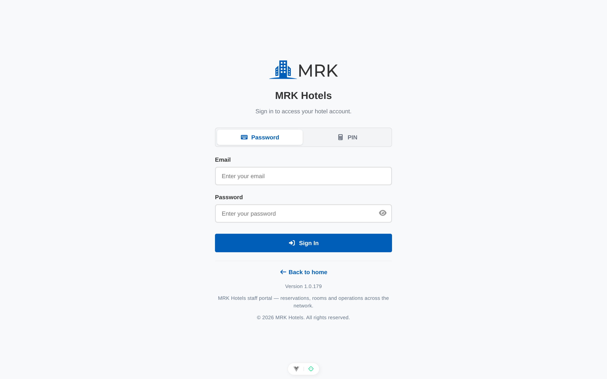<figcaption>Sign-in page — switch between password and PIN mode.</figcaption></figure>

### 2.4 Signing in: password or PIN

The sign-in page offers **two modes** — switch between them with the **Password / PIN** buttons at the top of the form:

- **Password** (default): enter your email and password, then click **Sign In**.
- **PIN**: quick sign-in for shared terminals (front desk, bar, kitchen). Type your **username or registration number** (e.g. `EMP-2026-0004`), then tap your **4-digit PIN** on the on-screen keypad. You are signed in automatically the moment the 4th digit is entered — there is no button to press. Use **C** to clear the whole PIN and **⌫** to delete the last digit.

<figure>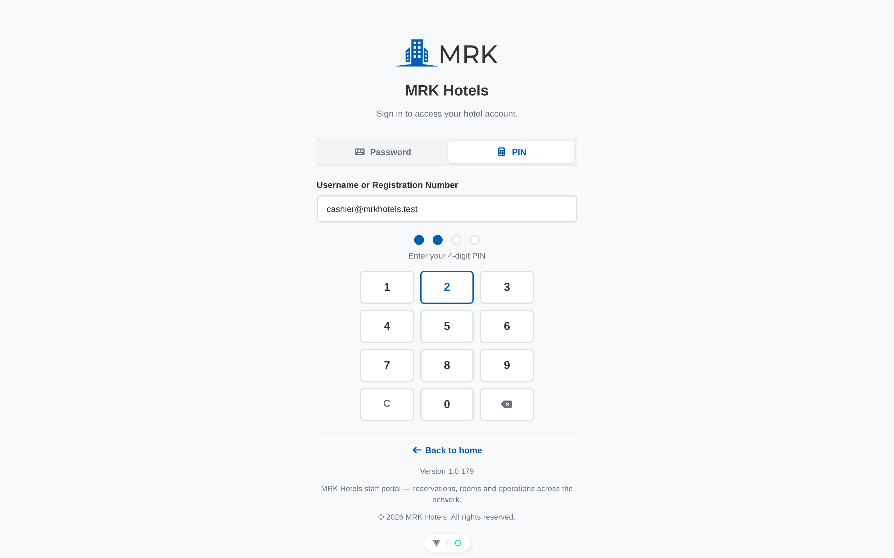<figcaption>PIN sign-in — enter your username or registration number, then tap your 4-digit PIN on the keypad; the dots track your progress.</figcaption></figure>

> **No PIN yet?** PINs are assigned by your hotel admin or manager from the **Staff** page (section 17) — you cannot set your own. Until you have one, keep using the password mode.
>
> Both modes are equally protected: too many failed attempts temporarily block sign-in, and a rejected PIN always restarts from an empty keypad.

---

## 3. The Public Booking Portal

The public side lets guests discover hotels and book rooms without creating an account.

### 3.1 Finding a hotel

1. Open the home page (`/`).
2. **Browse** the directory, or **filter by Country and City** using the dropdowns — the list updates automatically.
3. Each hotel card shows the number of available rooms, the room types on offer and the **starting price per night**.
4. Click **View Hotel** to open the hotel detail page, which lists all its rooms, rates and occupancy.

<figure>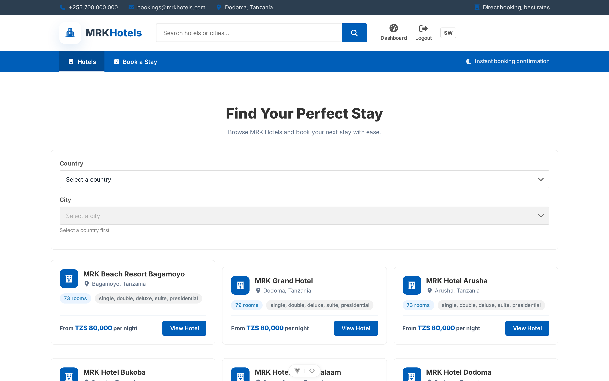<figcaption>The public portal home page — browse hotels, filter by country/city and download your invoice.</figcaption></figure>

### 3.2 Booking a stay

1. Open the **Book a Stay** page (`/booking`).
2. Pick the **hotel**, your **check-in** and **check-out** dates and a **booking type** (Single, Couple, Family, Group), then click **Check availability**.
3. Choose the **rooms** you want from the availability results.
4. Fill in your **name, email, phone, country and city**.
5. Choose a **booking date** (defaults to today; it cannot be after your check-in).
6. Review the **total** and click **Book**.
7. The system holds your rooms as **pending** and shows a payment card.

<figure>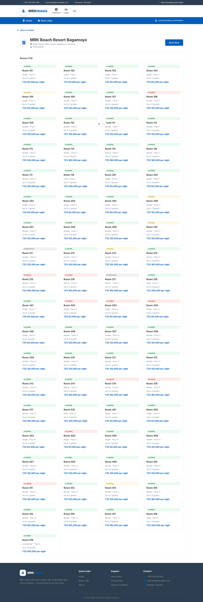<figcaption>Hotel detail page — rooms, rates and occupancy for the selected hotel.</figcaption></figure>

### 3.3 Paying for the booking

Payment depends on the methods the hotel has enabled:

| Method | How it works |
| --- | --- |
| **Selcom** | Settles instantly — the booking is confirmed immediately. |
| **Mobile money** (Airtel Money, Mixx by Yas, HaloPesa, M-Pesa) | The guest pays via their phone (ClickPesa prompt). The booking is confirmed once the payment is verified — by the payment webhook or by the hotel's receptionist. |
| **Bank transfer** (CRDB, NMB, NBC, Other) | The booking is held and marked **awaiting confirmation** until the hotel confirms it. |

Mobile money needs the guest's **phone number** to receive the payment prompt.

### 3.4 Booking requests (no specific room chosen)

If the guest did not pick a specific room, the request is saved as a **booking requisition** (a booking request), not a firm reservation. The hotel sees it in **Booking Requisitions** and contacts the guest. No online payment is taken for these.

### 3.5 Downloading your invoice

On the public portal's home page, the **"Download your invoice"** card lets a guest fetch their invoice PDF without signing in:

1. Enter the **booking reference** (e.g. `BK-2026-0001`).
2. Enter the **phone number** used when booking (any spelling works — local `0712…` or international `+255…`).
3. Click **Download invoice** — the PDF (named after the invoice number, e.g. `INV-2026-0001.pdf`) downloads to the device.

The invoice shows the hotel's details (logo, TIN/VRN where configured), itemized charges, the VAT 18% breakdown, payments made, the balance, payment instructions, and signature areas. If no confirmed booking matches the reference and phone, a "No invoice found" message appears — double-check both values.

---

## 4. The Hotel Panel — General

After signing in, staff land on their **Dashboard**. The menus across the top (or in the mobile menu) are filtered by role.

Common actions used everywhere:

- **Refresh** reloads the current list.
- **Search** filters by name, guest or reference.
- **From / To** date filters limit a list to a date range.
- **Pagination** at the bottom of long lists.

For security, the session ends automatically after **5 minutes of inactivity**, and also if you **leave the page** (switch to another tab, minimise or close the window) — you will need to sign in again.

---

## 5. Dashboard

The dashboard shows today's picture at a glance:

- Check-ins and check-outs today
- Guests currently in house
- Upcoming reservations
- Revenue today and pending payments
- Occupancy rate and room status (available / occupied / cleaning / maintenance)
- Pending booking requisitions, low-stock items, orders today and open tables

<figure>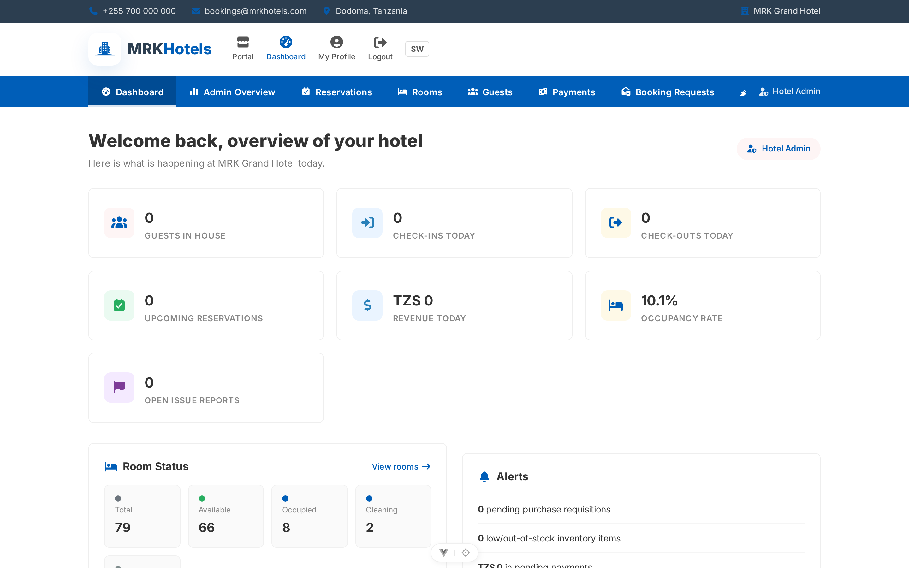<figcaption>Staff dashboard — today's arrivals, departures, revenue and occupancy at a glance.</figcaption></figure>

---

## 6. Reservations

The Reservations page is the heart of reception work. It lists every reservation with the guest, booking type, room, stay dates, total and balance, and a status badge.

### 6.1 Statuses

| Status | Meaning |
| --- | --- |
| Pending | Requested / held, not yet confirmed (e.g. awaiting payment) |
| Confirmed | Payment settled or confirmed by the hotel |
| Checked in | Guest is on the property |
| Checked out | Guest has left |
| Cancelled | Reservation cancelled |
| No show | Guest never arrived |

### 6.2 Creating a reservation

1. Click **New Reservation**.
2. **Guest details** — pick an existing guest from the dropdown, or enter a walk-in guest (name, phone, email, country, city, ID type/number).
3. **Booking** — choose the booking type, booking date, optional room type filter, and set the stay dates (arrival, departure or number of days).
4. Click **Check Availability** to see the rooms free for those dates, then **select the rooms** you want. The suggested **total** is calculated automatically.
5. **Payment** — enter the total and how much the guest is **paying now**. If they pay now, choose the payment method (cash, mobile money, bank, card), the provider, and a transaction reference.
6. Click **Save Reservation**. The reservation is created and any amount paid is recorded as a payment.

### 6.3 Working with a reservation

For each pending or confirmed reservation the row offers:

- **Check in** — marks the guest as arrived.
- **Check out** — closes the stay for a checked-in guest.
- **No show** — for a confirmed reservation the guest never arrived.
- **Cancel** — cancels a pending or confirmed reservation.

<figure>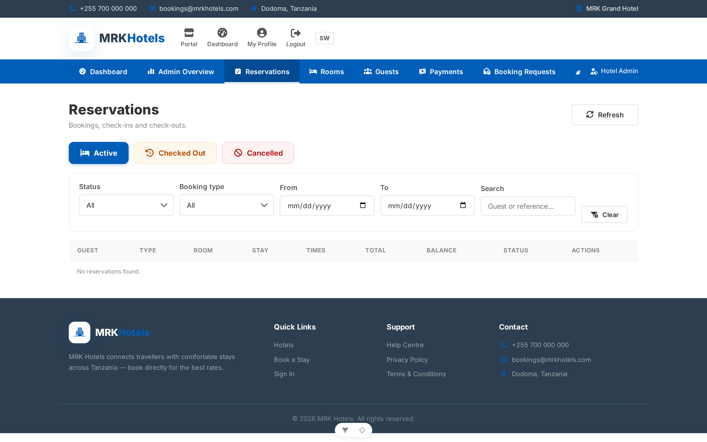<figcaption>Reservations page — guest, room, stay dates, total, balance and status for every booking.</figcaption></figure>

---

## 7. Rooms

The Rooms page manages the hotel's rooms:

- See every room with its number, type, floor, rate, occupancy and current status.
- **Add / edit / delete** rooms.
- **Change room status**: available, occupied, cleaning, maintenance.

Room types: Single, Double, Suite, Deluxe, Presidential.

<figure>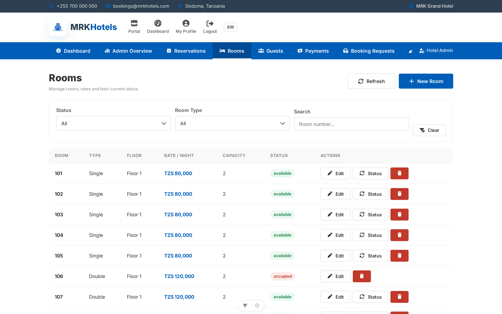<figcaption>Rooms page — every room with its number, type, floor, rate, occupancy and status.</figcaption></figure>

---

## 8. Guests

The Guests page keeps the guest register:

- Search guests by name, email or phone.
- **Add** a new guest or **edit** an existing profile.
- Profiles store contact details, country/city and ID information.
- The guest list also feeds the **existing guest** dropdown when creating a reservation.

<figure>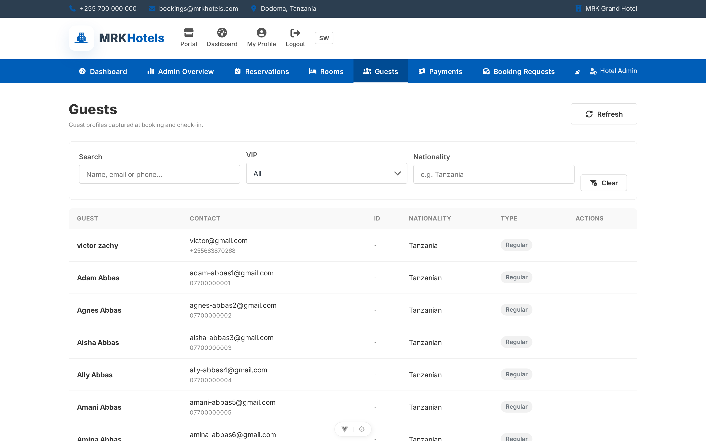<figcaption>Guests page — the hotel's guest register with contact and ID details.</figcaption></figure>

---

## 9. Payments

The Payments page records all money taken. You can:

- See every payment with its amount, method, provider and status.
- **Record a payment** against a reservation.
- Track payment status: **pending**, **awaiting confirmation**, **completed**, **failed**, **refunded**.

### 9.1 Payment methods and providers

| Method | Providers |
| --- | --- |
| Cash | — |
| Mobile money | Airtel Money, Mixx by Yas, HaloPesa, M-Pesa |
| Bank | CRDB, NMB, NBC, Other |
| Selcom | — (settles instantly) |
| Card | — |

<figure>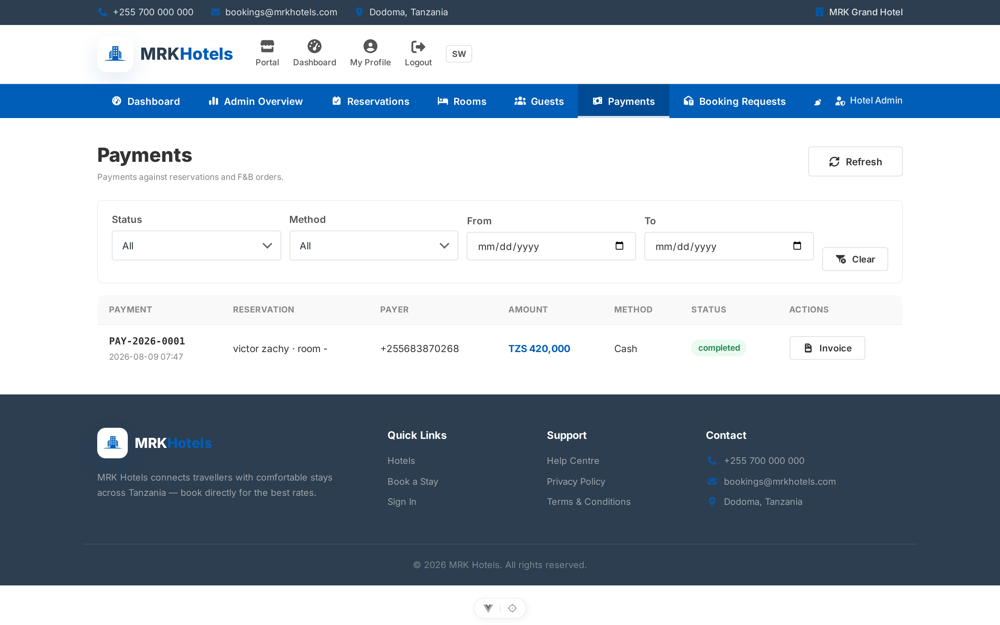<figcaption>Payments page — amount, method, provider and status of every payment taken.</figcaption></figure>

---

## 10. Booking Requisitions

This is the inbox for **booking requests** that came in without a specific room (from the online portal or by phone). Each requisition carries the guest's details, requested room type and dates. The hotel reviews it and responds to the guest.

> Booking requisitions are separate from firm reservations — a reservation reserves an actual room; a requisition is a request for the hotel to reply.

<figure>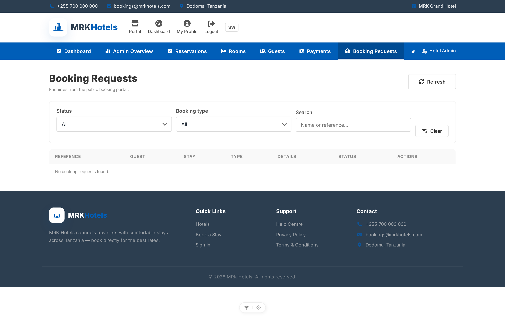<figcaption>Booking requisitions — booking requests that arrived without a specific room.</figcaption></figure>

---

## 11. Housekeeping

The Housekeeping module tracks room cleanliness and work:

- See which rooms are **dirty**, **cleaning** or **clean**.
- Create and assign **cleaning tasks** to housekeeping staff.
- Mark tasks complete so rooms return to **available**.

<figure>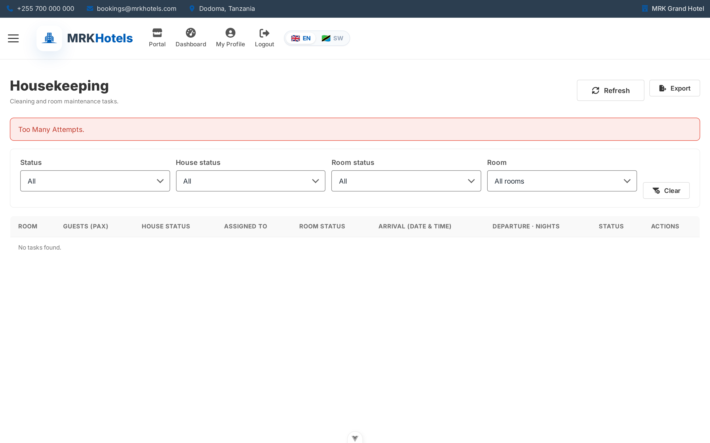<figcaption>Housekeeping — room cleanliness and cleaning tasks.</figcaption></figure>

---

## 12. Orders and Menu (Food & Beverage)

### 12.1 Menu

The Menu page (admin/kitchen) manages what the hotel serves:

- Add / edit / delete menu items with name, price and category.
- Categories and items appear in the ordering screens.

### 12.2 Orders

The Orders page handles service in the restaurant, bar and room service:

- Take a new order (waiter/bartender/staff) with items, quantities and the table or room.
- Track order status through preparation, served and billed.
- Kitchen sees the queue of orders to prepare.

### 12.3 The Order Pad (Take Order)

Waiters and bartenders take table orders on the **Take Order** screen, built like a touch POS:

- **Restaurant / Bar switch** — one tap at the top flips the whole pad: the category buttons, the open-orders queue and the order type all follow. Bartenders start on the Bar; anyone can switch.
- **Category buttons** — tap a category (Grills, Cocktails, Desserts…) to pop up its items; tap an item and it lands on the ticket instantly.
- **Diners (covers)** — set the head-count of the party once when seating (the − / + counter). It does not block anything: it simply travels with the ticket so reports can later compute average spend per guest and covers per day. A bar walk-up can leave it at zero.
  - Covers are *not* proportional to orders: a family of five is one ticket with five covers; a solo beer is one ticket with one cover. Covers ÷ orders = your average party size — watch it drift to spot emptying tables even when revenue looks flat.
- **Transaction type** is chosen for you: restaurant orders are Dine-in, bar orders are At-bar automatically; room-service orders taken from the Orders page stay Hotel-menu.
- **Served with** — grill-style mains in the restaurant (mishkaki, nyama choma…) pop up an accompaniment question (wali, ugali, chips…). The choice prints on the kitchen ticket and stays on the order history.

### 12.4 Working the Kitchen Board (single click)

Kitchen staff land on a dedicated dark **Kitchen Board**: one card per open ticket showing the order number, table/room, department and minutes elapsed. Every dish on the card **is itself a button** — tap it once when it is ready, and a runner taps again once it reaches the guest. There are no modals, no filters and no saving; the board refreshes itself every 15 seconds so new tickets appear on their own, and "Served with" sides show right under their mains. Payment remains a separate manager/cashier step.

<figure>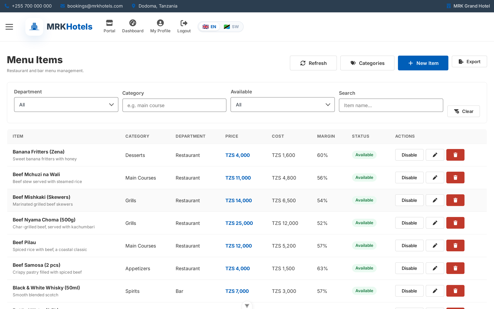<figcaption>Menu items — what the hotel serves, with prices and categories.</figcaption></figure>

<figure>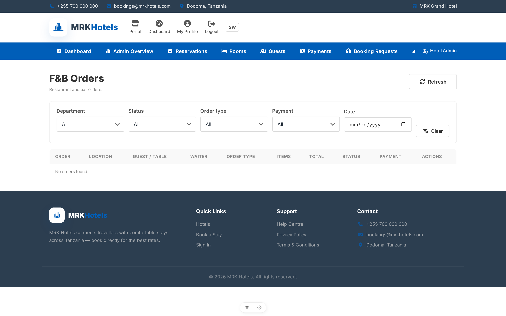<figcaption>F&B orders — service in the restaurant, bar and room service.</figcaption></figure>

---

## 13. Laundry

The Laundry module manages guest and hotel laundry:

- Record a laundry order (guest, items, quantities, price).
- Track status: received, washing, drying, ironing, completed, delivered.
- Each order gets a laundry number for tracking.

<figure>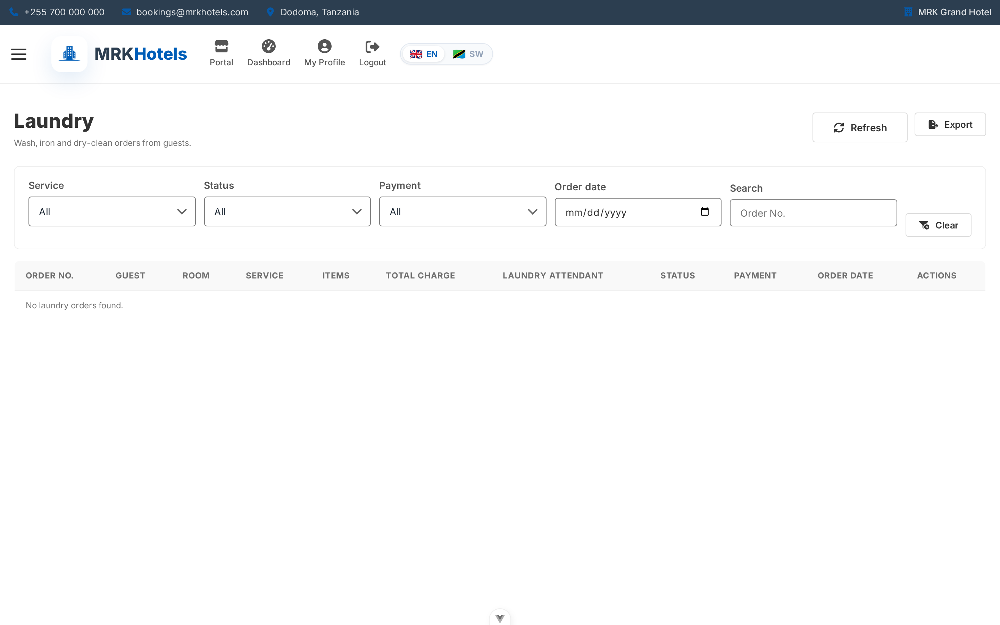<figcaption>Laundry — guest and hotel laundry orders with their progress.</figcaption></figure>

---

## 14. Fun and Games

The Fun & Games module manages paid recreational activities and games in the hotel:

- Add orders for games or activities.
- Record guest, item/activity and price, with a fun-game number for tracking.

<figure>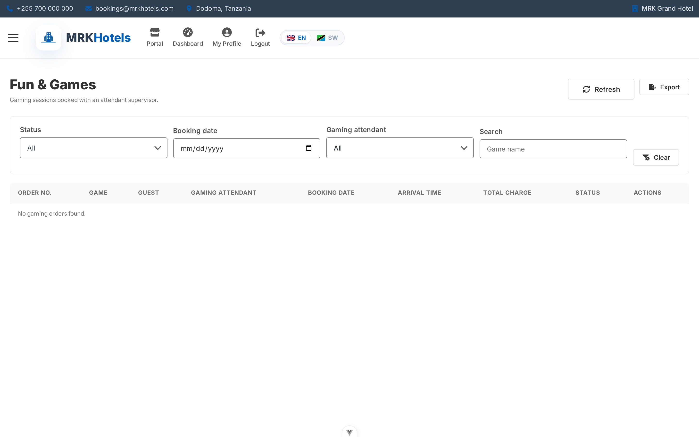<figcaption>Fun & Games — paid recreational activities and games.</figcaption></figure>

---

## 15. Inventory and Suppliers

### 15.1 Inventory

- Maintain the stock list: item name, unit, quantity, reorder level and cost.
- The dashboard warns about **low-stock** items.
- Stock is adjusted automatically when goods are received, and stock movements are recorded.

<figure>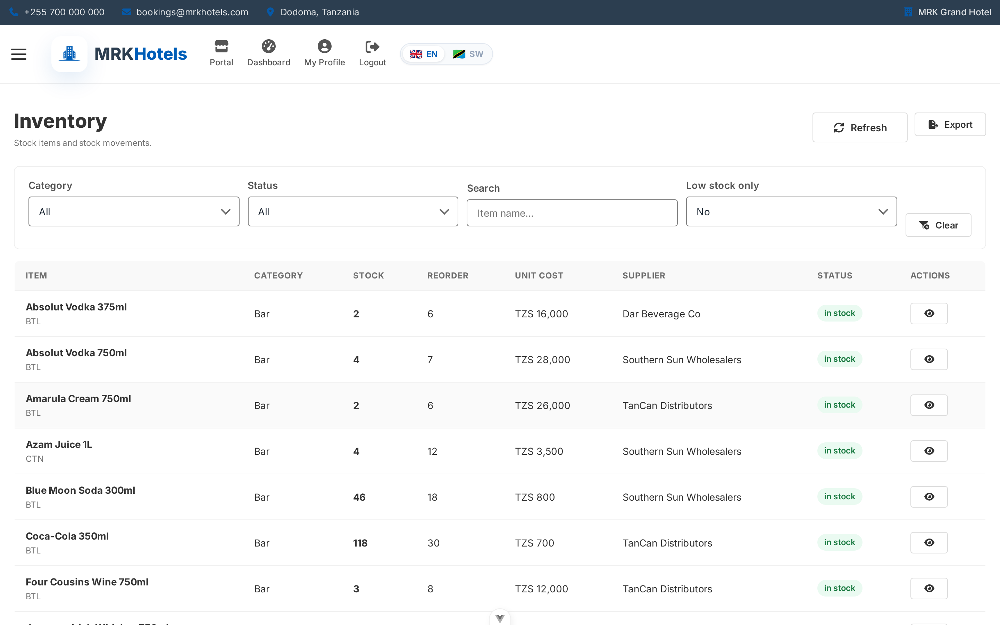<figcaption>Inventory — stock items, quantities, reorder levels and costs.</figcaption></figure>

### 15.2 Suppliers

- Keep the supplier register: name, contact person, phone, email, address.
- Suppliers are linked to purchase orders.

<figure>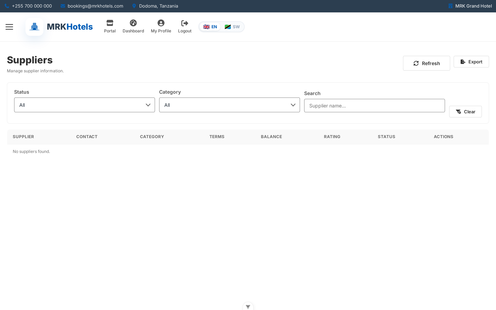<figcaption>Suppliers — the register of suppliers linked to purchase orders.</figcaption></figure>

---

## 16. Procurement

### 16.1 Requisitions

- A department/staff member requests items (quantity, need-by date, notes).
- Requisitions are reviewed and converted into purchase orders.

<figure>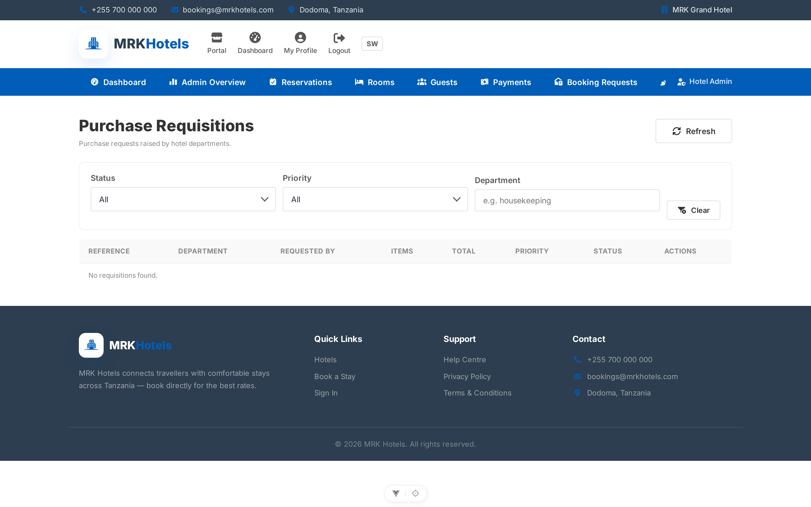<figcaption>Purchase requisitions — staff requests for items to be ordered.</figcaption></figure>

### 16.2 Purchase Orders

- Create a purchase order from a requisition or directly.
- Choose the **supplier**, add items with quantity and price, and record the expected delivery date.
- Track status: pending, approved, ordered, received, cancelled.

<figure>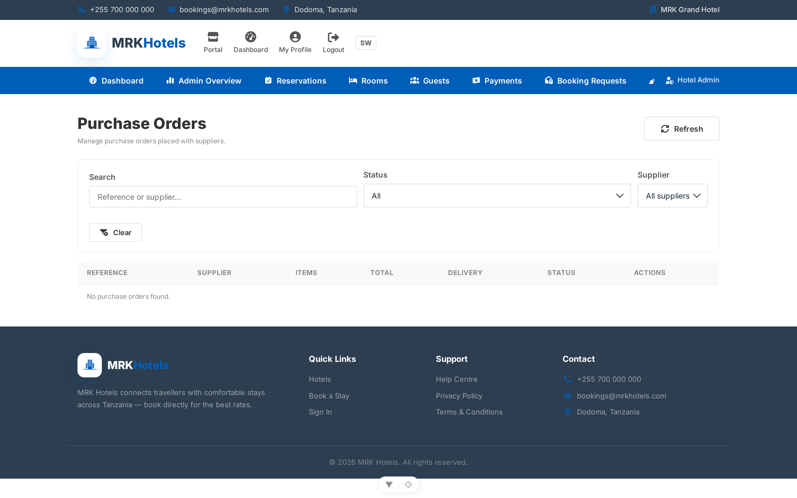<figcaption>Purchase orders — supplier orders with items, quantities and delivery dates.</figcaption></figure>

### 16.3 Goods Received

- When ordered goods arrive, record the **goods received note (GRN)** against the purchase order.
- Quantities received update **inventory automatically**.
- Any difference between ordered and received quantities is captured on the GRN.

<figure>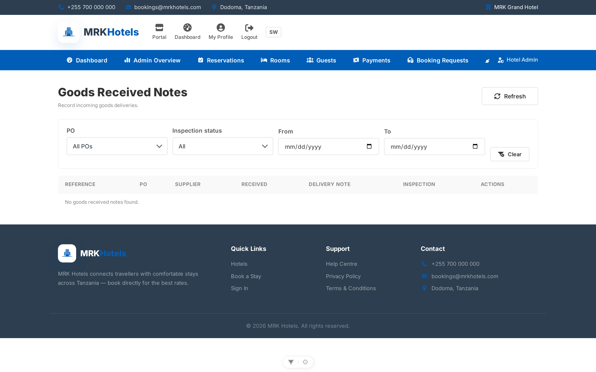<figcaption>Goods Received — receipts against purchase orders; quantities update inventory automatically.</figcaption></figure>

---

## 17. Staff

The Staff page (admin/manager) manages the team:

- Add staff with their role (manager, accountant, receptionist, housekeeping, kitchen, waiter, bartender, staff, …).
- Each staff member gets a **registration number** (e.g. `EMP-2026-0004`) — it doubles as their identifier for PIN sign-in (section 2.4).
- **Activate / deactivate** accounts, **reset passwords**, and **invite** staff to sign in.
- **Set a 4-digit login PIN** from the staff row (**Set PIN**) so the member can use PIN sign-in on shared terminals. The dialog **auto-generates a secure random PIN** by default — re-roll it with the refresh button, copy it with the copy button, and share it with the member. Switch to **Type it myself** if you prefer to enter a PIN of your own choosing (both fields have an eye toggle to reveal what you typed). PINs are stored securely hashed and can be replaced at any time. You can only set PINs for roles at or below your own — and never your own.
- Record ID/attachments for each member.

<figure>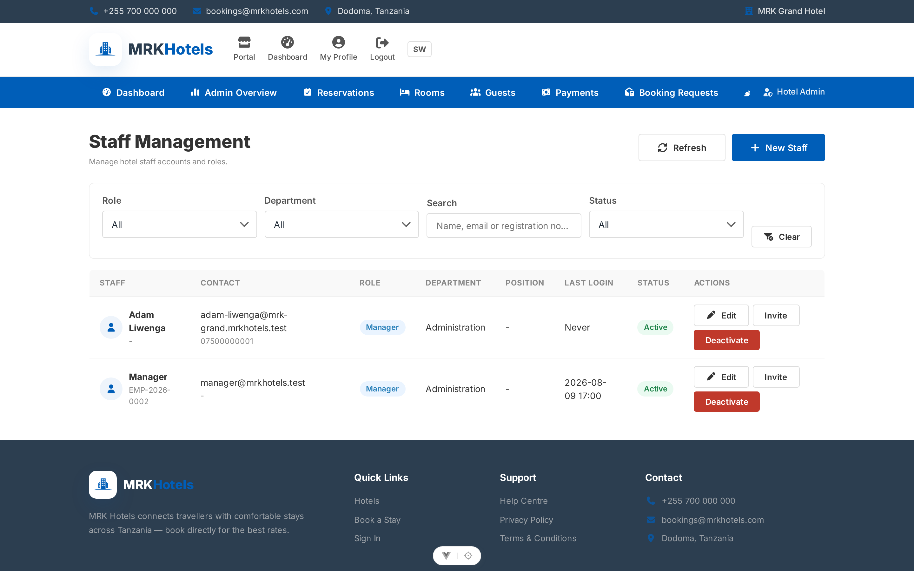<figcaption>Staff — manage the team, roles, accounts, invites, password resets and login PINs.</figcaption></figure>

<figure>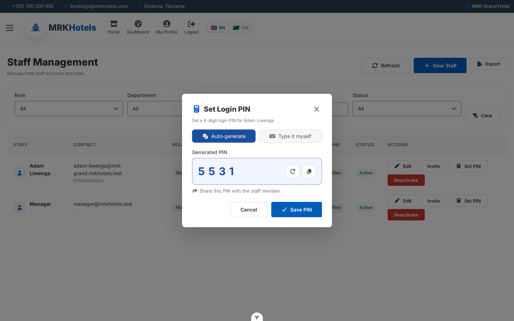<figcaption>Set Login PIN — a random PIN is generated for you to share; or switch to typing one yourself. PINs are stored securely hashed and can be replaced at any time.</figcaption></figure>

---

## 18. Messages

Messages is the staff inbox. Every employee can chat one-to-one with colleagues and take part in group chats, inside the hotel or across the whole MRK Hotels network. Beyond plain chat it also offers replies with quotes, urgent priority and polls, pinning and starring, forwarding, reusable templates, scheduled sends, search, CSV export, English↔Swahili translation, announcements, shift handovers, room-linked task chats, meetings, guest SMS and one-tap SOS alerts — all available from the **Workspace** panel and the message bubble menus.

### 18.1 Conversations

- **New Message** starts a chat. Choose the scope first:
  - **Hotel Confidential** — colleagues in your hotel only.
  - **Global Messaging** — any staff member on the platform, across hotels.
- Search for a colleague by name, then pick them — the chat opens instantly.
- Unread messages show a blue badge on the conversation and on the Messages menu.
- A green **online dot** next to an avatar (conversation list, thread header, group members, search results) means that colleague is connected right now — in your hotel or anywhere on the network; offline colleagues show no dot.

### 18.2 Group chats

- **New Group** creates a team chat: name the group, pick at least one colleague, and create it.
- The **creator** can add or remove members; any member can **leave** the group.
- Group messages count as read once they have been seen by at least one member.

### 18.3 Delivery and read ticks

After you send a message, a tick shows its state:

| Tick | Meaning |
| --- | --- |
| ✓ (single) | Sent and delivered to the other device |
| ✓✓ (double) | Read — the recipient opened the chat |
| ✓✓ (filled) | Seen by other members of a group ("Seen by N") |

> A message becomes **delivered** as soon as the recipient's device has pulled it — even before it is opened. It becomes **read** when the recipient opens the conversation.

### 18.4 Audio, attachments and view-once

- Tap the **microphone** and speak — the audio message is sent as soon as you stop, and plays back inside the chat.
- Use the **paperclip** to attach an image or any file.
- To send a **view-once** image or video, toggle the eye icon in the composer before sending. The recipient can open it **only once**; after that it shows as "opened" and can never be replayed.

### 18.5 Deleting messages and reactions

- **Delete a message**: hover (desktop) or long-press (mobile) a bubble and choose **Delete**.
  - **For me** — only you can no longer see it; the other person still can.
  - **For everyone** — the message disappears for everyone in the chat.
- **React to a message**: hover/long-press a bubble and pick an emoji. The reaction appears under the message; tap your own reaction to remove it. Reactions update live for everyone.

### 18.6 Mentions

- Type **@** in the composer to see a list of colleagues, then pick someone. Their name is highlighted in the message, and they get a notification that they were mentioned.

### 18.7 Statuses

- Post a **status** (text, photo or video) from the **Statuses** page. It is visible to your colleagues for **24 hours**, then disappears automatically.
- View statuses from the Statuses page — colleagues with an active status also show a **coloured ring** around their avatar in the conversation list.
- You can **react** to a status (tap the emoji) and see who has viewed it.

### 18.8 Audio and video calls

- Open a conversation and tap the **phone** (audio) or **video** icon to call a colleague.
- They see an incoming-call screen and can **Accept** or **Decline**. A busy colleague can also decline, showing as a declined call.
- The call connects peer-to-peer (no server-side media) and ends when either side hangs up. Missed calls appear in your **call history**.

<figure><figcaption>Messages — a thread with an urgent poll, a reply quote and a pinned message.</figcaption></figure>

### 18.9 Replies, priority and polls

- **Reply to a message**: hover/long-press a bubble and choose **Reply** (or tap the reply icon in the message menu). A reply bar appears in the composer; your message is sent as a reply and the original is quoted above it. Anyone can tap the quote to jump to the original message.
- **Mark a message urgent**: toggle the **priority** (lightning) switch in the composer before sending. Urgent messages show a red border, an "urgent" tag, are automatically pinned, and are escalated to management if nobody reads them in time.
- **Send a poll**: open the poll builder in the composer, enter the question and at least two options, and choose whether staff may pick more than one. The poll appears inside the chat with live vote counts and percentages — tap an option to vote (once). Polls update for everyone in real time.

### 18.10 Pinning and starring

- **Pin a message** to keep it at the top of the chat for everyone (e.g. a shift schedule or room list). Choose **Pin** from a bubble's menu; unpin from the pinned panel.
- **Star a message** to save it to your personal list (like a bookmark — nobody else sees it). Open **Starred** in the Workspace panel to jump back to any starred message.

### 18.11 Forwarding, templates and scheduled messages

- **Forward a message** to another colleague or group: choose **Forward** from the message menu, pick the target chat, and send. The copy is labelled "Forwarded" so everyone knows it came from elsewhere.
- **Save a template**: choose **Save as template** from the message menu to store a frequently used message. The template picker (lightning) in the composer inserts it in one tap.
- **Schedule a message**: open the scheduler (clock) in the composer, pick a date and time, and send. The message is delivered automatically at that moment. Manage pending sends under **Workspace → Scheduled** and cancel them from there.

<figure>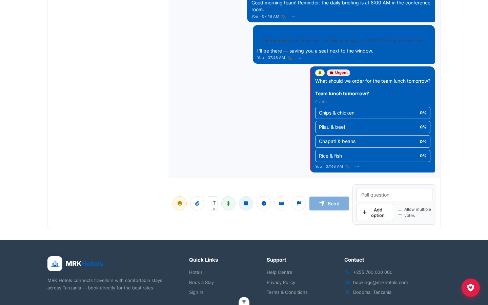<figcaption>Composer tools — poll builder, scheduler and template picker.</figcaption></figure>

### 18.12 Search, export and translate

- **Search messages**: use the magnifier in the thread header to search inside the current chat. Use **Workspace → Search** for a global search across all your chats.
- **Export a chat**: use the export (download) button in the thread header to download the whole conversation as a CSV file, ready for Excel.
- **Translate a message**: any colleague's message can be translated between English and Swahili with the translate button in the message menu — the bubble toggles between the original and the translation (works offline).

### 18.13 Announcements and escalation

- **Announcements**: management posts hotel-wide announcements that appear in **Workspace → Announcements**. Tap **Acknowledge** so the poster can see who has read it.
- **Escalate a message**: if a message needs management attention, choose **Escalate** from the message menu. It appears in the Escalations tab, where a manager can mark it **Resolved**.

<figure>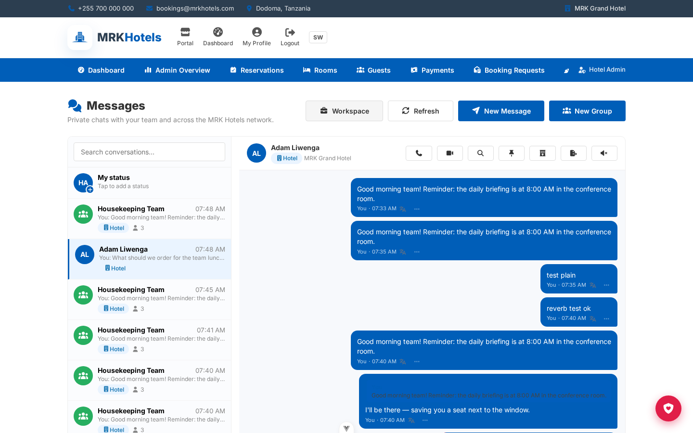<figcaption>Workspace panel — announcements, meetings, handovers, guest SMS, nearby staff, escalations, SOS, scheduled, starred and retention tabs.</figcaption></figure>

### 18.14 Mute, do-not-disturb and retention

- **Mute a chat**: use the speaker icon in the thread header (or **Mute** in a chat's menu) to silence a conversation — optionally until a chosen date. Muted chats show a speaker-off icon.
- **Do Not Disturb**: set a daily DND window in the workspace so you are not notified during your quiet hours.
- **Retention (admins)**: the Retention tab lets hotel admins set how many days chat history is kept. Messages older than the policy are cleaned up automatically.

### 18.15 Shift handovers and room-linked chats

- **Shift handovers**: at the end of a shift, post a handover note (summary + times) from **Workspace → Handovers**. The next shift acknowledges it, and the whole hotel can see it was received.
- **Link a chat to a room**: use the room icon in the thread header to attach a chat to a hotel room (e.g. housekeeping for Room 401). Room-linked chats can become **task groups**, and any message in them can be **converted into a housekeeping task** — so "Room 401 needs sheets" turns into a real job.

### 18.16 Nearby staff and guest SMS

- **Nearby staff**: update your zone/floor in **Workspace → Nearby**, and see which colleagues are nearby (within the last 30 minutes). Your location updates your team live.
- **Guest SMS**: from **Workspace → Guest SMS**, send a text message to a guest's phone (e.g. "your room is ready") — this is one-way (hotel → guest): guests cannot reply by text, they call the help desk instead. All sent messages and history stay in the hotel.

### 18.17 Meetings and SOS alerts

- **Meetings**: schedule a meeting (title, start time, duration, type) and invite colleagues from **Workspace → Meetings**. Invitees get a live invitation and can accept or decline; the organizer sees responses update instantly.
- **SOS alerts**: the red **SOS** button floats over the chat list. Press it in an emergency — every hotel employee is alerted immediately, can **Acknowledge** (so everyone knows help is coming) and a manager can mark the alert **Resolved**.

<figure>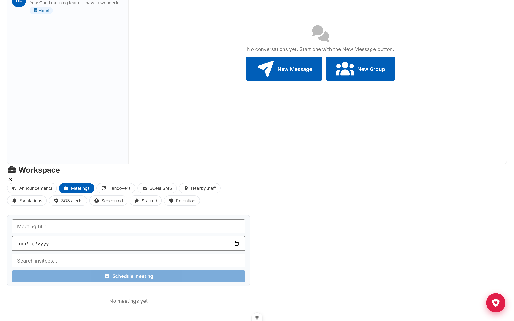<figcaption>Meetings — schedule a meeting and invite colleagues.</figcaption></figure>

<figure>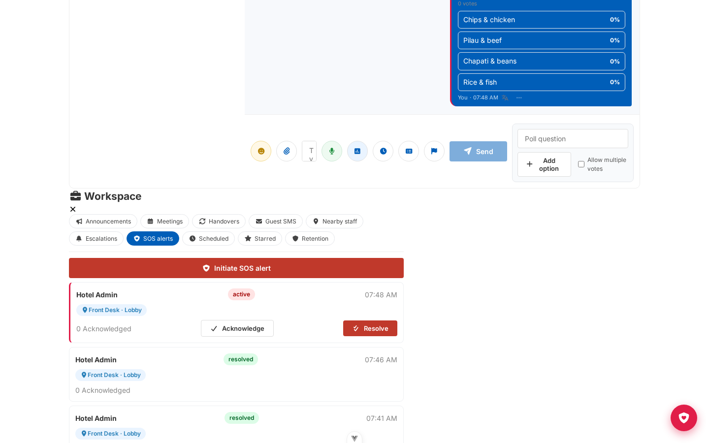<figcaption>SOS alerts — initiate, acknowledge and resolve an emergency alert.</figcaption></figure>

<figure>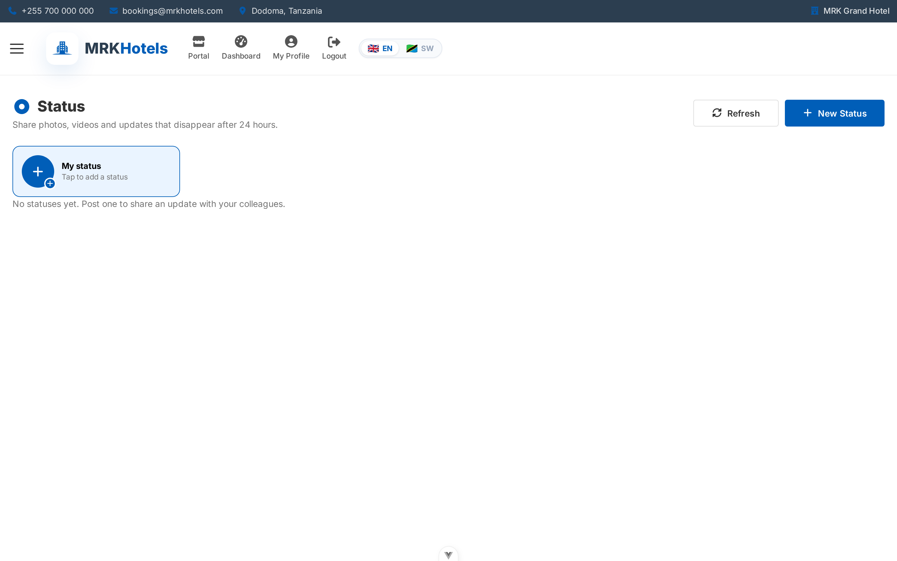<figcaption>Statuses — post a 24-hour text, photo or video status for your colleagues.</figcaption></figure>

---

## 19. Reports and Overview

### 19.1 Overview (admin/manager)

A high-level business overview of hotel performance. Each section can be searched and filtered, and shows its own **pagination** (15 records per page):

- **Employees** — search by name, email or registration number; filter by **role** and **account status**.
- **Clients in the hotel** — search by guest name, phone or room number.
- **Upcoming arrivals** — search by guest name.
- **Housekeeping queue** — filter by task status.

Each section footer lets you jump between pages. The summary cards above the sections always reflect the whole hotel.

<figure>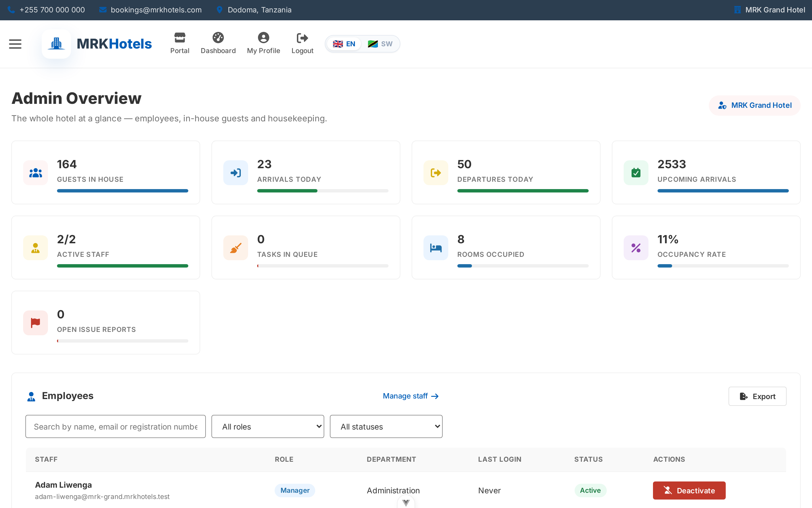<figcaption>Admin Overview — employees, in-house clients, upcoming arrivals and the housekeeping queue.</figcaption></figure>

### 19.2 Reports (admin/manager/accountant)

- **Occupancy** — room occupancy across dates.
- **Revenue** — money earned over a period.
- **Room status** — current state of every room.
- **Audit logs** — who did what and when (admin/manager).

<figure>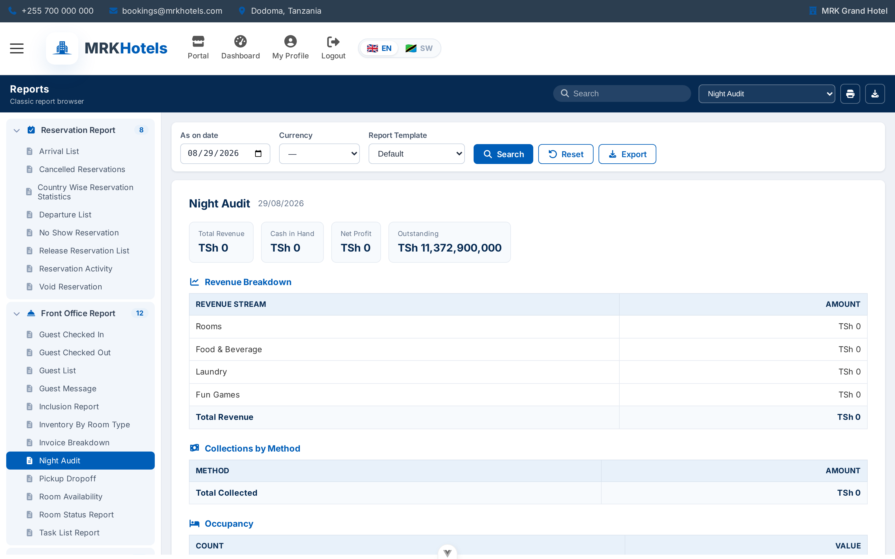<figcaption>Reports — occupancy, revenue, room status and audit logs.</figcaption></figure>

---

## 20. Profile and Password

- **Profile** shows your complete account details: name, staff/registration number, email, phone, country code, role and role level, department, position, ID type and number, your hotel, the sub-manager flag, account status, last login and the date you joined.
- **Clock in / out** from the attendance card and see how long you have been on shift. If your hotel has location, QR, or selfie verification enabled, the clock-in card will ask for your phone's location, may request a selfie (you must grant camera access), and, where required, to scan the office's QR code (shown on the manager's phone, refreshed every minute) before your shift starts — this proves you were actually at the hotel. The card also shows any suspicious flags or penalties raised by the anti-cheat checks, which a manager reviews.
- **Change password** from your profile; pick a strong password and keep it safe.
- If the hotel admin resets your password, sign in with the temporary one and change it immediately.

<figure>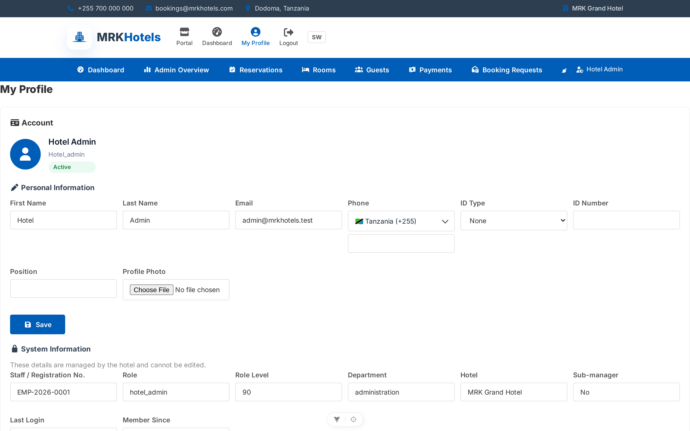<figcaption>Profile — account details, clock in/out card and password change.</figcaption></figure>

---

## 21. Business Logic & Lifecycles

Every record in MRK Hotels moves through a fixed set of states. Each lifecycle below shows the allowed forward moves and the people who can make them. A record can only move **forward** — an illegal jump is refused with an error.

**The whole system in one loop** — from the moment a guest books to the moment the room is ready for the next guest:

```
  ① A GUEST BOOKS
     Online portal, by phone or at the front desk.
     • With a chosen room  → a pending RESERVATION is created.
     • Without a room      → a BOOKING REQUISITION is created; the hotel replies.
        │
        ▼
  ② THE MONEY MOVES
     pending → completed  (or held as awaiting confirmation)
     • Selcom settles instantly.
     • Mobile money is confirmed by the receptionist — the online
       payment webhook can also complete it automatically.
     • Bank transfer is confirmed by the hotel.
     Once settled, the reservation is CONFIRMED.
        │
        ▼
  ③ THE GUEST ARRIVES
     Resident: check-in → reservation CHECKED IN, room OCCUPIED, IN HOUSE.
     Non-resident: a walk-in guest with NO room who comes only for the
     services (restaurant, bar, fun & games, laundry).
        │
        ▼
  ④ THE STAY — OR — USING THE SERVICES
     Resident: F&B orders, laundry, fun & games and room extras are billed
     to the room and added to the reservation balance.
     Non-resident: the same services are available without a room — the
     guest pays directly on the spot.
        │
        ▼
  ⑤ THE GUEST LEAVES
     Resident: check-out settles any outstanding balance (last payment
     recorded) and the reservation becomes CHECKED OUT.
     Non-resident: the visit simply ends.
        │
        ▼
  ⑥ CLEAN-UP (residents only)
     Check-out queues a cleaning task automatically:
     dirty → cleaning → verified → room clean.
        │
        ▼
  ⑦ ROOM READY
     The room returns to AVAILABLE for the next guest.
        │
        ▼
   ───────────────────────────────────────────────
   LOOP RESTARTS: a new guest books → back to ①
```

Three **supporting loops** keep the main loop running:

```
  SUPPLY — keeps the hotel stocked
     Requisition → Manager approves → Purchase order → Finance approves
        → Goods received (GRN) → inventory restocked
        → kitchen / housekeeping use stock → low-stock warning → new requisition

  PEOPLE — the team behind every step
   Attendance:     clock in (location check when enabled; QR scan when enabled) → on shift → clock out
     Issues:      new → in progress → resolved
     Messages:    sent → delivered → read
     Urgent:      sent → (unread) → auto-escalated → resolved
     SOS:         initiated → acknowledged → resolved
     Meeting:     scheduled → invited → accepted / declined
     Handover:    posted → acknowledged

  ORGANIZATION — the admin builds the team; every position serves the client
     Admin onboards a member → assigns role, department and position
      → registration number issued (EMP-2026-0004)
      → account activated → optional 4-digit login PIN setup by an administrator (hiari); members may sign in using either their password or their PIN
     The chain of service — each position deals with clients directly:
        Receptionist  — books, checks guests in/out, replies to booking
                        requisitions, records desk payments, keeps the register
        Waiter / Bartender / Staff — takes F&B orders and serves the
                        restaurant, bar and room service, records fun & games
                        and laundry at the point of service
        Kitchen       — prepares every order that comes up from the floor
        Housekeeping  — dirty → cleaning → verified → clean; guest laundry:
                        received → washing → drying → ironing → delivered
        Accountant    — records and confirms payments, balances the ledger
        Procurement   — requisition → manager approves → purchase order
                        → finance approves → goods received → stock restocked
     The MANAGER supervises the team and signs off the records that need it.
     The ADMIN keeps the team healthy: reset password / set a new PIN any
        time, invite and reactivate as needed, deactivate the account when a
        member leaves → a new member joins → back to the start
```

### 21.1 Online booking and payment

```
Requested → Pending → Confirmed → Checked in → Checked out
                ↕          ↘ No show
           Payment held    ↘ Cancelled
```

- A booking starts **pending**. Depending on the payment method:
  - **Selcom** settles instantly → **confirmed** immediately.
  - **Mobile money** stays pending until it is confirmed — by the payment webhook or by the receptionist.
  - **Bank transfer** is held **awaiting confirmation** until the hotel verifies the deposit.
- A confirmed reservation is **checked in** on arrival and **checked out** on departure. It can be marked **no show** or **cancelled**.

### 21.2 Booking requisition (no specific room)

```
Pending → Reviewing → Quoted → Confirmed
                 ↘ Rejected → Cancelled
```

The hotel reviews the request, may send a **quote**, and confirms the stay. The guest can track the request online using its reference. No online payment is taken for requisitions.

### 21.3 Reservation status flow

```
Pending → Confirmed → Checked in → Checked out
    ↘ Cancelled          ↘ No show
```

Reception staff check guests in and out. **Check-out** first settles any outstanding balance (see 21.4) and queues a cleaning task for the room.

### 21.4 Payment status flow

```
Pending → Awaiting confirmation → Completed → Refunded
    ↘ Failed
```

- **Completed** payments are settled; a completed payment can be **refunded**.
- **Mobile money** (online or at the front desk) is confirmed by the **receptionist** with the reference from the guest's SMS. An online payment can also be completed automatically by the payment webhook.
- **Bank transfers** stay **awaiting confirmation** until the hotel verifies the deposit.
- Failed payments stay **failed** and are never counted as income.

### 21.5 F&B order lifecycle

```
Pending → In progress/Processing/Preparing → Ready → Served → Completed
    ↘ Cancelled
```

- The kitchen works the order, marks items **ready**, and serving staff mark them **served**.
- Payment: **Unpaid → Paid**, or **billed to room** when an in-house guest is charged to their stay. A billed order is marked completed.

### 21.6 Housekeeping task lifecycle

```
Dirty → In progress → Confirmed → Verified → Completed
```

- A task is created as **dirty** (check-out queues one automatically). Staff **start** it, the supervisor **confirms**, someone **verifies** the result, and it is **completed**.
- When a verified room is clean, its status returns to **available**.
- Room status flow: Dirty → Cleaning → Clean / Available.

### 21.7 Laundry order lifecycle

```
Pending → Ready → Delivered
    ↘ Cancelled
```

Each order gets a laundry number for tracking. Orders move from pending to ready once washed/ironed, then delivered to the guest.

### 21.8 Procurement lifecycle

```
Requisition:  Pending → Approved → Purchase order      (Rejected / Cancelled)
Purchase order: Pending → Manager approved → Finance approved → Received / Partially received
                    ↘ Cancelled
Goods received:  GRN records what arrived → inventory updates automatically
```

- A department raises a **requisition**; a **manager** approves it.
- The approved requisition becomes a **purchase order**. The **manager** approves the PO first, then **finance** approves it.
- When the goods arrive, a **goods received note** records what was received (and any rejects); inventory is adjusted automatically.

### 21.9 Issue report lifecycle

```
New → In progress → Resolved
  ↘ Cancelled
```

Any staff member raises an issue; a manager picks it up (**in progress**), works it, and **resolves** it. Comments keep the audit trail. Reports can be cancelled while new or in progress.

### 21.10 Messaging lifecycle

```
Sent → Delivered → Read
```

- **Delivered** when the recipient's device has pulled the message.
- **Read** when the recipient opens the chat (groups: seen by at least one member).
- The ticks in the chat bubble show the current state (see 18.3).

---

## 22. The Superadmin Panel

The superadmin sees a separate layout (dark sidebar):

- **Dashboard** — platform-wide summary.
- **Tenants** — every hotel (tenant) in the system:
  - Approve new hotels (`pending` → `active`).
  - Edit hotel details.
  - **Tax & invoice details** per hotel — the **TIN** and **VRN** printed on invoices, plus the **signature & stamp** images rendered above the authorized signature line on every invoice PDF.
  - **Toggle payment methods** per hotel — including turning **Selcom** on/off.
- **Reports** — platform-wide reports.
- **Profile** — account and password.

> Public online payments only offer the methods a hotel has enabled. Selcom ships **disabled by default**; the superadmin turns it on per hotel.

---

## 23. The Owner Panel (multi-hotel owners)

An **owner account** is for someone who owns **several hotels**. One sign-in covers all of them — no need for a separate account per hotel.

- **My Hotels dashboard** — combined totals across every owned hotel: revenue (30 days), average occupancy, guests in house, active reservations and total rooms, plus a per-hotel comparison table.
- **Hotel drill-down** — click any hotel name to see its details: contact info, TIN/VRN, rooms, occupancy, in-house guests, active reservations and revenue (30 days + total).
- **Profile** — update your personal details, profile photo and password.

<figure>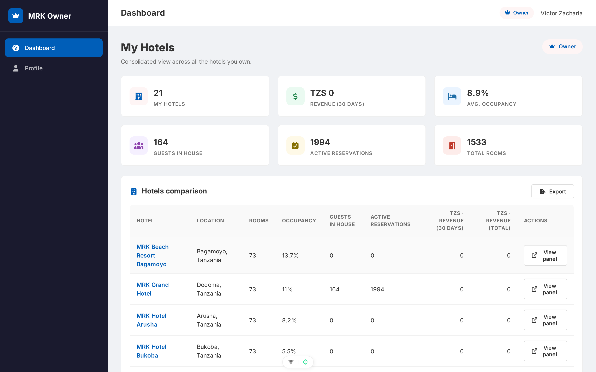<figcaption>Owner dashboard — combined KPIs and a per-hotel comparison table across every owned hotel.</figcaption></figure>
<figure>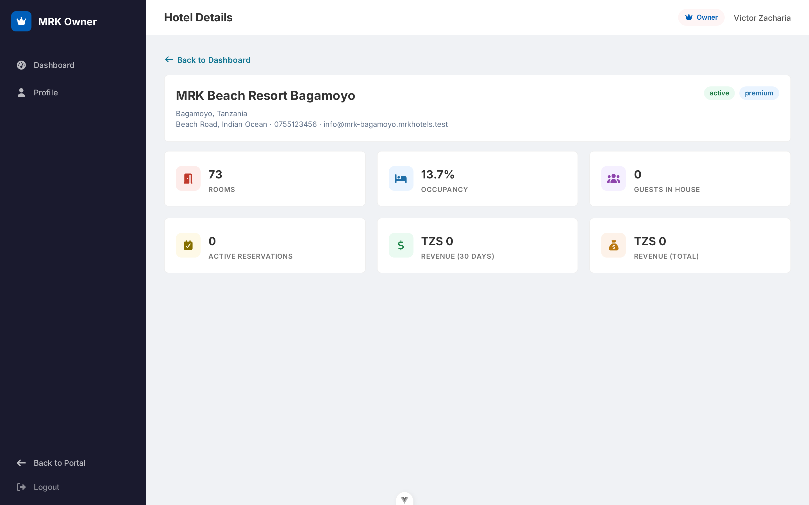<figcaption>Hotel drill-down — contact info, rooms, occupancy, in-house guests and revenue for one hotel.</figcaption></figure>
<figure>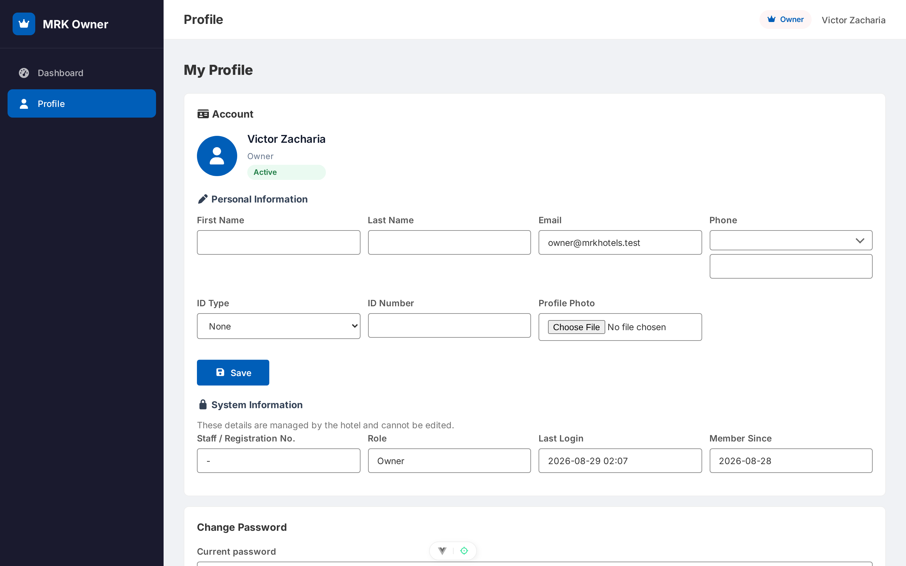<figcaption>Owner profile — edit your personal details, photo and password.</figcaption></figure>

The superadmin creates owner accounts and assigns hotels to them (Hotel Management → select a hotel → **Owner** card).

---

## 24. Language

Use the **EN / SW** button in the top bar to switch the whole interface between English and Swahili. Your choice is remembered.

---

## 25. Troubleshooting

| Problem | Solution |
| --- | --- |
| "Unauthenticated" alert on sign-in | Clear the saved sign-in: open DevTools → Application → Session Storage → delete `auth_token`, then refresh and sign in again. |
| "Country field is required" when booking | Pick a country from the dropdown (it feeds the guest's country). |
| Password expired | The system resets it to your full name in capital letters; sign in and change it from Profile. |
| Can't see a menu | That role is not allowed that menu. Ask your hotel admin or superadmin. |
| Page looks stale | Hard-refresh with Ctrl+Shift+R. |

---

## 26. Customer Self-Service Portal

Hotels that sign up through the TSCL pricing page use the **Customer Portal** to manage their subscription, view payments, and update hotel details — without needing superadmin help.

### 26.1 Signing Up

1. Visit **tscl.app/portal/pricing** to see available plans (Starter, Growth, Enterprise)
2. Click **Get Started** on your preferred plan
3. Fill in the registration form:
   - Hotel name, contact person, email, phone, city, country
   - **Legal registration**: TIN number, VRN number (if applicable), business registration number, country of registration
   - Password (minimum 8 characters)
4. Click **Create account** — your account will be pending approval with a 14-day free trial

### 26.2 Signing In

1. Visit **tscl.app/portal/login**
2. Enter your email and password
3. You will be directed to your portal dashboard

### 26.3 Portal Dashboard

The dashboard shows:
- **Trial banner** with countdown (if on trial)
- **KPI cards**: rooms, reservations, guests, revenue
- **Quick actions**: jump to hotel details, subscription, or staff
- **Account info**: current plan, status, subdomain, trial expiry

### 26.4 Subscription Management

Visit **/portal/subscription** to:
- See your current plan and trial status
- **Upgrade or downgrade** between Starter, Growth, and Enterprise plans
- Changes take effect immediately

### 26.5 Making Payments

Visit **/portal/payments** to:
- View payment history with search and filters
- **Make a new payment** via:
  - **Mobile Money**: M-Pesa, Tigo Pesa, Airtel Money, HaloPesa, EzyPesa — you receive a USSD prompt on your phone
  - **Bank Transfer**: Select your bank (CRDB, NMB, Stanbic, ABSA, NCBA, Equity), enter account number and transaction reference — recorded as pending until confirmed by our team

### 26.6 Hotel Details

Visit **/portal/hotel** to update:
- Hotel name, contact person, phone, city, country
- TIN and VRN numbers
- (Subdomain and email are read-only)

### 26.7 Staff Management

Visit **/portal/staff** to:
- View all staff members with search and role filters
- See role badges and status indicators

---

*End of manual — © MRK Hotels. For support contact your hotel administrator.*
